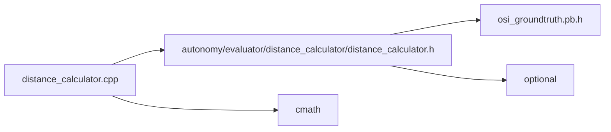

<a id="distance__calculator_8cpp"></a>
# File distance\_calculator.cpp

![][C++]

**Location**: `autonomy/evaluator/distance\_calculator/distance\_calculator.cpp`


## Namespaces

* [simulation\_framework](namespacesimulation__framework.md#namespacesimulation__framework)
* [simulation\_framework::evaluator](namespacesimulation__framework_1_1evaluator.md#namespacesimulation__framework_1_1evaluator)

## Includes

* [autonomy/evaluator/distance_calculator/distance_calculator.h](distance__calculator_8h.md#distance__calculator_8h)
* <cmath>





## Source


```cpp


#include "autonomy/evaluator/distance_calculator/distance_calculator.h"
#include <cmath>

namespace simulation_framework
{
namespace evaluator
{

double DistanceDrivenCalculator::Calculate(const osi3::GroundTruth& ground_truth)
{
    double distance = 0.0;
    auto host_vehicle_index = std::make_optional<int>();

    const auto& host_vehicle_id = ground_truth.host_vehicle_id();
    const auto moving_objects_count = ground_truth.moving_object_size();

    for (int i = 0; i < moving_objects_count; ++i)
    {
        if (host_vehicle_id.value() == ground_truth.moving_object(i).id().value())
        {
            host_vehicle_index.value() = i;
            break;
        }
    }

    if (!host_vehicle_index.has_value())
    {
        return distance;
    }

    const auto& host_vehicle_base = ground_truth.moving_object(host_vehicle_index.value()).base();

    if (!is_initialized_)
    {
        is_initialized_ = true;
        last_xpos_ = host_vehicle_base.position().x();
        last_ypos_ = host_vehicle_base.position().y();
        return 0;
    }

    double current_xpos = host_vehicle_base.position().x();
    double current_ypos = host_vehicle_base.position().y();

    // Values to be substituted in the standard Euclidean distance formula
    const auto delta_xpos = last_xpos_.value() - current_xpos;
    const auto delta_ypos = last_ypos_.value() - current_ypos;

    // Euclidean distance formula to calculate distance between two points/positions.
    distance = std::sqrt((delta_xpos * delta_xpos) + (delta_ypos * delta_ypos));

    // Update value of last position values with the recent current position value.
    last_xpos_ = current_xpos;
    last_ypos_ = current_ypos;

    return distance;
}
}  // namespace evaluator

}  // namespace simulation_framework
```


[public]: https://img.shields.io/badge/-public-brightgreen (public)
[C++]: https://img.shields.io/badge/language-C%2B%2B-blue (C++)
[private]: https://img.shields.io/badge/-private-red (private)
[const]: https://img.shields.io/badge/-const-lightblue (const)
[static]: https://img.shields.io/badge/-static-lightgrey (static)
[protected]: https://img.shields.io/badge/-protected-yellow (protected)