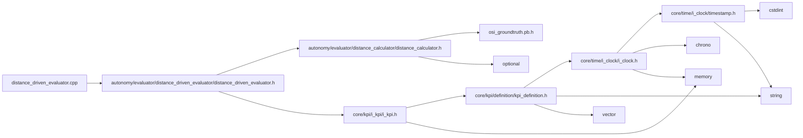

<a id="distance__driven__evaluator_8cpp"></a>
# File distance\_driven\_evaluator.cpp

![][C++]

**Location**: `autonomy/evaluator/distance\_driven\_evaluator/distance\_driven\_evaluator.cpp`


## Namespaces

* [simulation\_framework](namespacesimulation__framework.md#namespacesimulation__framework)
* [simulation\_framework::evaluator](namespacesimulation__framework_1_1evaluator.md#namespacesimulation__framework_1_1evaluator)

## Includes

* [autonomy/evaluator/distance_driven_evaluator/distance_driven_evaluator.h](distance__driven__evaluator_8h.md#distance__driven__evaluator_8h)





## Source


```cpp


#include "autonomy/evaluator/distance_driven_evaluator/distance_driven_evaluator.h"

namespace simulation_framework
{
namespace evaluator
{

DistanceDrivenEvaluator::DistanceDrivenEvaluator(const std::string& kpi_name) : driven_dist_(0.0), kpi_name_(kpi_name)
{
}

void DistanceDrivenEvaluator::Init() {}

void DistanceDrivenEvaluator::Reset()
{
    driven_dist_ = 0.0;
}

core::kpi::KpiContent DistanceDrivenEvaluator::CalculateKpi(const osi3::GroundTruth& ground_truth)
{
    core::kpi::KpiContent kpi_content;
    kpi_content.name = kpi_name_;
    kpi_content.data_type = core::kpi::Datatype::Value::kDouble;
    kpi_content.type = GetKpiType();
    kpi_content.unit = "m";
    kpi_content.timestamp.seconds = ground_truth.timestamp().seconds();
    kpi_content.timestamp.nanoseconds = ground_truth.timestamp().nanos();

    const auto dist_from_last_position = distance_calculator_.Calculate(ground_truth);
    driven_dist_ += dist_from_last_position;
    kpi_content.value = std::to_string(driven_dist_);

    return kpi_content;
}

core::kpi::Type DistanceDrivenEvaluator::GetKpiType() const
{
    return core::kpi::Type::kScalar;
}

}  // namespace evaluator
}  // namespace simulation_framework
```


[public]: https://img.shields.io/badge/-public-brightgreen (public)
[C++]: https://img.shields.io/badge/language-C%2B%2B-blue (C++)
[private]: https://img.shields.io/badge/-private-red (private)
[const]: https://img.shields.io/badge/-const-lightblue (const)
[static]: https://img.shields.io/badge/-static-lightgrey (static)
[protected]: https://img.shields.io/badge/-protected-yellow (protected)