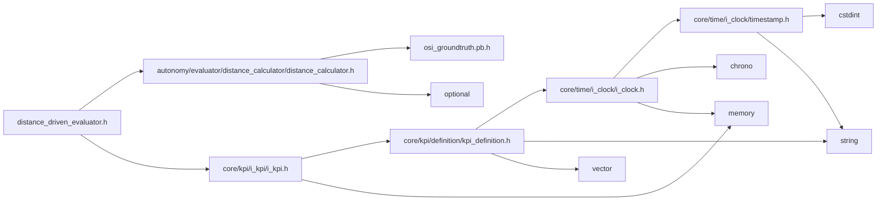
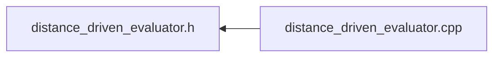

<a id="distance__driven__evaluator_8h"></a>
# File distance\_driven\_evaluator.h

![][C++]

**Location**: `autonomy/evaluator/distance\_driven\_evaluator/distance\_driven\_evaluator.h`


## Classes

* [simulation\_framework::evaluator::DistanceDrivenEvaluator](classsimulation__framework_1_1evaluator_1_1DistanceDrivenEvaluator.md#classsimulation__framework_1_1evaluator_1_1DistanceDrivenEvaluator)

## Namespaces

* [simulation\_framework](namespacesimulation__framework.md#namespacesimulation__framework)
* [evaluator](namespaceevaluator.md#namespaceevaluator)
* [simulation\_framework::evaluator](namespacesimulation__framework_1_1evaluator.md#namespacesimulation__framework_1_1evaluator)

## Includes

* [autonomy/evaluator/distance_calculator/distance_calculator.h](distance__calculator_8h.md#distance__calculator_8h)
* [core/kpi/i_kpi/i_kpi.h](i__kpi_8h.md#i__kpi_8h)





## Included by

* [distance_driven_evaluator.cpp](distance__driven__evaluator_8cpp.md#distance__driven__evaluator_8cpp)





## Source


```cpp


#pragma once

#include "autonomy/evaluator/distance_calculator/distance_calculator.h"
#include "core/kpi/i_kpi/i_kpi.h"

namespace simulation_framework
{

namespace evaluator
{


class DistanceDrivenEvaluator : public core::kpi::IKpi<osi3::GroundTruth>
{
  public:
    DistanceDrivenEvaluator(const std::string& kpi_name = "driven_dist");
    ~DistanceDrivenEvaluator() = default;

    void Init() override;
    void Reset() override;
    core::kpi::KpiContent CalculateKpi(const osi3::GroundTruth& ground_truth) override;
    core::kpi::Type GetKpiType() const override;

  private:
    double driven_dist_;
    std::string kpi_name_;
    core::kpi::KpiContent kpi_content_{};
    DistanceDrivenCalculator distance_calculator_{};
};

}  // namespace evaluator
}  // namespace simulation_framework
```


[public]: https://img.shields.io/badge/-public-brightgreen (public)
[C++]: https://img.shields.io/badge/language-C%2B%2B-blue (C++)
[private]: https://img.shields.io/badge/-private-red (private)
[const]: https://img.shields.io/badge/-const-lightblue (const)
[static]: https://img.shields.io/badge/-static-lightgrey (static)
[protected]: https://img.shields.io/badge/-protected-yellow (protected)