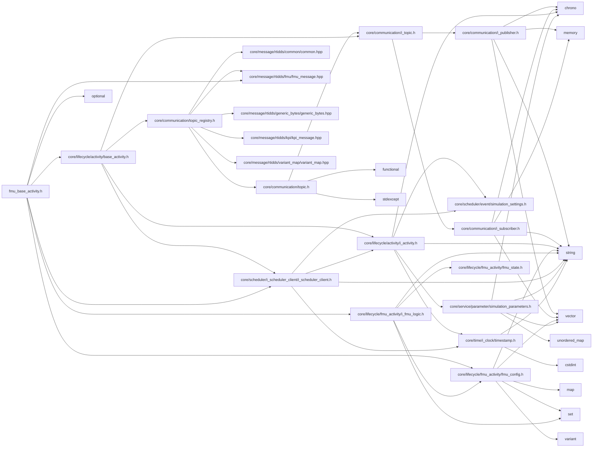

<a id="fmu__base__activity_8h"></a>
# File fmu\_base\_activity.h

![][C++]

**Location**: `core/lifecycle/fmu\_activity/fmu\_base\_activity.h`


## Classes

* [simulation\_framework::core::lifecycle::FmuBaseActivity](classsimulation__framework_1_1core_1_1lifecycle_1_1FmuBaseActivity.md#classsimulation__framework_1_1core_1_1lifecycle_1_1FmuBaseActivity)

## Namespaces

* [simulation\_framework](namespacesimulation__framework.md#namespacesimulation__framework)
* [simulation\_framework::core](namespacesimulation__framework_1_1core.md#namespacesimulation__framework_1_1core)
* [simulation\_framework::core::lifecycle](namespacesimulation__framework_1_1core_1_1lifecycle.md#namespacesimulation__framework_1_1core_1_1lifecycle)

## Includes

* [core/lifecycle/activity/base_activity.h](base__activity_8h.md#base__activity_8h)
* [core/lifecycle/fmu_activity/fmu_config.h](fmu__config_8h.md#fmu__config_8h)
* [core/lifecycle/fmu_activity/i_fmu_logic.h](i__fmu__logic_8h.md#i__fmu__logic_8h)
* core/message/rtidds/fmu/fmu_message.hpp
* [core/scheduler/i_scheduler_client/i_scheduler_client.h](i__scheduler__client_8h.md#i__scheduler__client_8h)
* <optional>





## Source


```cpp


#pragma once

#include "core/lifecycle/activity/base_activity.h"
#include "core/lifecycle/fmu_activity/fmu_config.h"
#include "core/lifecycle/fmu_activity/i_fmu_logic.h"
#include "core/message/rtidds/fmu/fmu_message.hpp"
#include "core/scheduler/i_scheduler_client/i_scheduler_client.h"
#include <optional>

namespace simulation_framework
{
namespace core
{

class CommunicationManager;

namespace lifecycle
{

class FmuBaseActivity : public BaseActivity
{
  public:
    FmuBaseActivity(const std::string& name,
                    std::shared_ptr<CommunicationManager> communication_manager,
                    std::unique_ptr<scheduling::ISchedulerClient> scheduler_client,
                    FmuConfig fmu_config,
                    std::unique_ptr<IFmuLogic> fmu_logic,
                    const std::optional<double> step_size = std::nullopt);

    virtual void ExecuteStep() override;

    virtual void Init() override;

    virtual void AddPublisherAndSubscriber() override;

  protected:
    FmuInOutMap DecodeMessage(const rtidds::FmuMessage& message) const;

    rtidds::FmuMessage EncodeMessage(const FmuInOutMap& outputs) const;

    FmuInOutMap DecodeBytesMessage(const rtidds::GenericBytesMessage& message) const;

    rtidds::GenericBytesMessage EncodeBytesMessage(const FmuInOutMap& outputs) const;

    void AddSubscriberForTopic(const std::string& topic_name, FmuInOutMap& var_map);

    void AddPublisherForTopic(const std::string& topic_name, const FmuInOutMap& var_map);

    FmuConfig fmu_config_{};

    std::unique_ptr<IFmuLogic> fmu_logic_;

    std::optional<double> step_size_;

    FmuTopicToVarMap init_param_topics_to_var_map_{};

    FmuTopicToVarMap input_topics_to_var_map_{};

    FmuTopicToVarMap output_topics_to_var_map_{};
};

}  // namespace lifecycle
}  // namespace core
}  // namespace simulation_framework
```


[public]: https://img.shields.io/badge/-public-brightgreen (public)
[C++]: https://img.shields.io/badge/language-C%2B%2B-blue (C++)
[private]: https://img.shields.io/badge/-private-red (private)
[const]: https://img.shields.io/badge/-const-lightblue (const)
[static]: https://img.shields.io/badge/-static-lightgrey (static)
[protected]: https://img.shields.io/badge/-protected-yellow (protected)