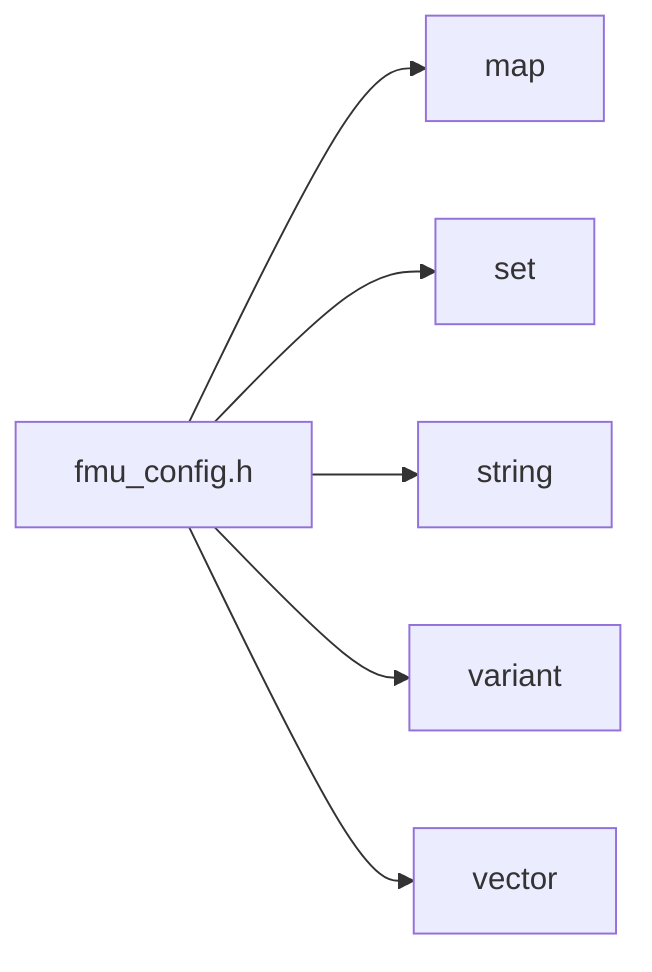
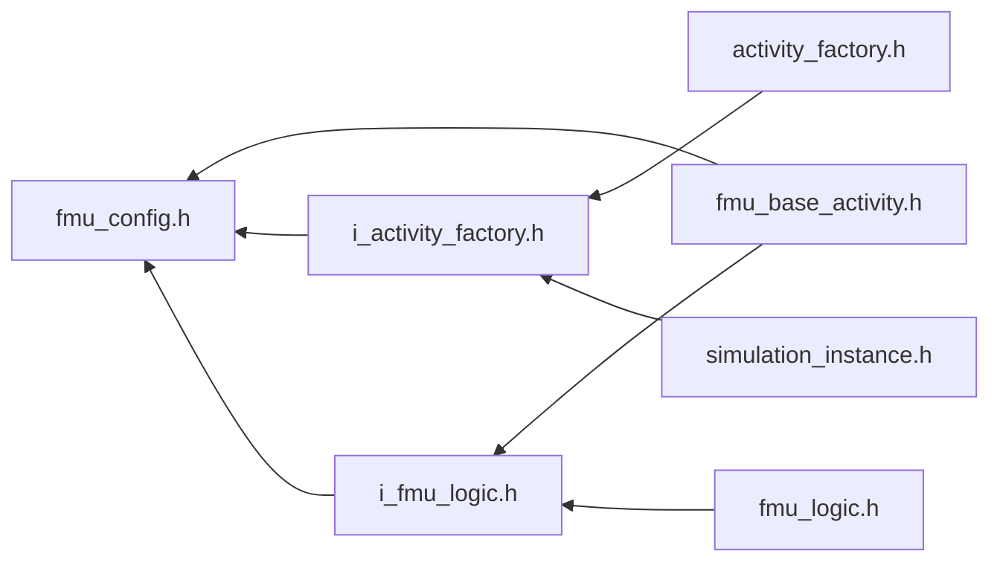

<a id="fmu__config_8h"></a>
# File fmu\_config.h

![][C++]

**Location**: `core/lifecycle/fmu\_activity/fmu\_config.h`


## Classes

* [simulation\_framework::core::lifecycle::FmuConfig](structsimulation__framework_1_1core_1_1lifecycle_1_1FmuConfig.md#structsimulation__framework_1_1core_1_1lifecycle_1_1FmuConfig)

## Namespaces

* [simulation\_framework](namespacesimulation__framework.md#namespacesimulation__framework)
* [simulation\_framework::core](namespacesimulation__framework_1_1core.md#namespacesimulation__framework_1_1core)
* [simulation\_framework::core::lifecycle](namespacesimulation__framework_1_1core_1_1lifecycle.md#namespacesimulation__framework_1_1core_1_1lifecycle)

## Includes

* <map>
* <set>
* <string>
* <variant>
* <vector>





## Included by

* [fmu_base_activity.h](fmu__base__activity_8h.md#fmu__base__activity_8h)
* [i_activity_factory.h](i__activity__factory_8h.md#i__activity__factory_8h)
* [i_fmu_logic.h](i__fmu__logic_8h.md#i__fmu__logic_8h)





## Source


```cpp


#pragma once

#include <map>
#include <set>
#include <string>
#include <variant>
#include <vector>

namespace simulation_framework
{
namespace core
{
namespace lifecycle
{

using FmuInOutType = std::variant<bool, int, double, std::string, std::vector<uint8_t>>;
using FmuInOutMap = std::map<std::string, FmuInOutType>;
using FmuTopicToVarNames = std::map<std::string, std::set<std::string>>;
using FmuTopicToVarMap = std::map<std::string, FmuInOutMap>;
using FmuMessageToVarNames = std::map<std::string, std::string>;
using FmuVarToMessageNames = std::map<std::string, std::string>;

struct FmuConfig
{
    enum class MessageType
    {
        kFmuMessage,
        kGenericBytesMessage
    };

    std::string path;

    FmuTopicToVarNames topics_to_inputs{};

    FmuTopicToVarNames topics_to_init_params{};

    FmuTopicToVarNames topics_to_outputs{};

    FmuMessageToVarNames message_to_var_name{};

    FmuVarToMessageNames var_to_message_name{};

    std::map<std::string, MessageType> topic_to_message_type{};
};

}  // namespace lifecycle
}  // namespace core
}  // namespace simulation_framework
```


[public]: https://img.shields.io/badge/-public-brightgreen (public)
[C++]: https://img.shields.io/badge/language-C%2B%2B-blue (C++)
[private]: https://img.shields.io/badge/-private-red (private)
[const]: https://img.shields.io/badge/-const-lightblue (const)
[static]: https://img.shields.io/badge/-static-lightgrey (static)
[protected]: https://img.shields.io/badge/-protected-yellow (protected)