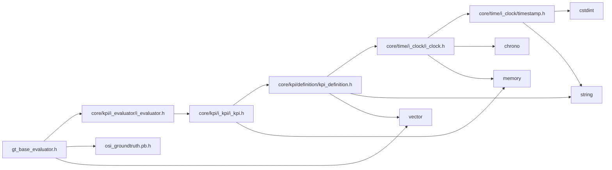

<a id="gt__base__evaluator_8h"></a>
# File gt\_base\_evaluator.h

![][C++]

**Location**: `autonomy/evaluator/gt\_base\_evaluator/gt\_base\_evaluator.h`


## Classes

* [simulation\_framework::evaluator::GtBaseEvaluator](classsimulation__framework_1_1evaluator_1_1GtBaseEvaluator.md#classsimulation__framework_1_1evaluator_1_1GtBaseEvaluator)

## Namespaces

* [simulation\_framework](namespacesimulation__framework.md#namespacesimulation__framework)
* [evaluator](namespaceevaluator.md#namespaceevaluator)
* [simulation\_framework::evaluator](namespacesimulation__framework_1_1evaluator.md#namespacesimulation__framework_1_1evaluator)

## Includes

* [core/kpi/i_evaluator/i_evaluator.h](i__evaluator_8h.md#i__evaluator_8h)
* <osi_groundtruth.pb.h>
* <vector>





## Source


```cpp


#pragma once

#include "core/kpi/i_evaluator/i_evaluator.h"
#include <osi_groundtruth.pb.h>
#include <vector>

namespace simulation_framework
{

namespace evaluator
{

class GtBaseEvaluator : public core::IEvaluator<osi3::GroundTruth>
{
  public:
    GtBaseEvaluator();
    virtual ~GtBaseEvaluator() = default;

    void Init();

    void Reset();

    void Evaluate();

    void AddKpi(std::unique_ptr<core::kpi::IKpi<osi3::GroundTruth>> kpi) override;

    core::kpi::KpiMessage GetKpiMessage() const;

    void SetInput(const osi3::GroundTruth& ground_truth);

  private:
    std::vector<std::unique_ptr<core::kpi::IKpi<osi3::GroundTruth>>> kpis_;

    osi3::GroundTruth ground_truth_;

    core::kpi::KpiMessage kpi_message_{};
};

}  // namespace evaluator
}  // namespace simulation_framework
```


[public]: https://img.shields.io/badge/-public-brightgreen (public)
[C++]: https://img.shields.io/badge/language-C%2B%2B-blue (C++)
[private]: https://img.shields.io/badge/-private-red (private)
[const]: https://img.shields.io/badge/-const-lightblue (const)
[static]: https://img.shields.io/badge/-static-lightgrey (static)
[protected]: https://img.shields.io/badge/-protected-yellow (protected)