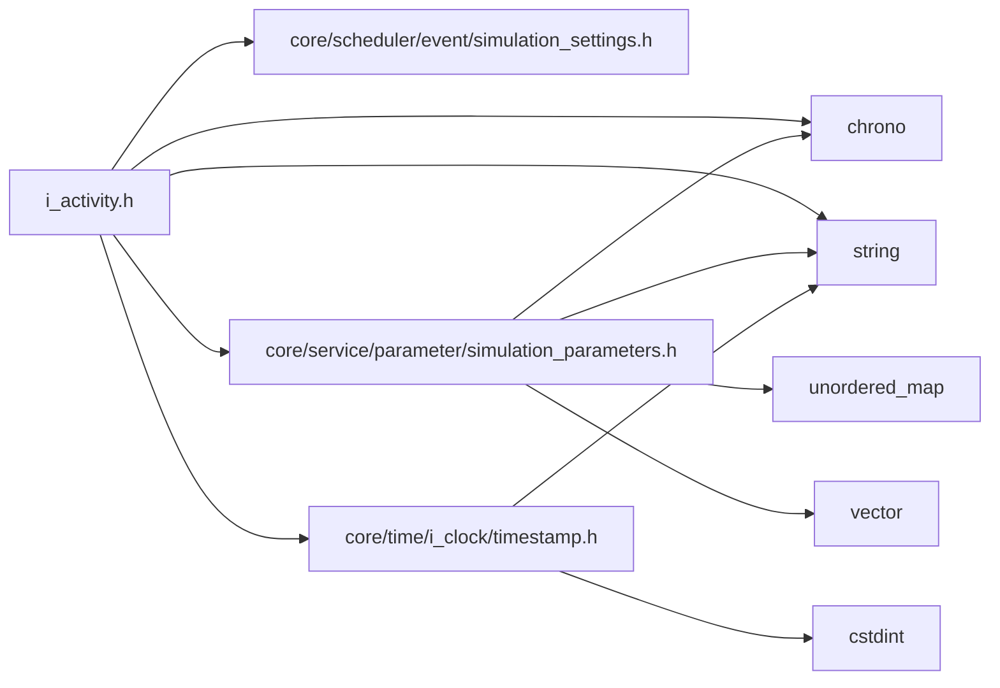
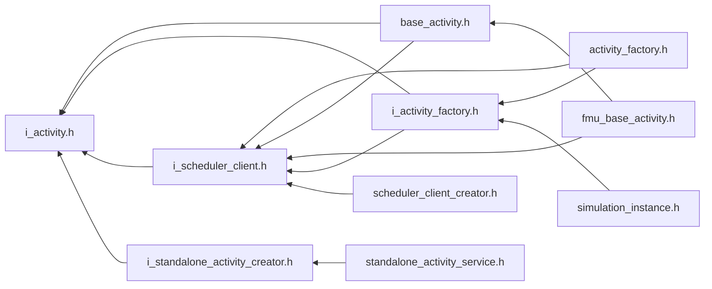

<a id="i__activity_8h"></a>
# File i\_activity.h

![][C++]

**Location**: `core/lifecycle/activity/i\_activity.h`


## Classes

* [simulation\_framework::core::lifecycle::IActivity](classsimulation__framework_1_1core_1_1lifecycle_1_1IActivity.md#classsimulation__framework_1_1core_1_1lifecycle_1_1IActivity)

## Namespaces

* [simulation\_framework](namespacesimulation__framework.md#namespacesimulation__framework)
* [simulation\_framework::core](namespacesimulation__framework_1_1core.md#namespacesimulation__framework_1_1core)
* [simulation\_framework::core::lifecycle](namespacesimulation__framework_1_1core_1_1lifecycle.md#namespacesimulation__framework_1_1core_1_1lifecycle)

## Includes

* core/scheduler/event/simulation_settings.h
* [core/service/parameter/simulation_parameters.h](simulation__parameters_8h.md#simulation__parameters_8h)
* [core/time/i_clock/timestamp.h](timestamp_8h.md#timestamp_8h)
* <chrono>
* <string>





## Included by

* [base_activity.h](base__activity_8h.md#base__activity_8h)
* [i_activity_factory.h](i__activity__factory_8h.md#i__activity__factory_8h)
* [i_scheduler_client.h](i__scheduler__client_8h.md#i__scheduler__client_8h)
* [i_standalone_activity_creator.h](i__standalone__activity__creator_8h.md#i__standalone__activity__creator_8h)





## Source


```cpp


#pragma once

#include "core/scheduler/event/simulation_settings.h"
#include "core/service/parameter/simulation_parameters.h"
#include "core/time/i_clock/timestamp.h"
#include <chrono>
#include <string>

namespace simulation_framework
{
namespace core
{
namespace lifecycle
{

class IActivity
{
  public:
    virtual ~IActivity() = default;

    virtual void Init() = 0;

    virtual void WaitForPubSubConnection() = 0;

    virtual void Step() = 0;

    virtual void Finalize() = 0;

    virtual void Shutdown() = 0;

    virtual std::string GetName() const = 0;

    virtual time::Timestamp GetCurrentTimestamp() const = 0;

    virtual std::chrono::milliseconds GetCycleTime() const = 0;

    virtual const SimulationParameters::CustomizedParameters& GetCustomizedParameters() const = 0;

    virtual std::string GetSimulationOutputDirectory() const = 0;

    virtual void SetUpCommunication() = 0;

    virtual void SetSimulationSettings(const scheduling::SimulationSettings& sim_settings) = 0;
};

}  // namespace lifecycle
}  // namespace core
}  // namespace simulation_framework
```


[public]: https://img.shields.io/badge/-public-brightgreen (public)
[C++]: https://img.shields.io/badge/language-C%2B%2B-blue (C++)
[private]: https://img.shields.io/badge/-private-red (private)
[const]: https://img.shields.io/badge/-const-lightblue (const)
[static]: https://img.shields.io/badge/-static-lightgrey (static)
[protected]: https://img.shields.io/badge/-protected-yellow (protected)