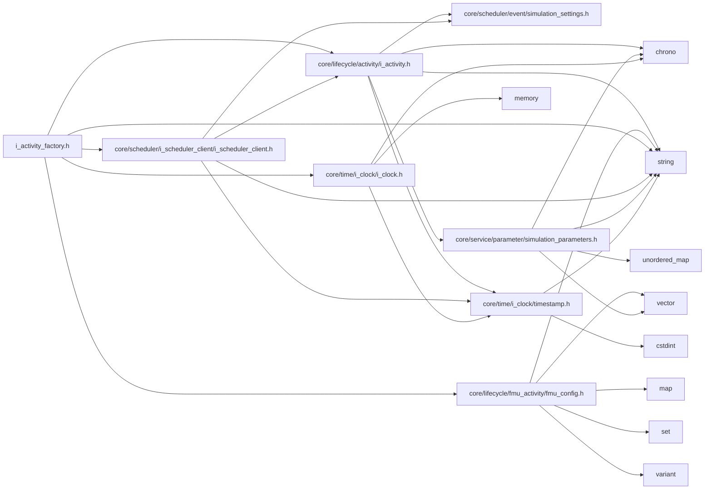
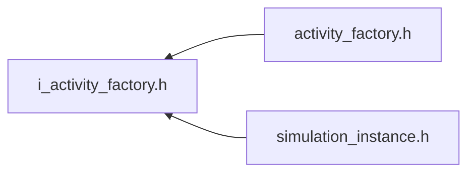

<a id="i__activity__factory_8h"></a>
# File i\_activity\_factory.h

![][C++]

**Location**: `core/lifecycle/i\_activity\_factory/i\_activity\_factory.h`


## Classes

* [simulation\_framework::core::lifecycle::IActivityFactory](classsimulation__framework_1_1core_1_1lifecycle_1_1IActivityFactory.md#classsimulation__framework_1_1core_1_1lifecycle_1_1IActivityFactory)

## Namespaces

* [simulation\_framework](namespacesimulation__framework.md#namespacesimulation__framework)
* [simulation\_framework::core](namespacesimulation__framework_1_1core.md#namespacesimulation__framework_1_1core)
* [simulation\_framework::core::lifecycle](namespacesimulation__framework_1_1core_1_1lifecycle.md#namespacesimulation__framework_1_1core_1_1lifecycle)

## Includes

* [core/lifecycle/activity/i_activity.h](i__activity_8h.md#i__activity_8h)
* [core/lifecycle/fmu_activity/fmu_config.h](fmu__config_8h.md#fmu__config_8h)
* [core/scheduler/i_scheduler_client/i_scheduler_client.h](i__scheduler__client_8h.md#i__scheduler__client_8h)
* [core/time/i_clock/i_clock.h](i__clock_8h.md#i__clock_8h)
* <string>





## Included by

* [activity_factory.h](activity__factory_8h.md#activity__factory_8h)
* [simulation_instance.h](simulation__instance_8h.md#simulation__instance_8h)





## Source


```cpp


#pragma once

#include "core/lifecycle/activity/i_activity.h"
#include "core/lifecycle/fmu_activity/fmu_config.h"
#include "core/scheduler/i_scheduler_client/i_scheduler_client.h"
#include "core/time/i_clock/i_clock.h"
#include <string>

namespace simulation_framework
{
namespace core
{
namespace lifecycle
{

class IActivityFactory
{
  public:
    virtual ~IActivityFactory() = default;

    virtual std::unique_ptr<IActivity> Create(
        const std::string& activity_name,
        const scheduling::SchedulerClientType type = scheduling::SchedulerClientType::kDUMMY) = 0;

    virtual std::unique_ptr<IActivity> CreateFmuActivity(
        const std::string& activity_name,
        const FmuConfig& fmu_config,
        const scheduling::SchedulerClientType type = scheduling::SchedulerClientType::kDUMMY) = 0;

    virtual time::milliseconds GetSimulationBaseCycleTime() const = 0;

    virtual void SetSimulationBaseCycleTime(const time::milliseconds& time) = 0;
};

}  // namespace lifecycle
}  // namespace core
}  // namespace simulation_framework
```


[public]: https://img.shields.io/badge/-public-brightgreen (public)
[C++]: https://img.shields.io/badge/language-C%2B%2B-blue (C++)
[private]: https://img.shields.io/badge/-private-red (private)
[const]: https://img.shields.io/badge/-const-lightblue (const)
[static]: https://img.shields.io/badge/-static-lightgrey (static)
[protected]: https://img.shields.io/badge/-protected-yellow (protected)