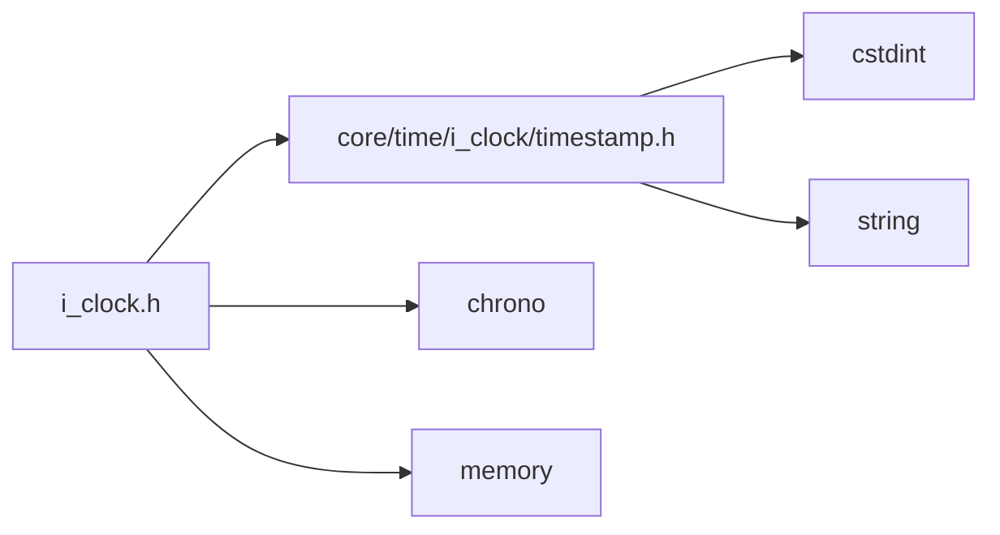
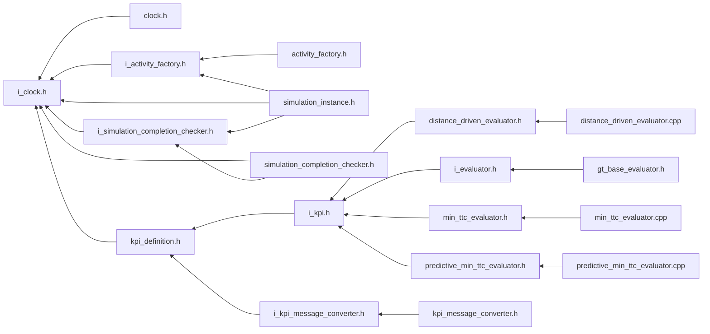

<a id="i__clock_8h"></a>
# File i\_clock.h

![][C++]

**Location**: `core/time/i\_clock/i\_clock.h`


## Classes

* [simulation\_framework::core::time::IClock](classsimulation__framework_1_1core_1_1time_1_1IClock.md#classsimulation__framework_1_1core_1_1time_1_1IClock)

## Namespaces

* [simulation\_framework](namespacesimulation__framework.md#namespacesimulation__framework)
* [simulation\_framework::core](namespacesimulation__framework_1_1core.md#namespacesimulation__framework_1_1core)
* [time](namespacetime.md#namespacetime)
* [simulation\_framework::core::time](namespacesimulation__framework_1_1core_1_1time.md#namespacesimulation__framework_1_1core_1_1time)

## Includes

* [core/time/i_clock/timestamp.h](timestamp_8h.md#timestamp_8h)
* <chrono>
* <memory>





## Included by

* [clock.h](clock_8h.md#clock_8h)
* [i_activity_factory.h](i__activity__factory_8h.md#i__activity__factory_8h)
* [i_simulation_completion_checker.h](i__simulation__completion__checker_8h.md#i__simulation__completion__checker_8h)
* [kpi_definition.h](kpi__definition_8h.md#kpi__definition_8h)
* [simulation_completion_checker.h](simulation__completion__checker_8h.md#simulation__completion__checker_8h)
* [simulation_instance.h](simulation__instance_8h.md#simulation__instance_8h)





## Source


```cpp


#pragma once

#include "core/time/i_clock/timestamp.h"
#include <chrono>
#include <memory>

namespace simulation_framework
{
namespace core
{
namespace time
{

template <class Duration>
using timepoint = std::chrono::time_point<std::chrono::system_clock, Duration>;
using milliseconds = std::chrono::milliseconds;

class IClock
{
  public:
    virtual ~IClock() = default;

    virtual void SetNow(const milliseconds& ms) = 0;

    virtual void SetNow(const Timestamp& timestamp) = 0;

    virtual milliseconds GetNow() const = 0;

    virtual Timestamp GetNowAsTimestamp() const = 0;

    virtual void IncrementBy(const milliseconds& ms) = 0;
};

}  // namespace time
}  // namespace core
}  // namespace simulation_framework
```


[public]: https://img.shields.io/badge/-public-brightgreen (public)
[C++]: https://img.shields.io/badge/language-C%2B%2B-blue (C++)
[private]: https://img.shields.io/badge/-private-red (private)
[const]: https://img.shields.io/badge/-const-lightblue (const)
[static]: https://img.shields.io/badge/-static-lightgrey (static)
[protected]: https://img.shields.io/badge/-protected-yellow (protected)