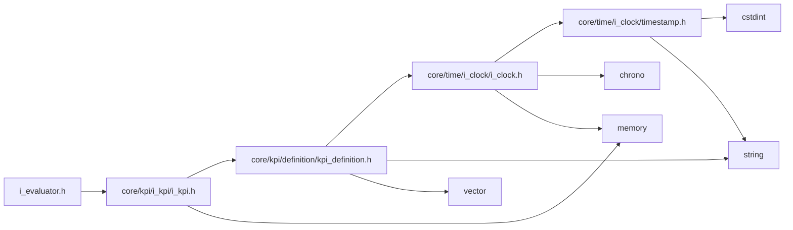
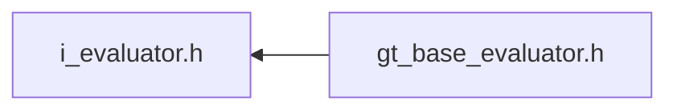

<a id="i__evaluator_8h"></a>
# File i\_evaluator.h

![][C++]

**Location**: `core/kpi/i\_evaluator/i\_evaluator.h`


## Classes

* [simulation\_framework::core::IEvaluator](classsimulation__framework_1_1core_1_1IEvaluator.md#classsimulation__framework_1_1core_1_1IEvaluator)

## Namespaces

* [simulation\_framework](namespacesimulation__framework.md#namespacesimulation__framework)
* [simulation\_framework::core](namespacesimulation__framework_1_1core.md#namespacesimulation__framework_1_1core)

## Includes

* [core/kpi/i_kpi/i_kpi.h](i__kpi_8h.md#i__kpi_8h)





## Included by

* [gt_base_evaluator.h](gt__base__evaluator_8h.md#gt__base__evaluator_8h)





## Source


```cpp


#pragma once

#include "core/kpi/i_kpi/i_kpi.h"

namespace simulation_framework
{
namespace core
{


template <typename T>
class IEvaluator
{
  public:
    virtual ~IEvaluator() = default;

    virtual void Init() = 0;

    virtual void Reset() = 0;

    virtual void Evaluate() = 0;

    // /**
    //  * Add one KPI into this evaluator
    //  * @param kpi iKpi interface
    //  */
    virtual void AddKpi(std::unique_ptr<kpi::IKpi<T>> kpi) = 0;

    virtual core::kpi::KpiMessage GetKpiMessage() const = 0;

    virtual void SetInput(const T& input) = 0;
};

}  // namespace core
}  // namespace simulation_framework
```


[public]: https://img.shields.io/badge/-public-brightgreen (public)
[C++]: https://img.shields.io/badge/language-C%2B%2B-blue (C++)
[private]: https://img.shields.io/badge/-private-red (private)
[const]: https://img.shields.io/badge/-const-lightblue (const)
[static]: https://img.shields.io/badge/-static-lightgrey (static)
[protected]: https://img.shields.io/badge/-protected-yellow (protected)