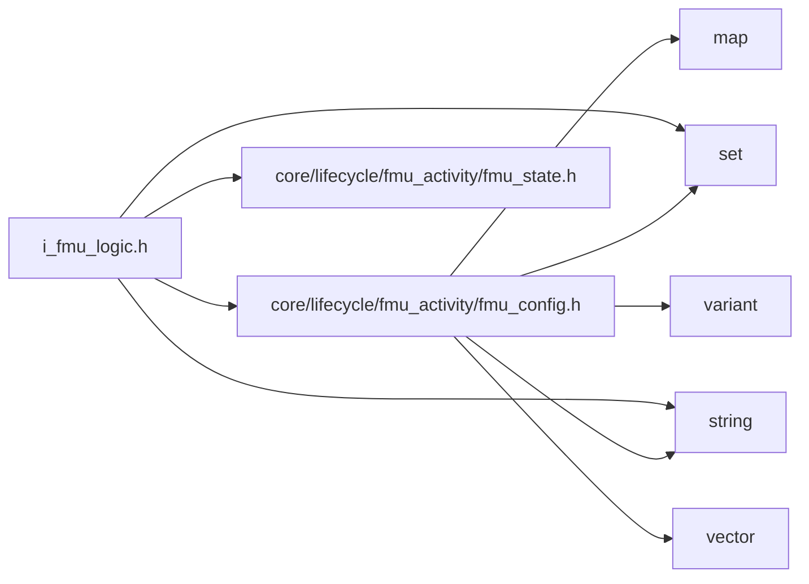
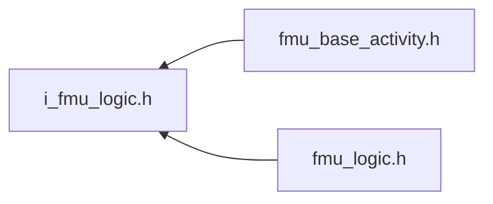

<a id="i__fmu__logic_8h"></a>
# File i\_fmu\_logic.h

![][C++]

**Location**: `core/lifecycle/fmu\_activity/i\_fmu\_logic.h`


## Classes

* [simulation\_framework::core::lifecycle::IFmuLogic](classsimulation__framework_1_1core_1_1lifecycle_1_1IFmuLogic.md#classsimulation__framework_1_1core_1_1lifecycle_1_1IFmuLogic)

## Namespaces

* [simulation\_framework](namespacesimulation__framework.md#namespacesimulation__framework)
* [simulation\_framework::core](namespacesimulation__framework_1_1core.md#namespacesimulation__framework_1_1core)
* [simulation\_framework::core::lifecycle](namespacesimulation__framework_1_1core_1_1lifecycle.md#namespacesimulation__framework_1_1core_1_1lifecycle)

## Includes

* [core/lifecycle/fmu_activity/fmu_config.h](fmu__config_8h.md#fmu__config_8h)
* core/lifecycle/fmu_activity/fmu_state.h
* <set>
* <string>





## Included by

* [fmu_base_activity.h](fmu__base__activity_8h.md#fmu__base__activity_8h)
* [fmu_logic.h](fmu__logic_8h.md#fmu__logic_8h)





## Source


```cpp


#pragma once

#include "core/lifecycle/fmu_activity/fmu_config.h"
#include "core/lifecycle/fmu_activity/fmu_state.h"
#include <set>
#include <string>

namespace simulation_framework
{
namespace core
{

namespace lifecycle
{

class IFmuLogic
{
  public:
    virtual ~IFmuLogic() = default;

    virtual void SetupExperiment(double start = 0, double stop = 0, double tolerance = 0) = 0;

    virtual void EnterInitialization() = 0;

    virtual void ExitInitialization() = 0;

    virtual void Setup(double start = 0, double stop = 0, double tolerance = 0) = 0;

    virtual bool Step(double step_size) = 0;

    virtual FmuInOutMap InitInOutMap(std::set<std::string> variable_names) = 0;

    virtual bool Step(double step_size, const FmuInOutMap& input) = 0;

    virtual void SetInitializationParams(const FmuInOutMap& params) = 0;

    virtual void SetInputs(const FmuInOutMap& inputs) = 0;

    virtual FmuInOutMap GetOutputs() const = 0;

    virtual void GetOutputs(FmuInOutMap& requested_outputs) const = 0;

    virtual FmuState GetFmuState() const = 0;
};

}  // namespace lifecycle
}  // namespace core
}  // namespace simulation_framework
```


[public]: https://img.shields.io/badge/-public-brightgreen (public)
[C++]: https://img.shields.io/badge/language-C%2B%2B-blue (C++)
[private]: https://img.shields.io/badge/-private-red (private)
[const]: https://img.shields.io/badge/-const-lightblue (const)
[static]: https://img.shields.io/badge/-static-lightgrey (static)
[protected]: https://img.shields.io/badge/-protected-yellow (protected)