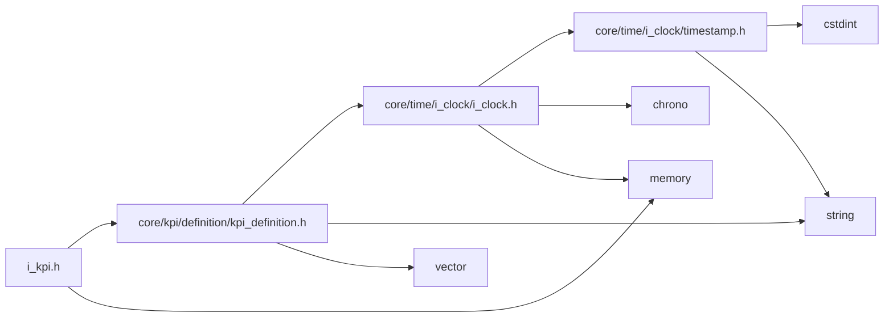
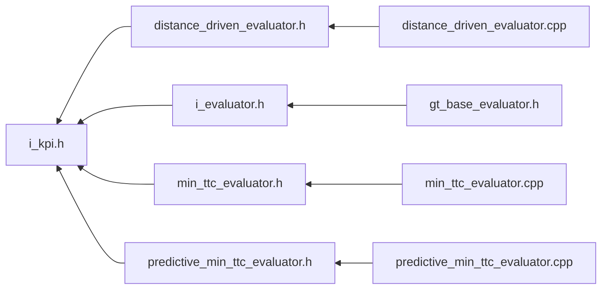

<a id="i__kpi_8h"></a>
# File i\_kpi.h

![][C++]

**Location**: `core/kpi/i\_kpi/i\_kpi.h`


## Classes

* [simulation\_framework::core::kpi::IKpi](classsimulation__framework_1_1core_1_1kpi_1_1IKpi.md#classsimulation__framework_1_1core_1_1kpi_1_1IKpi)

## Namespaces

* [simulation\_framework](namespacesimulation__framework.md#namespacesimulation__framework)
* [core](namespacecore.md#namespacecore)
* [simulation\_framework::core](namespacesimulation__framework_1_1core.md#namespacesimulation__framework_1_1core)
* [kpi](namespacekpi.md#namespacekpi)
* [simulation\_framework::core::kpi](namespacesimulation__framework_1_1core_1_1kpi.md#namespacesimulation__framework_1_1core_1_1kpi)

## Includes

* [core/kpi/definition/kpi_definition.h](kpi__definition_8h.md#kpi__definition_8h)
* <memory>





## Included by

* [distance_driven_evaluator.h](distance__driven__evaluator_8h.md#distance__driven__evaluator_8h)
* [i_evaluator.h](i__evaluator_8h.md#i__evaluator_8h)
* [min_ttc_evaluator.h](min__ttc__evaluator_8h.md#min__ttc__evaluator_8h)
* [predictive_min_ttc_evaluator.h](predictive__min__ttc__evaluator_8h.md#predictive__min__ttc__evaluator_8h)





## Source


```cpp


#pragma once

#include "core/kpi/definition/kpi_definition.h"
#include <memory>

namespace simulation_framework
{
namespace core
{
namespace kpi
{

template <typename T>
class IKpi
{
  public:
    virtual ~IKpi() = default;

    virtual void Init() = 0;

    virtual void Reset() = 0;

    virtual KpiContent CalculateKpi(const T& input) = 0;

    virtual kpi::Type GetKpiType() const = 0;
};

}  // namespace kpi
}  // namespace core
}  // namespace simulation_framework
```


[public]: https://img.shields.io/badge/-public-brightgreen (public)
[C++]: https://img.shields.io/badge/language-C%2B%2B-blue (C++)
[private]: https://img.shields.io/badge/-private-red (private)
[const]: https://img.shields.io/badge/-const-lightblue (const)
[static]: https://img.shields.io/badge/-static-lightgrey (static)
[protected]: https://img.shields.io/badge/-protected-yellow (protected)