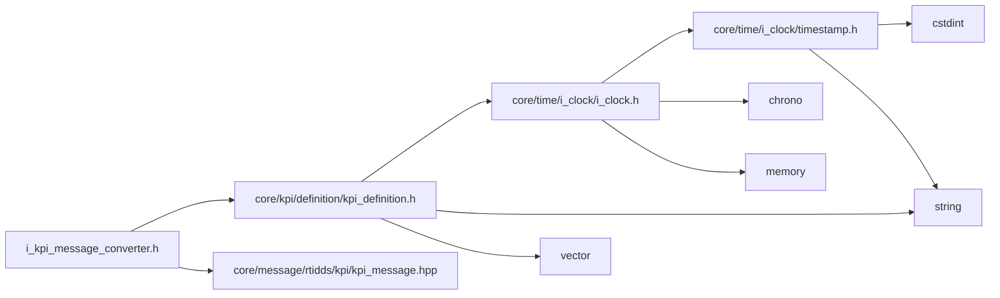
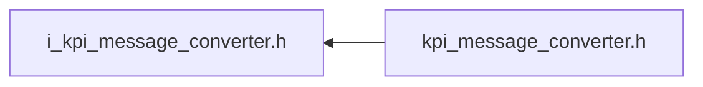

<a id="i__kpi__message__converter_8h"></a>
# File i\_kpi\_message\_converter.h

![][C++]

**Location**: `core/kpi/kpi\_message\_converter/i\_kpi\_message\_converter.h`


## Classes

* [simulation\_framework::core::kpi::IKpiMessageConverter](classsimulation__framework_1_1core_1_1kpi_1_1IKpiMessageConverter.md#classsimulation__framework_1_1core_1_1kpi_1_1IKpiMessageConverter)

## Namespaces

* [simulation\_framework](namespacesimulation__framework.md#namespacesimulation__framework)
* [simulation\_framework::core](namespacesimulation__framework_1_1core.md#namespacesimulation__framework_1_1core)
* [simulation\_framework::core::kpi](namespacesimulation__framework_1_1core_1_1kpi.md#namespacesimulation__framework_1_1core_1_1kpi)

## Includes

* [core/kpi/definition/kpi_definition.h](kpi__definition_8h.md#kpi__definition_8h)
* core/message/rtidds/kpi/kpi_message.hpp





## Included by

* [kpi_message_converter.h](kpi__message__converter_8h.md#kpi__message__converter_8h)





## Source


```cpp


#pragma once

#include "core/kpi/definition/kpi_definition.h"
#include "core/message/rtidds/kpi/kpi_message.hpp"

namespace simulation_framework
{
namespace core
{
namespace kpi
{

class IKpiMessageConverter
{
  public:
    virtual ~IKpiMessageConverter() = default;

    virtual rtidds::KpiMessage ConvertToDds(const KpiMessage& kpi_msgs) = 0;

    virtual KpiMessage DecodeFromDds(const rtidds::KpiMessage& kpi_msgs) = 0;
};

}  // namespace kpi
}  // namespace core
}  // namespace simulation_framework
```


[public]: https://img.shields.io/badge/-public-brightgreen (public)
[C++]: https://img.shields.io/badge/language-C%2B%2B-blue (C++)
[private]: https://img.shields.io/badge/-private-red (private)
[const]: https://img.shields.io/badge/-const-lightblue (const)
[static]: https://img.shields.io/badge/-static-lightgrey (static)
[protected]: https://img.shields.io/badge/-protected-yellow (protected)