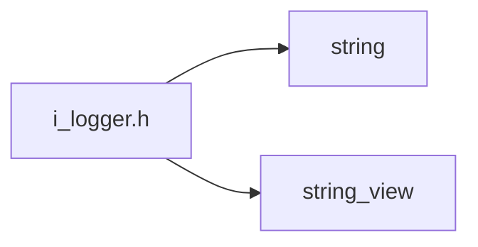
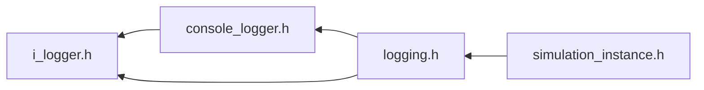

<a id="i__logger_8h"></a>
# File i\_logger.h

![][C++]

**Location**: `core/logging/i\_logger.h`


## Classes

* [simulation\_framework::core::logging::ILogger](classsimulation__framework_1_1core_1_1logging_1_1ILogger.md#classsimulation__framework_1_1core_1_1logging_1_1ILogger)

## Namespaces

* [simulation\_framework](namespacesimulation__framework.md#namespacesimulation__framework)
* [simulation\_framework::core](namespacesimulation__framework_1_1core.md#namespacesimulation__framework_1_1core)
* [simulation\_framework::core::logging](namespacesimulation__framework_1_1core_1_1logging.md#namespacesimulation__framework_1_1core_1_1logging)

## Includes

* <string>
* <string_view>





## Included by

* [console_logger.h](console__logger_8h.md#console__logger_8h)
* [logging.h](logging_8h.md#logging_8h)





## Source


```cpp


#pragma once
#include <string>
#include <string_view>

namespace simulation_framework
{
namespace core
{
namespace logging
{

enum class LogLevel : int
{
    kDebug = 0,
    kInfo,
    kWarning,
    kError,

};

class ILogger
{
  public:
    virtual ~ILogger() = default;

    [[nodiscard]] virtual LogLevel GetCurrentLogLevel() const = 0;

    virtual void SetCurrentLogLevel(LogLevel log_level) = 0;

    virtual void Log(LogLevel level, std::string_view message) = 0;
};

}  // namespace logging
}  // namespace core
}  // namespace simulation_framework
```


[public]: https://img.shields.io/badge/-public-brightgreen (public)
[C++]: https://img.shields.io/badge/language-C%2B%2B-blue (C++)
[private]: https://img.shields.io/badge/-private-red (private)
[const]: https://img.shields.io/badge/-const-lightblue (const)
[static]: https://img.shields.io/badge/-static-lightgrey (static)
[protected]: https://img.shields.io/badge/-protected-yellow (protected)