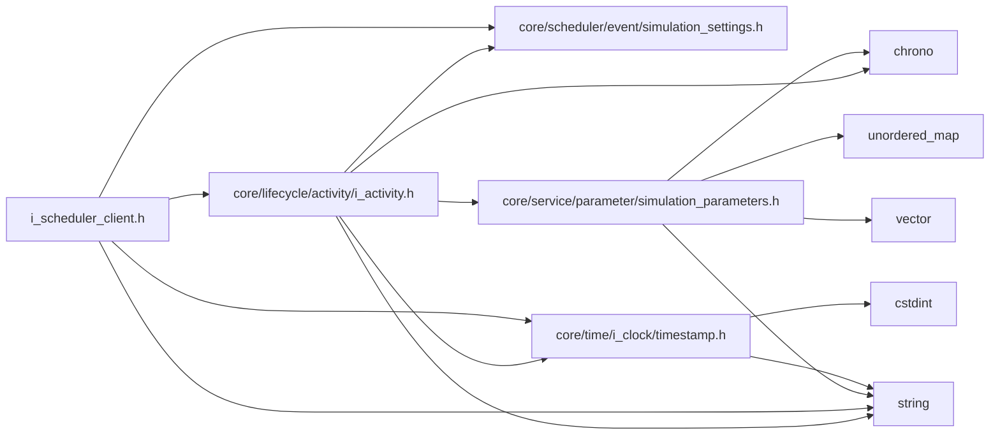
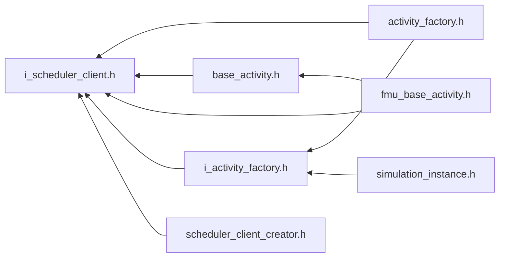

<a id="i__scheduler__client_8h"></a>
# File i\_scheduler\_client.h

![][C++]

**Location**: `core/scheduler/i\_scheduler\_client/i\_scheduler\_client.h`


## Classes

* [simulation\_framework::core::scheduling::ISchedulerClient](classsimulation__framework_1_1core_1_1scheduling_1_1ISchedulerClient.md#classsimulation__framework_1_1core_1_1scheduling_1_1ISchedulerClient)

## Namespaces

* [simulation\_framework](namespacesimulation__framework.md#namespacesimulation__framework)
* [simulation\_framework::core](namespacesimulation__framework_1_1core.md#namespacesimulation__framework_1_1core)
* [simulation\_framework::core::scheduling](namespacesimulation__framework_1_1core_1_1scheduling.md#namespacesimulation__framework_1_1core_1_1scheduling)

## Includes

* [core/lifecycle/activity/i_activity.h](i__activity_8h.md#i__activity_8h)
* core/scheduler/event/simulation_settings.h
* [core/time/i_clock/timestamp.h](timestamp_8h.md#timestamp_8h)
* <string>





## Included by

* [activity_factory.h](activity__factory_8h.md#activity__factory_8h)
* [base_activity.h](base__activity_8h.md#base__activity_8h)
* [fmu_base_activity.h](fmu__base__activity_8h.md#fmu__base__activity_8h)
* [i_activity_factory.h](i__activity__factory_8h.md#i__activity__factory_8h)
* [scheduler_client_creator.h](scheduler__client__creator_8h.md#scheduler__client__creator_8h)





## Source


```cpp


#pragma once

#include "core/lifecycle/activity/i_activity.h"
#include "core/scheduler/event/simulation_settings.h"
#include "core/time/i_clock/timestamp.h"
#include <string>

namespace simulation_framework
{
namespace core
{
namespace scheduling
{

using lifecycle::IActivity;


enum class SchedulerClientType
{
    kRTIDDS = 0,  
    kDUMMY,       
};

class ISchedulerClient
{
  public:
    virtual ~ISchedulerClient() = default;

    virtual void BindActivity(IActivity* activity) = 0;

    virtual bool ShouldStep(const std::string& topic_name) = 0;

    virtual void SendAbort() = 0;

    virtual time::Timestamp GetCurrentTimestamp() const = 0;

    virtual const SimulationSettings& GetSimulationSettings() const = 0;

    virtual bool IsPrimaryActivity() const = 0;

    virtual void SetSimulationSettings(const SimulationSettings& sim_settings) = 0;
};

}  // namespace scheduling
}  // namespace core
}  // namespace simulation_framework
```


[public]: https://img.shields.io/badge/-public-brightgreen (public)
[C++]: https://img.shields.io/badge/language-C%2B%2B-blue (C++)
[private]: https://img.shields.io/badge/-private-red (private)
[const]: https://img.shields.io/badge/-const-lightblue (const)
[static]: https://img.shields.io/badge/-static-lightgrey (static)
[protected]: https://img.shields.io/badge/-protected-yellow (protected)