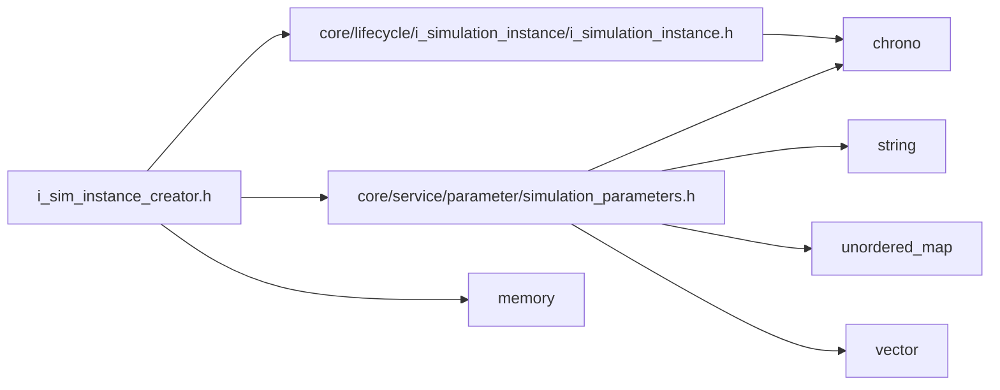
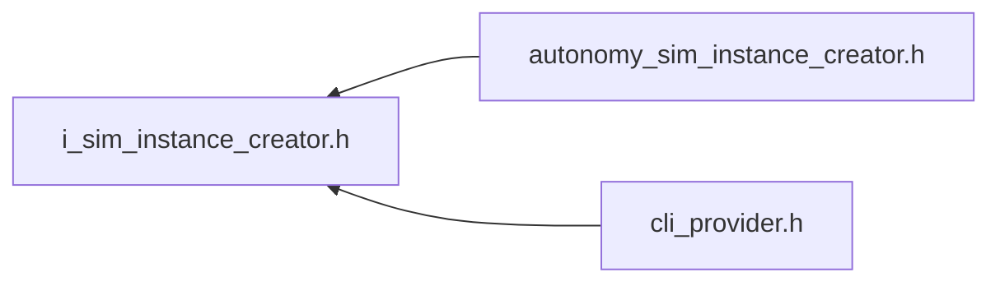

<a id="i__sim__instance__creator_8h"></a>
# File i\_sim\_instance\_creator.h

![][C++]

**Location**: `autonomy/simulation/sim\_instance/i\_sim\_instance\_creator.h`


## Classes

* [simulation\_framework::autonomy::ISimInstanceCreator](classsimulation__framework_1_1autonomy_1_1ISimInstanceCreator.md#classsimulation__framework_1_1autonomy_1_1ISimInstanceCreator)

## Namespaces

* [simulation\_framework](namespacesimulation__framework.md#namespacesimulation__framework)
* [autonomy](namespaceautonomy.md#namespaceautonomy)
* [simulation\_framework::autonomy](namespacesimulation__framework_1_1autonomy.md#namespacesimulation__framework_1_1autonomy)

## Includes

* [core/lifecycle/i_simulation_instance/i_simulation_instance.h](i__simulation__instance_8h.md#i__simulation__instance_8h)
* [core/service/parameter/simulation_parameters.h](simulation__parameters_8h.md#simulation__parameters_8h)
* <memory>





## Included by

* [autonomy_sim_instance_creator.h](autonomy__sim__instance__creator_8h.md#autonomy__sim__instance__creator_8h)
* [cli_provider.h](cli__provider_8h.md#cli__provider_8h)





## Source


```cpp


#pragma once

#include "core/lifecycle/i_simulation_instance/i_simulation_instance.h"
#include "core/service/parameter/simulation_parameters.h"
#include <memory>

namespace simulation_framework
{

namespace autonomy
{

class ISimInstanceCreator
{
  public:
    virtual ~ISimInstanceCreator() = default;

    virtual std::unique_ptr<core::lifecycle::ISimulationInstance> Create(
        const core::SimulationParameters& core_parameters) = 0;
};

}  // namespace autonomy
}  // namespace simulation_framework
```


[public]: https://img.shields.io/badge/-public-brightgreen (public)
[C++]: https://img.shields.io/badge/language-C%2B%2B-blue (C++)
[private]: https://img.shields.io/badge/-private-red (private)
[const]: https://img.shields.io/badge/-const-lightblue (const)
[static]: https://img.shields.io/badge/-static-lightgrey (static)
[protected]: https://img.shields.io/badge/-protected-yellow (protected)