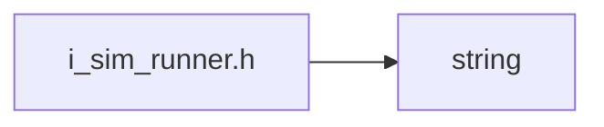
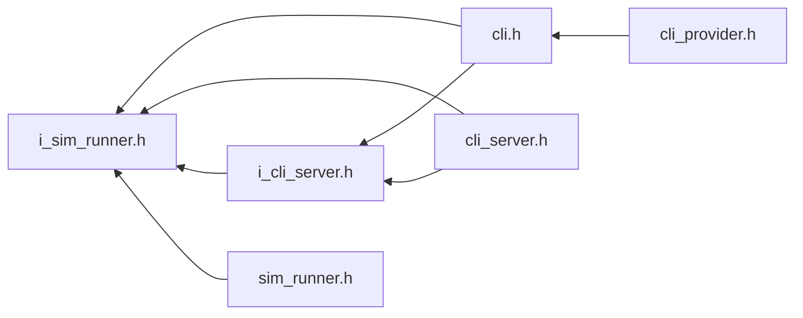

<a id="i__sim__runner_8h"></a>
# File i\_sim\_runner.h

![][C++]

**Location**: `core/service/sim\_runner/i\_sim\_runner.h`


## Classes

* [simulation\_framework::core::StateFeedback](structsimulation__framework_1_1core_1_1StateFeedback.md#structsimulation__framework_1_1core_1_1StateFeedback)
* [simulation\_framework::core::ISimRunner](classsimulation__framework_1_1core_1_1ISimRunner.md#classsimulation__framework_1_1core_1_1ISimRunner)

## Namespaces

* [simulation\_framework](namespacesimulation__framework.md#namespacesimulation__framework)
* [simulation\_framework::core](namespacesimulation__framework_1_1core.md#namespacesimulation__framework_1_1core)

## Includes

* <string>





## Included by

* [cli.h](cli_8h.md#cli_8h)
* [cli_server.h](cli__server_8h.md#cli__server_8h)
* [i_cli_server.h](i__cli__server_8h.md#i__cli__server_8h)
* [sim_runner.h](sim__runner_8h.md#sim__runner_8h)





## Source


```cpp


#pragma once

#include <string>

namespace simulation_framework
{
namespace core
{

struct StateFeedback
{
    bool execute_status;

    std::string error_msg;
};

enum class SimState
{
    kInitialized,  
    kRunning,      
    kPaused,       
    kFinished,     
    kTerminated,   
    kError         
};

class ISimRunner
{
  public:
    virtual ~ISimRunner() = default;

    virtual StateFeedback Run() = 0;

    virtual StateFeedback Pause() = 0;

    virtual StateFeedback Resume() = 0;

    virtual StateFeedback StepN(int n) = 0;

    virtual StateFeedback Stop() = 0;

    virtual StateFeedback Terminate() = 0;

    virtual SimState GetSimulationState() const = 0;

    virtual uint64_t GetExecutedStepCount() const = 0;

    virtual void RunOverSimulation() = 0;
};

}  // namespace core
}  // namespace simulation_framework
```


[public]: https://img.shields.io/badge/-public-brightgreen (public)
[C++]: https://img.shields.io/badge/language-C%2B%2B-blue (C++)
[private]: https://img.shields.io/badge/-private-red (private)
[const]: https://img.shields.io/badge/-const-lightblue (const)
[static]: https://img.shields.io/badge/-static-lightgrey (static)
[protected]: https://img.shields.io/badge/-protected-yellow (protected)