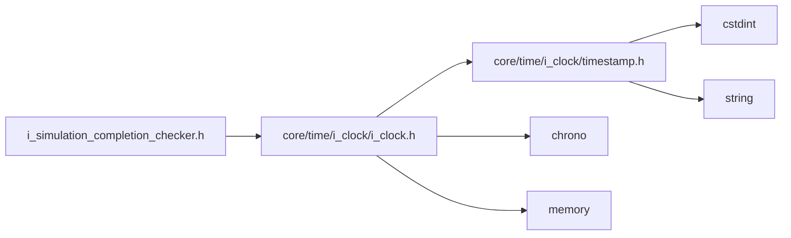
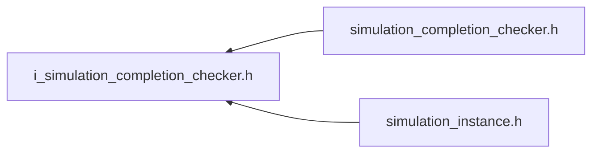

<a id="i__simulation__completion__checker_8h"></a>
# File i\_simulation\_completion\_checker.h

![][C++]

**Location**: `core/time/i\_simulation\_completion\_checker/i\_simulation\_completion\_checker.h`


## Classes

* [simulation\_framework::core::time::ISimulationCompletionChecker](classsimulation__framework_1_1core_1_1time_1_1ISimulationCompletionChecker.md#classsimulation__framework_1_1core_1_1time_1_1ISimulationCompletionChecker)

## Namespaces

* [simulation\_framework](namespacesimulation__framework.md#namespacesimulation__framework)
* [simulation\_framework::core](namespacesimulation__framework_1_1core.md#namespacesimulation__framework_1_1core)
* [simulation\_framework::core::time](namespacesimulation__framework_1_1core_1_1time.md#namespacesimulation__framework_1_1core_1_1time)

## Includes

* [core/time/i_clock/i_clock.h](i__clock_8h.md#i__clock_8h)





## Included by

* [simulation_completion_checker.h](simulation__completion__checker_8h.md#simulation__completion__checker_8h)
* [simulation_instance.h](simulation__instance_8h.md#simulation__instance_8h)





## Source


```cpp


#pragma once

#include "core/time/i_clock/i_clock.h"

namespace simulation_framework
{
namespace core
{
namespace time
{

class ISimulationCompletionChecker
{
  public:
    virtual bool IsSimulationFinished() const = 0;

    virtual ~ISimulationCompletionChecker() = default;

    virtual std::chrono::milliseconds GetSimulationDuration() const = 0;
};

}  // namespace time
}  // namespace core
}  // namespace simulation_framework
```


[public]: https://img.shields.io/badge/-public-brightgreen (public)
[C++]: https://img.shields.io/badge/language-C%2B%2B-blue (C++)
[private]: https://img.shields.io/badge/-private-red (private)
[const]: https://img.shields.io/badge/-const-lightblue (const)
[static]: https://img.shields.io/badge/-static-lightgrey (static)
[protected]: https://img.shields.io/badge/-protected-yellow (protected)