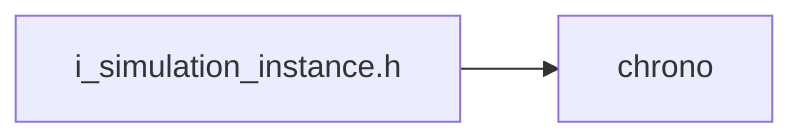
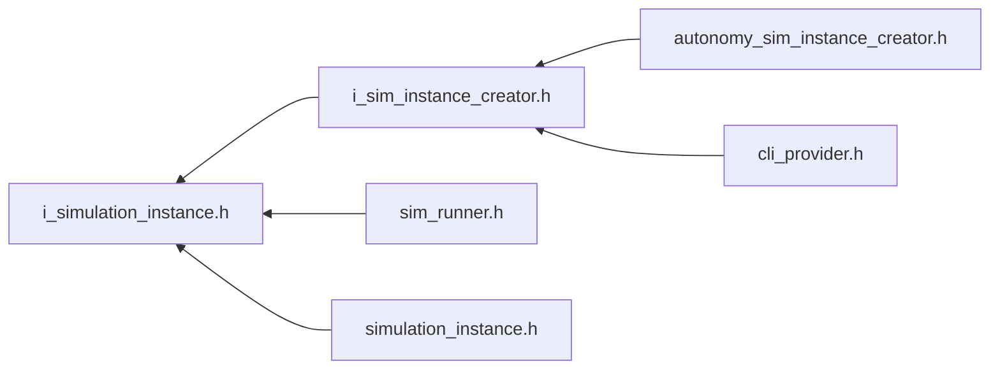

<a id="i__simulation__instance_8h"></a>
# File i\_simulation\_instance.h

![][C++]

**Location**: `core/lifecycle/i\_simulation\_instance/i\_simulation\_instance.h`


## Classes

* [simulation\_framework::core::lifecycle::ISimulationInstance](classsimulation__framework_1_1core_1_1lifecycle_1_1ISimulationInstance.md#classsimulation__framework_1_1core_1_1lifecycle_1_1ISimulationInstance)

## Namespaces

* [simulation\_framework](namespacesimulation__framework.md#namespacesimulation__framework)
* [simulation\_framework::core](namespacesimulation__framework_1_1core.md#namespacesimulation__framework_1_1core)
* [simulation\_framework::core::lifecycle](namespacesimulation__framework_1_1core_1_1lifecycle.md#namespacesimulation__framework_1_1core_1_1lifecycle)

## Includes

* <chrono>





## Included by

* [i_sim_instance_creator.h](i__sim__instance__creator_8h.md#i__sim__instance__creator_8h)
* [sim_runner.h](sim__runner_8h.md#sim__runner_8h)
* [simulation_instance.h](simulation__instance_8h.md#simulation__instance_8h)





## Source


```cpp


#pragma once

#include <chrono>

namespace simulation_framework
{
namespace core
{
namespace lifecycle
{


class ISimulationInstance
{
  public:
    virtual ~ISimulationInstance() = default;

    virtual void StepOnce() = 0;

    virtual void Reset() = 0;

    virtual void Init() = 0;

    virtual bool IsSimulationFinished() = 0;

    virtual bool IsPauseRequested() = 0;

    virtual std::chrono::milliseconds GetSimulationDuration() const = 0;

    virtual std::chrono::milliseconds GetSimulationBaseCycleTime() const = 0;
};

}  // namespace lifecycle
}  // namespace core
}  // namespace simulation_framework
```


[public]: https://img.shields.io/badge/-public-brightgreen (public)
[C++]: https://img.shields.io/badge/language-C%2B%2B-blue (C++)
[private]: https://img.shields.io/badge/-private-red (private)
[const]: https://img.shields.io/badge/-const-lightblue (const)
[static]: https://img.shields.io/badge/-static-lightgrey (static)
[protected]: https://img.shields.io/badge/-protected-yellow (protected)