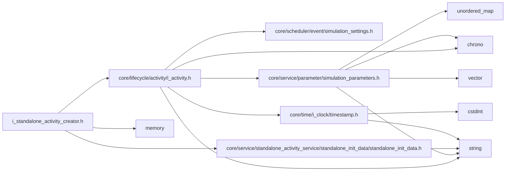
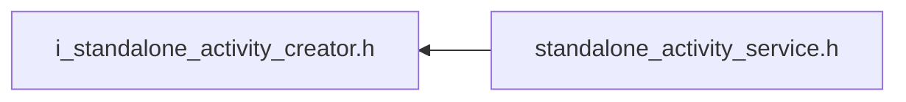

<a id="i__standalone__activity__creator_8h"></a>
# File i\_standalone\_activity\_creator.h

![][C++]

**Location**: `core/service/standalone\_activity\_service/standalone\_activity\_creator/i\_standalone\_activity\_creator.h`


## Classes

* [simulation\_framework::core::IStandaloneActivityCreator](classsimulation__framework_1_1core_1_1IStandaloneActivityCreator.md#classsimulation__framework_1_1core_1_1IStandaloneActivityCreator)

## Namespaces

* [simulation\_framework](namespacesimulation__framework.md#namespacesimulation__framework)
* [simulation\_framework::core](namespacesimulation__framework_1_1core.md#namespacesimulation__framework_1_1core)

## Includes

* [core/lifecycle/activity/i_activity.h](i__activity_8h.md#i__activity_8h)
* [core/service/standalone_activity_service/standalone_init_data/standalone_init_data.h](standalone__init__data_8h.md#standalone__init__data_8h)
* <memory>





## Included by

* [standalone_activity_service.h](standalone__activity__service_8h.md#standalone__activity__service_8h)





## Source


```cpp


#pragma once

#include "core/lifecycle/activity/i_activity.h"
#include "core/service/standalone_activity_service/standalone_init_data/standalone_init_data.h"
#include <memory>

namespace simulation_framework
{
namespace core
{

// clang-format off
class IStandaloneActivityCreator
{
  public:
    virtual ~IStandaloneActivityCreator() = default;

    virtual std::string GetName() = 0;

    virtual std::unique_ptr<core::lifecycle::IActivity> Create(
        [[maybe_unused]] const core::StandaloneInitData& standalone_init_data) = 0;
};
// clang-format on

}  // namespace core
}  // namespace simulation_framework
```


[public]: https://img.shields.io/badge/-public-brightgreen (public)
[C++]: https://img.shields.io/badge/language-C%2B%2B-blue (C++)
[private]: https://img.shields.io/badge/-private-red (private)
[const]: https://img.shields.io/badge/-const-lightblue (const)
[static]: https://img.shields.io/badge/-static-lightgrey (static)
[protected]: https://img.shields.io/badge/-protected-yellow (protected)