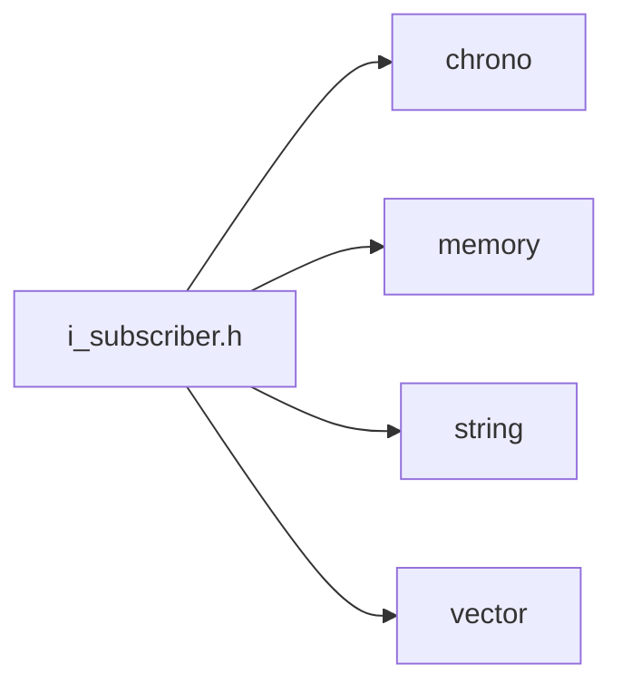
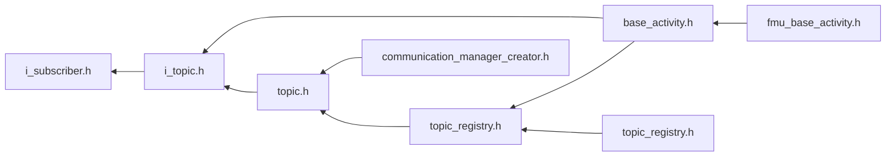

<a id="i__subscriber_8h"></a>
# File i\_subscriber.h

![][C++]

**Location**: `core/communication/i\_subscriber.h`


## Classes

* [simulation\_framework::core::ISubscriber](classsimulation__framework_1_1core_1_1ISubscriber.md#classsimulation__framework_1_1core_1_1ISubscriber)

## Namespaces

* [simulation\_framework](namespacesimulation__framework.md#namespacesimulation__framework)
* [simulation\_framework::core](namespacesimulation__framework_1_1core.md#namespacesimulation__framework_1_1core)

## Includes

* <chrono>
* <memory>
* <string>
* <vector>





## Included by

* [i_topic.h](i__topic_8h.md#i__topic_8h)





## Source


```cpp


#pragma once

#include <chrono>
#include <memory>
#include <string>
#include <vector>

namespace simulation_framework
{
namespace core
{

class ISubscriber
{
  public:
    virtual ~ISubscriber() = default;
    virtual void Execute() = 0;
    virtual void Init() = 0;
    virtual bool WaitForPublisher(std::chrono::milliseconds timeout = std::chrono::milliseconds(60000)) = 0;
};

using Subscribers = std::vector<std::unique_ptr<ISubscriber>>;

}  // namespace core
}  // namespace simulation_framework
```


[public]: https://img.shields.io/badge/-public-brightgreen (public)
[C++]: https://img.shields.io/badge/language-C%2B%2B-blue (C++)
[private]: https://img.shields.io/badge/-private-red (private)
[const]: https://img.shields.io/badge/-const-lightblue (const)
[static]: https://img.shields.io/badge/-static-lightgrey (static)
[protected]: https://img.shields.io/badge/-protected-yellow (protected)