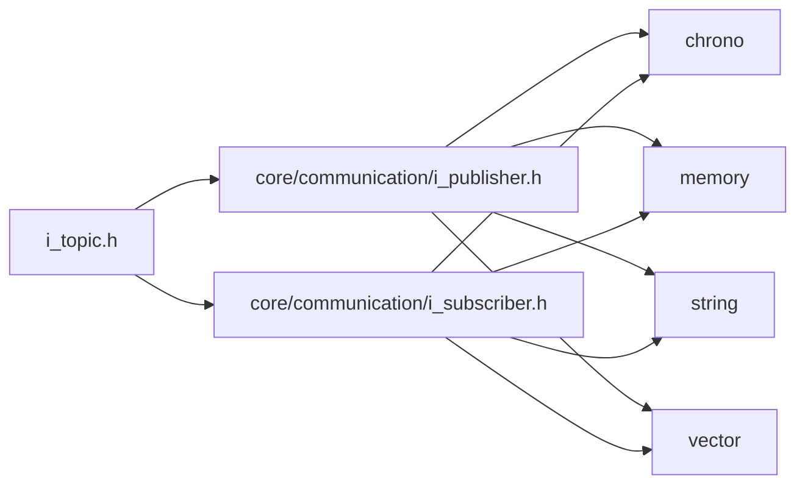
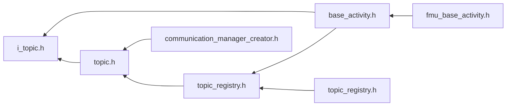

<a id="i__topic_8h"></a>
# File i\_topic.h

![][C++]

**Location**: `core/communication/i\_topic.h`


## Classes

* [simulation\_framework::core::ITopic](classsimulation__framework_1_1core_1_1ITopic.md#classsimulation__framework_1_1core_1_1ITopic)

## Namespaces

* [simulation\_framework](namespacesimulation__framework.md#namespacesimulation__framework)
* [simulation\_framework::core](namespacesimulation__framework_1_1core.md#namespacesimulation__framework_1_1core)

## Includes

* [core/communication/i_publisher.h](i__publisher_8h.md#i__publisher_8h)
* [core/communication/i_subscriber.h](i__subscriber_8h.md#i__subscriber_8h)





## Included by

* [base_activity.h](base__activity_8h.md#base__activity_8h)
* [topic.h](topic_8h.md#topic_8h)





## Source


```cpp


#pragma once

#include "core/communication/i_publisher.h"
#include "core/communication/i_subscriber.h"

namespace simulation_framework
{
namespace core
{

enum class TopicType
{
    kRTIDDS = 0,
    kGRPC
};
using TopicId = std::string;

class ITopic
{
  public:
    virtual ~ITopic() = default;

    virtual TopicId GetId() const = 0;

    virtual TopicType GetType() const = 0;

    virtual std::size_t SubscriberCount() const = 0;

    virtual std::size_t PublisherCount() const = 0;

    virtual void AddPublisher(std::unique_ptr<IPublisher> pub_ptr) = 0;

    virtual void AddSubscriber(std::unique_ptr<ISubscriber> sub_ptr) = 0;

    virtual void ClearPubSub() = 0;

    virtual const Subscribers& GetSubscribers() const = 0;

    virtual const Publishers& GetPublishers() const = 0;
};

using TopicIdVector = std::vector<TopicId>;
using Topics = std::vector<std::shared_ptr<ITopic>>;

}  // namespace core
}  // namespace simulation_framework
```


[public]: https://img.shields.io/badge/-public-brightgreen (public)
[C++]: https://img.shields.io/badge/language-C%2B%2B-blue (C++)
[private]: https://img.shields.io/badge/-private-red (private)
[const]: https://img.shields.io/badge/-const-lightblue (const)
[static]: https://img.shields.io/badge/-static-lightgrey (static)
[protected]: https://img.shields.io/badge/-protected-yellow (protected)