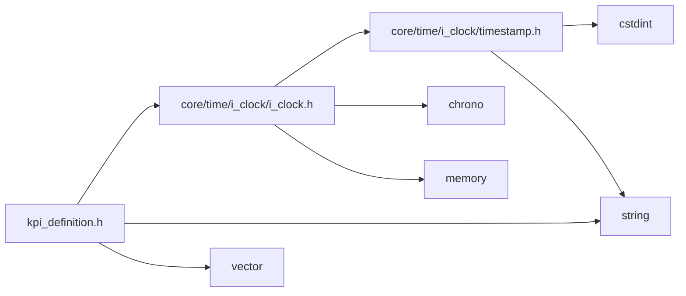
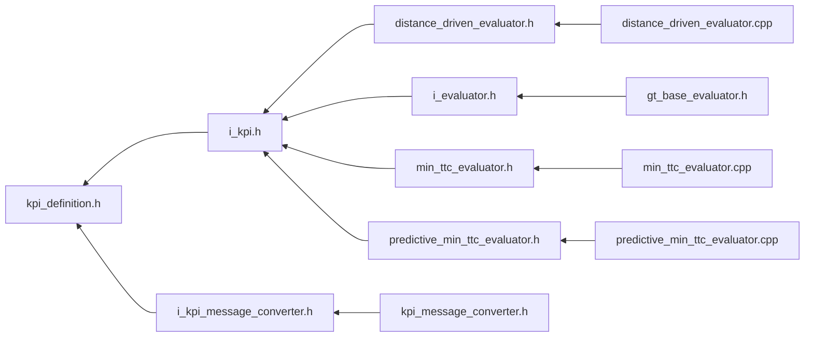

<a id="kpi__definition_8h"></a>
# File kpi\_definition.h

![][C++]

**Location**: `core/kpi/definition/kpi\_definition.h`


## Classes

* [simulation\_framework::core::kpi::Datatype](classsimulation__framework_1_1core_1_1kpi_1_1Datatype.md#classsimulation__framework_1_1core_1_1kpi_1_1Datatype)
* [simulation\_framework::core::kpi::KpiContent](structsimulation__framework_1_1core_1_1kpi_1_1KpiContent.md#structsimulation__framework_1_1core_1_1kpi_1_1KpiContent)

## Namespaces

* [simulation\_framework](namespacesimulation__framework.md#namespacesimulation__framework)
* [simulation\_framework::core](namespacesimulation__framework_1_1core.md#namespacesimulation__framework_1_1core)
* [simulation\_framework::core::kpi](namespacesimulation__framework_1_1core_1_1kpi.md#namespacesimulation__framework_1_1core_1_1kpi)

## Includes

* [core/time/i_clock/i_clock.h](i__clock_8h.md#i__clock_8h)
* <string>
* <vector>





## Included by

* [i_kpi.h](i__kpi_8h.md#i__kpi_8h)
* [i_kpi_message_converter.h](i__kpi__message__converter_8h.md#i__kpi__message__converter_8h)





## Source


```cpp


#pragma once

#include "core/time/i_clock/i_clock.h"
#include <string>
#include <vector>

namespace simulation_framework
{
namespace core
{
namespace kpi
{

enum class Type : uint8_t
{
    kScalar = 0,  
    kTimeSeries,  
    kLog,         
    kOther        
};

class Datatype
{
  public:
    enum class Value : uint8_t
    {
        kDouble = 0,
        kInteger,
        kString,
        kBoolean,
        kJson,
        kOther
    };

    Datatype();
    Datatype(Value value);
    Datatype(const std::string& value_string);

    ~Datatype() = default;

    operator Value() const;

    std::string ToString() const noexcept;
    void FromString(const std::string& value_string) noexcept;

    bool operator==(Datatype other) const;

  private:
    Value value_;
};


struct KpiContent
{
    core::time::Timestamp timestamp;
    std::string name;
    Datatype data_type;
    std::string value;
    std::string unit;
    Type type;
};

inline bool operator==(const core::kpi::KpiContent& lhs, const core::kpi::KpiContent& rhs)
{
    return (lhs.timestamp == rhs.timestamp) && (lhs.name == rhs.name) && (lhs.data_type == rhs.data_type) &&
           (lhs.value == rhs.value) && (lhs.unit == rhs.unit) && (lhs.type == rhs.type);
}

using KpiMessage = std::vector<KpiContent>;

}  // namespace kpi
}  // namespace core
}  // namespace simulation_framework
```


[public]: https://img.shields.io/badge/-public-brightgreen (public)
[C++]: https://img.shields.io/badge/language-C%2B%2B-blue (C++)
[private]: https://img.shields.io/badge/-private-red (private)
[const]: https://img.shields.io/badge/-const-lightblue (const)
[static]: https://img.shields.io/badge/-static-lightgrey (static)
[protected]: https://img.shields.io/badge/-protected-yellow (protected)