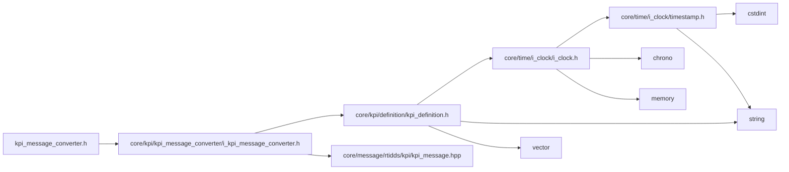

<a id="kpi__message__converter_8h"></a>
# File kpi\_message\_converter.h

![][C++]

**Location**: `core/kpi/kpi\_message\_converter/kpi\_message\_converter.h`


## Classes

* [simulation\_framework::core::kpi::KpiMessageConverter](classsimulation__framework_1_1core_1_1kpi_1_1KpiMessageConverter.md#classsimulation__framework_1_1core_1_1kpi_1_1KpiMessageConverter)

## Namespaces

* [simulation\_framework](namespacesimulation__framework.md#namespacesimulation__framework)
* [simulation\_framework::core](namespacesimulation__framework_1_1core.md#namespacesimulation__framework_1_1core)
* [simulation\_framework::core::kpi](namespacesimulation__framework_1_1core_1_1kpi.md#namespacesimulation__framework_1_1core_1_1kpi)

## Includes

* [core/kpi/kpi_message_converter/i_kpi_message_converter.h](i__kpi__message__converter_8h.md#i__kpi__message__converter_8h)





## Source


```cpp


#pragma once

#include "core/kpi/kpi_message_converter/i_kpi_message_converter.h"

namespace simulation_framework
{
namespace core
{
namespace kpi
{


class KpiMessageConverter : public IKpiMessageConverter
{
  public:
    rtidds::KpiMessage ConvertToDds(const KpiMessage& kpi_msgs) override;
    KpiMessage DecodeFromDds(const rtidds::KpiMessage& kpi_msgs) override;
};

}  // namespace kpi
}  // namespace core
}  // namespace simulation_framework
```


[public]: https://img.shields.io/badge/-public-brightgreen (public)
[C++]: https://img.shields.io/badge/language-C%2B%2B-blue (C++)
[private]: https://img.shields.io/badge/-private-red (private)
[const]: https://img.shields.io/badge/-const-lightblue (const)
[static]: https://img.shields.io/badge/-static-lightgrey (static)
[protected]: https://img.shields.io/badge/-protected-yellow (protected)