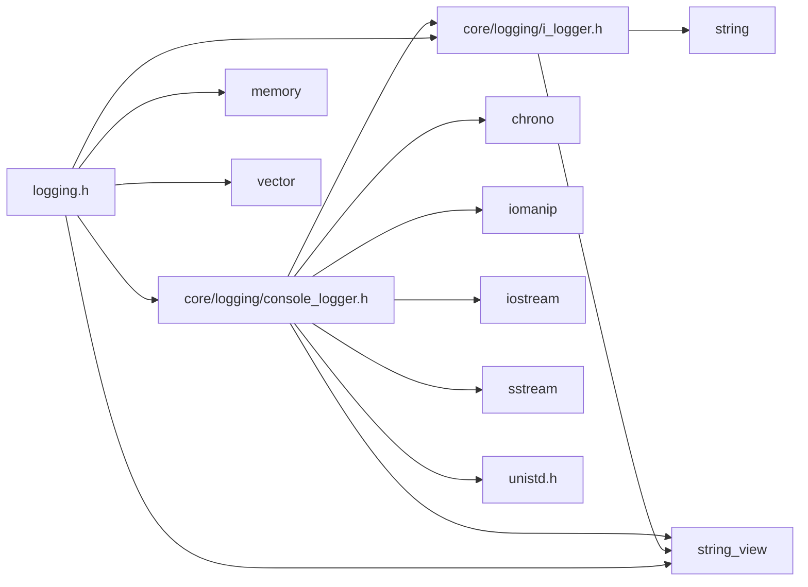

<a id="logging_8h"></a>
# File logging.h

![][C++]

**Location**: `core/logging/logging.h`


## Classes

* [simulation\_framework::core::logging::LoggingInstance](classsimulation__framework_1_1core_1_1logging_1_1LoggingInstance.md#classsimulation__framework_1_1core_1_1logging_1_1LoggingInstance)

## Namespaces

* [simulation\_framework](namespacesimulation__framework.md#namespacesimulation__framework)
* [simulation\_framework::core](namespacesimulation__framework_1_1core.md#namespacesimulation__framework_1_1core)
* [simulation\_framework::core::logging](namespacesimulation__framework_1_1core_1_1logging.md#namespacesimulation__framework_1_1core_1_1logging)

## Includes

* [core/logging/console_logger.h](console__logger_8h.md#console__logger_8h)
* [core/logging/i_logger.h](i__logger_8h.md#i__logger_8h)
* <memory>
* <string_view>
* <vector>





## Included by

* [simulation_instance.h](simulation__instance_8h.md#simulation__instance_8h)


## Source


```cpp


#pragma once

#include "core/logging/console_logger.h"
#include "core/logging/i_logger.h"
#include <memory>
#include <string_view>
#include <vector>

namespace simulation_framework
{
namespace core
{
namespace logging
{

class LoggingInstance
{
  public:
    using ILoggerContainer = std::vector<std::unique_ptr<ILogger>>;

    virtual ~LoggingInstance() = default;

    LoggingInstance(const LoggingInstance&) = delete;
    LoggingInstance& operator=(const LoggingInstance&) = delete;

    static LoggingInstance& GetInstance()
    {
        static LoggingInstance log_instance;
        return log_instance;
    }

    void RegisterLogger(std::unique_ptr<ILogger> logger) { loggers_.push_back(std::move(logger)); }

    void ClearLoggers() { loggers_.clear(); }

    const ILoggerContainer& GetLoggers() const { return loggers_; }

    void Log(LogLevel level, std::string_view message)
    {
        for (const auto& logger : loggers_)
        {
            if (logger)
            {
                logger->Log(level, message);
            }
        }
    }

    void SetLogLevel(LogLevel log_level)
    {
        for (const auto& logger : loggers_)
        {
            if (logger)
            {
                logger->SetCurrentLogLevel(log_level);
            }
        }
    }

  private:
    LoggingInstance() { RegisterLogger(std::make_unique<simulation_framework::core::logging::ConsoleLogger>()); };

    ILoggerContainer loggers_;
};

static inline void SetLogLevel(LogLevel log_level) noexcept
{
    LoggingInstance::GetInstance().SetLogLevel(log_level);
}

static inline void Debug(std::string_view message) noexcept
{
    LoggingInstance::GetInstance().Log(LogLevel::kDebug, message);
}

static inline void Info(std::string_view message) noexcept
{
    LoggingInstance::GetInstance().Log(LogLevel::kInfo, message);
}

static inline void Warning(std::string_view message) noexcept
{
    LoggingInstance::GetInstance().Log(LogLevel::kWarning, message);
}

static inline void Error(std::string_view message) noexcept
{
    LoggingInstance::GetInstance().Log(LogLevel::kError, message);
}

}  // namespace logging
}  // namespace core
}  // namespace simulation_framework
```


[public]: https://img.shields.io/badge/-public-brightgreen (public)
[C++]: https://img.shields.io/badge/language-C%2B%2B-blue (C++)
[private]: https://img.shields.io/badge/-private-red (private)
[const]: https://img.shields.io/badge/-const-lightblue (const)
[static]: https://img.shields.io/badge/-static-lightgrey (static)
[protected]: https://img.shields.io/badge/-protected-yellow (protected)