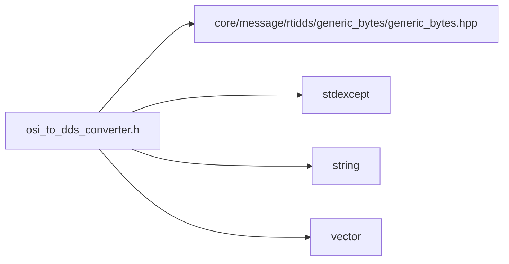

<a id="osi__to__dds__converter_8h"></a>
# File osi\_to\_dds\_converter.h

![][C++]

**Location**: `autonomy/communication/utils/osi\_to\_dds\_converter.h`


## Namespaces

* [simulation\_framework](namespacesimulation__framework.md#namespacesimulation__framework)
* [simulation\_framework::autonomy](namespacesimulation__framework_1_1autonomy.md#namespacesimulation__framework_1_1autonomy)
* [simulation\_framework::autonomy::communication](namespacesimulation__framework_1_1autonomy_1_1communication.md#namespacesimulation__framework_1_1autonomy_1_1communication)
* [simulation\_framework::autonomy::communication::utils](namespacesimulation__framework_1_1autonomy_1_1communication_1_1utils.md#namespacesimulation__framework_1_1autonomy_1_1communication_1_1utils)

## Includes

* core/message/rtidds/generic_bytes/generic_bytes.hpp
* <stdexcept>
* <string>
* <vector>





## Source


```cpp


#pragma once

#include "core/message/rtidds/generic_bytes/generic_bytes.hpp"
#include <stdexcept>
#include <string>
#include <vector>

namespace simulation_framework
{
namespace autonomy
{
namespace communication
{
namespace utils
{

template <typename OsiProtoType>
rtidds::GenericBytesMessage CreateDdsMessageFromOsiProto(const int frame_counter,
                                                         const std::string& header_name,
                                                         const OsiProtoType& osi_proto_msg)
{
    rtidds::GenericBytesMessage generic_msg{};
    generic_msg.header(header_name);
    generic_msg.frame_number(frame_counter);
    generic_msg.timestamp().seconds(osi_proto_msg.timestamp().seconds());
    generic_msg.timestamp().nanoseconds(osi_proto_msg.timestamp().nanos());

    size_t size = osi_proto_msg.ByteSizeLong();
    std::vector<unsigned char> proto_data_in_bytes;
    proto_data_in_bytes.resize(size);

    if (!osi_proto_msg.SerializeToArray(proto_data_in_bytes.data(), size))
    {
        throw std::runtime_error("[CreateDdsMessageFromOsiProto] Failed to serialize OSI proto message to bytes");
    }

    generic_msg.size(size);
    generic_msg.bytes_array(proto_data_in_bytes);
    return generic_msg;
}

template <typename OsiProtoType>
void ParseOsiProtoFromDdsMessage(const rtidds::GenericBytesMessage& dds_msg, OsiProtoType& osi_proto_msg)
{
    if (!osi_proto_msg.ParseFromArray(dds_msg.bytes_array().data(), dds_msg.size()))
    {
        throw std::runtime_error("[ParseOsiProtoFromDdsMessage] Failed to parse OSI proto message from bytes array");
    }
}

}  // namespace utils
}  // namespace communication
}  // namespace autonomy
}  // namespace simulation_framework
```


[public]: https://img.shields.io/badge/-public-brightgreen (public)
[C++]: https://img.shields.io/badge/language-C%2B%2B-blue (C++)
[private]: https://img.shields.io/badge/-private-red (private)
[const]: https://img.shields.io/badge/-const-lightblue (const)
[static]: https://img.shields.io/badge/-static-lightgrey (static)
[protected]: https://img.shields.io/badge/-protected-yellow (protected)