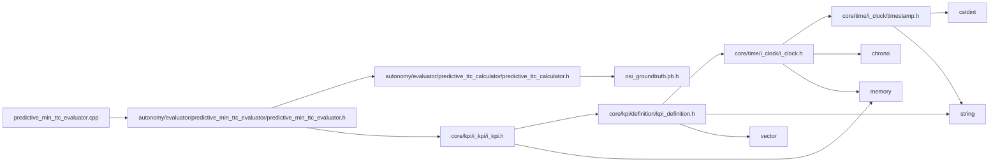

<a id="predictive__min__ttc__evaluator_8cpp"></a>
# File predictive\_min\_ttc\_evaluator.cpp

![][C++]

**Location**: `autonomy/evaluator/predictive\_min\_ttc\_evaluator/predictive\_min\_ttc\_evaluator.cpp`


## Namespaces

* [simulation\_framework](namespacesimulation__framework.md#namespacesimulation__framework)
* [simulation\_framework::evaluator](namespacesimulation__framework_1_1evaluator.md#namespacesimulation__framework_1_1evaluator)

## Includes

* [autonomy/evaluator/predictive_min_ttc_evaluator/predictive_min_ttc_evaluator.h](predictive__min__ttc__evaluator_8h.md#predictive__min__ttc__evaluator_8h)





## Source


```cpp


#include "autonomy/evaluator/predictive_min_ttc_evaluator/predictive_min_ttc_evaluator.h"

namespace simulation_framework
{
namespace evaluator
{

PredictiveMinTtcEvaluator::PredictiveMinTtcEvaluator(const std::string& kpi_name)
    : min_ttc_(std::chrono::milliseconds::max()), kpi_name_(kpi_name)
{
}

void PredictiveMinTtcEvaluator::Init() {}

void PredictiveMinTtcEvaluator::Reset()
{
    min_ttc_ = std::chrono::milliseconds::max();
}

core::kpi::KpiContent PredictiveMinTtcEvaluator::CalculateKpi(const osi3::GroundTruth& ground_truth)
{
    core::kpi::KpiContent kpi_content;
    kpi_content.name = kpi_name_;
    kpi_content.data_type = core::kpi::Datatype::Value::kDouble;
    kpi_content.type = GetKpiType();
    kpi_content.unit = "ms";
    kpi_content.timestamp.seconds = ground_truth.timestamp().seconds();
    kpi_content.timestamp.nanoseconds = ground_truth.timestamp().nanos();

    auto ttc = predictive_ttc_calculator_.Calculate(ground_truth);

    if (ttc < min_ttc_)
    {
        min_ttc_ = ttc;
    }

    kpi_content.value = std::to_string(min_ttc_.count());

    return kpi_content;
}

core::kpi::Type PredictiveMinTtcEvaluator::GetKpiType() const
{
    return core::kpi::Type::kScalar;
}

}  // namespace evaluator
}  // namespace simulation_framework
```


[public]: https://img.shields.io/badge/-public-brightgreen (public)
[C++]: https://img.shields.io/badge/language-C%2B%2B-blue (C++)
[private]: https://img.shields.io/badge/-private-red (private)
[const]: https://img.shields.io/badge/-const-lightblue (const)
[static]: https://img.shields.io/badge/-static-lightgrey (static)
[protected]: https://img.shields.io/badge/-protected-yellow (protected)