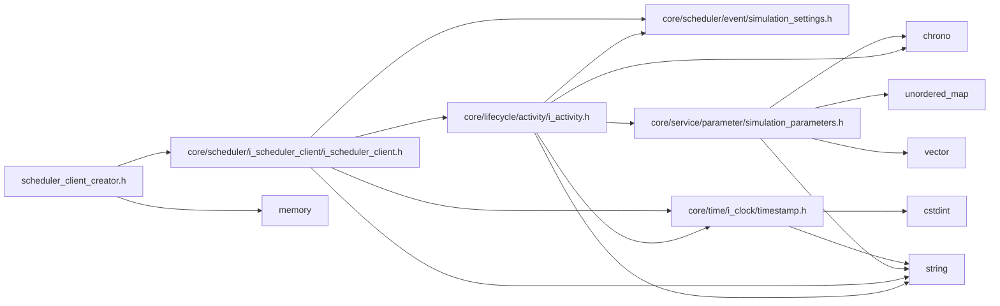

<a id="scheduler__client__creator_8h"></a>
# File scheduler\_client\_creator.h

![][C++]

**Location**: `core/scheduler/scheduler\_client/scheduler\_client\_creator.h`


## Namespaces

* [simulation\_framework](namespacesimulation__framework.md#namespacesimulation__framework)
* [simulation\_framework::core](namespacesimulation__framework_1_1core.md#namespacesimulation__framework_1_1core)
* [simulation\_framework::core::scheduling](namespacesimulation__framework_1_1core_1_1scheduling.md#namespacesimulation__framework_1_1core_1_1scheduling)
* [simulation\_framework::core::scheduling::scheduling\_client\_creator](namespacesimulation__framework_1_1core_1_1scheduling_1_1scheduling__client__creator.md#namespacesimulation__framework_1_1core_1_1scheduling_1_1scheduling__client__creator)

## Includes

* [core/scheduler/i_scheduler_client/i_scheduler_client.h](i__scheduler__client_8h.md#i__scheduler__client_8h)
* <memory>





## Source


```cpp


#pragma once

#include "core/scheduler/i_scheduler_client/i_scheduler_client.h"
#include <memory>

namespace simulation_framework
{
namespace core
{
namespace scheduling
{
namespace scheduling_client_creator
{


std::unique_ptr<ISchedulerClient> Create(const SchedulerClientType type);

}  // namespace scheduling_client_creator
}  // namespace scheduling
}  // namespace core
}  // namespace simulation_framework
```


[public]: https://img.shields.io/badge/-public-brightgreen (public)
[C++]: https://img.shields.io/badge/language-C%2B%2B-blue (C++)
[private]: https://img.shields.io/badge/-private-red (private)
[const]: https://img.shields.io/badge/-const-lightblue (const)
[static]: https://img.shields.io/badge/-static-lightgrey (static)
[protected]: https://img.shields.io/badge/-protected-yellow (protected)