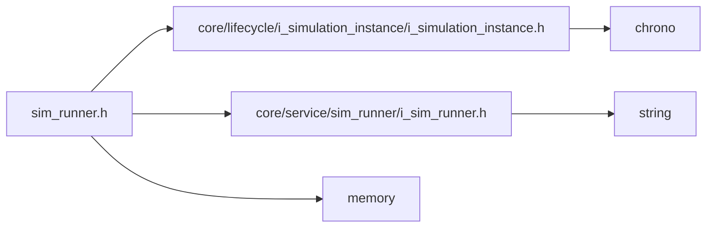

<a id="sim__runner_8h"></a>
# File sim\_runner.h

![][C++]

**Location**: `core/service/sim\_runner/sim\_runner.h`


## Classes

* [simulation\_framework::core::SimRunner](classsimulation__framework_1_1core_1_1SimRunner.md#classsimulation__framework_1_1core_1_1SimRunner)

## Namespaces

* [simulation\_framework](namespacesimulation__framework.md#namespacesimulation__framework)
* [simulation\_framework::core](namespacesimulation__framework_1_1core.md#namespacesimulation__framework_1_1core)

## Includes

* [core/lifecycle/i_simulation_instance/i_simulation_instance.h](i__simulation__instance_8h.md#i__simulation__instance_8h)
* [core/service/sim_runner/i_sim_runner.h](i__sim__runner_8h.md#i__sim__runner_8h)
* <memory>





## Source


```cpp


#pragma once

#include "core/lifecycle/i_simulation_instance/i_simulation_instance.h"
#include "core/service/sim_runner/i_sim_runner.h"
#include <memory>

namespace simulation_framework
{
namespace core
{

class SimRunnerImpl;

class SimRunner final : public ISimRunner
{
  public:
    ~SimRunner();

    explicit SimRunner(std::unique_ptr<lifecycle::ISimulationInstance> sim_instance);

    StateFeedback Run() override;

    StateFeedback Pause() override;

    StateFeedback Resume() override;

    StateFeedback StepN(int n) override;

    StateFeedback Stop() override;

    StateFeedback Terminate() override;

    SimState GetSimulationState() const;

    uint64_t GetExecutedStepCount() const;

    void RunOverSimulation() override;

  private:
    std::unique_ptr<SimRunnerImpl> impl_;
};

}  // namespace core
}  // namespace simulation_framework
```


[public]: https://img.shields.io/badge/-public-brightgreen (public)
[C++]: https://img.shields.io/badge/language-C%2B%2B-blue (C++)
[private]: https://img.shields.io/badge/-private-red (private)
[const]: https://img.shields.io/badge/-const-lightblue (const)
[static]: https://img.shields.io/badge/-static-lightgrey (static)
[protected]: https://img.shields.io/badge/-protected-yellow (protected)