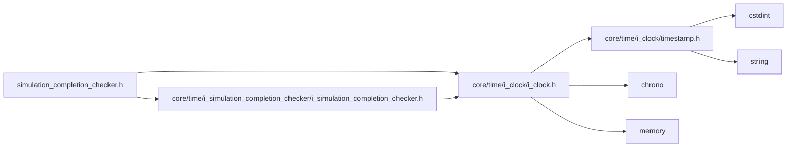

<a id="simulation__completion__checker_8h"></a>
# File simulation\_completion\_checker.h

![][C++]

**Location**: `autonomy/simulation/simulation\_completion\_checker/simulation\_completion\_checker.h`


## Classes

* [simulation\_framework::autonomy::SimulationCompletionChecker](classsimulation__framework_1_1autonomy_1_1SimulationCompletionChecker.md#classsimulation__framework_1_1autonomy_1_1SimulationCompletionChecker)

## Namespaces

* [simulation\_framework](namespacesimulation__framework.md#namespacesimulation__framework)
* [autonomy](namespaceautonomy.md#namespaceautonomy)
* [simulation\_framework::autonomy](namespacesimulation__framework_1_1autonomy.md#namespacesimulation__framework_1_1autonomy)

## Includes

* [core/time/i_clock/i_clock.h](i__clock_8h.md#i__clock_8h)
* [core/time/i_simulation_completion_checker/i_simulation_completion_checker.h](i__simulation__completion__checker_8h.md#i__simulation__completion__checker_8h)





## Source


```cpp


#pragma once

#include "core/time/i_clock/i_clock.h"
#include "core/time/i_simulation_completion_checker/i_simulation_completion_checker.h"

namespace simulation_framework
{

namespace autonomy
{

using namespace core::time;

class SimulationCompletionChecker : public ISimulationCompletionChecker
{
  public:
    SimulationCompletionChecker(std::shared_ptr<core::time::IClock> clock_ptr);

    bool IsSimulationFinished() const;

    std::chrono::milliseconds GetSimulationDuration() const;

  private:
    std::shared_ptr<core::time::IClock> clock_ptr_{};
};

}  // namespace autonomy
}  // namespace simulation_framework
```


[public]: https://img.shields.io/badge/-public-brightgreen (public)
[C++]: https://img.shields.io/badge/language-C%2B%2B-blue (C++)
[private]: https://img.shields.io/badge/-private-red (private)
[const]: https://img.shields.io/badge/-const-lightblue (const)
[static]: https://img.shields.io/badge/-static-lightgrey (static)
[protected]: https://img.shields.io/badge/-protected-yellow (protected)