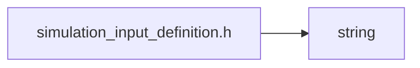

<a id="simulation__input__definition_8h"></a>
# File simulation\_input\_definition.h

![][C++]

**Location**: `autonomy/simulation/sim\_instance/simulation\_input\_definition.h`


## Namespaces

* [simulation\_framework](namespacesimulation__framework.md#namespacesimulation__framework)
* [autonomy](namespaceautonomy.md#namespaceautonomy)
* [simulation\_framework::autonomy](namespacesimulation__framework_1_1autonomy.md#namespacesimulation__framework_1_1autonomy)

## Includes

* <string>





## Source


```cpp


#pragma once

#include <string>

namespace simulation_framework
{

namespace autonomy
{

const static std::string kOpenScenarioFileName{"open_scenario_file"};

const static std::string kGtGenUserSettingsFileName{"user_settings_file"};

const static std::string kDriverInputFileName{"driver_input_file"};

const static std::string kDefaultDriverInputFilePath{
    "/tmp/simulation_framework/default_data/driver_input_default.json"};

const static std::string kDefaultDriverInputFileContent = R"(
{
    "driverInput": [
        {
            "defaultValue": "0",
            "inputSequence": [
                {
                    "endTime": 3.0,
                    "startTime": 1.0,
                    "value": "1"
                }
            ],
            "name": "dummy"
        }
    ]
})";

}  // namespace autonomy
}  // namespace simulation_framework
```


[public]: https://img.shields.io/badge/-public-brightgreen (public)
[C++]: https://img.shields.io/badge/language-C%2B%2B-blue (C++)
[private]: https://img.shields.io/badge/-private-red (private)
[const]: https://img.shields.io/badge/-const-lightblue (const)
[static]: https://img.shields.io/badge/-static-lightgrey (static)
[protected]: https://img.shields.io/badge/-protected-yellow (protected)