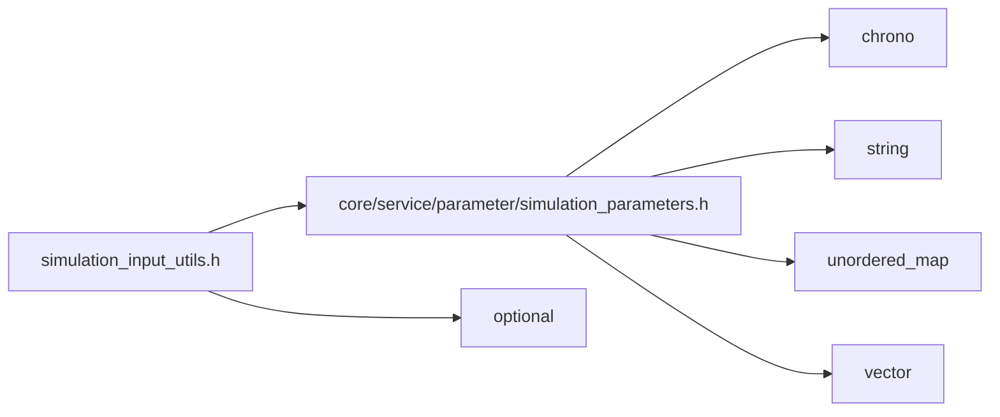

<a id="simulation__input__utils_8h"></a>
# File simulation\_input\_utils.h

![][C++]

**Location**: `autonomy/simulation/sim\_instance/simulation\_input\_utils.h`


## Namespaces

* [simulation\_framework](namespacesimulation__framework.md#namespacesimulation__framework)
* [autonomy](namespaceautonomy.md#namespaceautonomy)
* [simulation\_framework::autonomy](namespacesimulation__framework_1_1autonomy.md#namespacesimulation__framework_1_1autonomy)
* [util](namespaceutil.md#namespaceutil)
* [simulation\_framework::autonomy::util](namespacesimulation__framework_1_1autonomy_1_1util.md#namespacesimulation__framework_1_1autonomy_1_1util)

## Includes

* [core/service/parameter/simulation_parameters.h](simulation__parameters_8h.md#simulation__parameters_8h)
* <optional>





## Source


```cpp


#pragma once

#include "core/service/parameter/simulation_parameters.h"
#include <optional>

namespace simulation_framework
{
namespace autonomy
{

namespace util
{

std::optional<std::string> GetCustomizedParameterByName(const std::string& name,
                                                        const core::SimulationParameters& core_parameters);

std::string GetInputOpenScenarioFilePath(const core::SimulationParameters& core_parameters);

std::string GetGtGenUserSettingsFilePath(const core::SimulationParameters& core_parameters);

std::string GetDriverInputFilePath(const core::SimulationParameters& core_parameters);

}  // namespace util
}  // namespace autonomy
}  // namespace simulation_framework
```


[public]: https://img.shields.io/badge/-public-brightgreen (public)
[C++]: https://img.shields.io/badge/language-C%2B%2B-blue (C++)
[private]: https://img.shields.io/badge/-private-red (private)
[const]: https://img.shields.io/badge/-const-lightblue (const)
[static]: https://img.shields.io/badge/-static-lightgrey (static)
[protected]: https://img.shields.io/badge/-protected-yellow (protected)