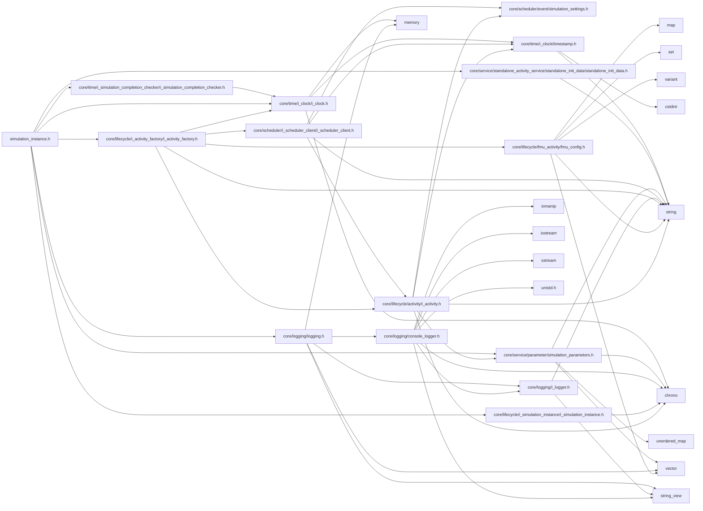

<a id="simulation__instance_8h"></a>
# File simulation\_instance.h

![][C++]

**Location**: `core/lifecycle/simulation\_instance/simulation\_instance.h`


## Classes

* [simulation\_framework::core::lifecycle::SimulationInstance](classsimulation__framework_1_1core_1_1lifecycle_1_1SimulationInstance.md#classsimulation__framework_1_1core_1_1lifecycle_1_1SimulationInstance)

## Namespaces

* [simulation\_framework](namespacesimulation__framework.md#namespacesimulation__framework)
* [simulation\_framework::core](namespacesimulation__framework_1_1core.md#namespacesimulation__framework_1_1core)
* [simulation\_framework::core::lifecycle](namespacesimulation__framework_1_1core_1_1lifecycle.md#namespacesimulation__framework_1_1core_1_1lifecycle)

## Includes

* [core/lifecycle/i_activity_factory/i_activity_factory.h](i__activity__factory_8h.md#i__activity__factory_8h)
* [core/lifecycle/i_simulation_instance/i_simulation_instance.h](i__simulation__instance_8h.md#i__simulation__instance_8h)
* [core/logging/logging.h](logging_8h.md#logging_8h)
* [core/service/parameter/simulation_parameters.h](simulation__parameters_8h.md#simulation__parameters_8h)
* [core/service/standalone_activity_service/standalone_init_data/standalone_init_data.h](standalone__init__data_8h.md#standalone__init__data_8h)
* [core/time/i_clock/i_clock.h](i__clock_8h.md#i__clock_8h)
* [core/time/i_simulation_completion_checker/i_simulation_completion_checker.h](i__simulation__completion__checker_8h.md#i__simulation__completion__checker_8h)





## Source


```cpp


#pragma once

#include "core/lifecycle/i_activity_factory/i_activity_factory.h"
#include "core/lifecycle/i_simulation_instance/i_simulation_instance.h"
#include "core/logging/logging.h"
#include "core/service/parameter/simulation_parameters.h"
#include "core/service/standalone_activity_service/standalone_init_data/standalone_init_data.h"
#include "core/time/i_clock/i_clock.h"
#include "core/time/i_simulation_completion_checker/i_simulation_completion_checker.h"

namespace simulation_framework
{
namespace core
{
namespace lifecycle
{

class SimulationInstanceImpl;


class SimulationInstance final : public ISimulationInstance
{

  public:
    SimulationInstance(std::unique_ptr<IActivityFactory> activity_factory,
                       std::shared_ptr<core::time::IClock> sim_clock,
                       std::unique_ptr<time::ISimulationCompletionChecker> sim_state_checker,
                       const core::StandaloneInitData& standalone_init_data,
                       const core::SimulationParameters& core_parameters);

    SimulationInstance(std::unique_ptr<IActivityFactory> activity_factory,
                       std::shared_ptr<core::time::IClock> sim_clock,
                       std::unique_ptr<time::ISimulationCompletionChecker> sim_state_checker,
                       const core::StandaloneInitData& standalone_init_data,
                       const std::string& scheduling_config_path,
                       const logging::LogLevel log_level = logging::LogLevel::kDebug);

    ~SimulationInstance();

    void Init() override;
    void StepOnce() override;
    void Reset() override;
    bool IsSimulationFinished() override;
    bool IsPauseRequested() override;
    std::chrono::milliseconds GetSimulationDuration() const override;
    std::chrono::milliseconds GetSimulationBaseCycleTime() const override;

  private:
    std::unique_ptr<SimulationInstanceImpl> impl_;
};

}  // namespace lifecycle
}  // namespace core
}  // namespace simulation_framework
```


[public]: https://img.shields.io/badge/-public-brightgreen (public)
[C++]: https://img.shields.io/badge/language-C%2B%2B-blue (C++)
[private]: https://img.shields.io/badge/-private-red (private)
[const]: https://img.shields.io/badge/-const-lightblue (const)
[static]: https://img.shields.io/badge/-static-lightgrey (static)
[protected]: https://img.shields.io/badge/-protected-yellow (protected)