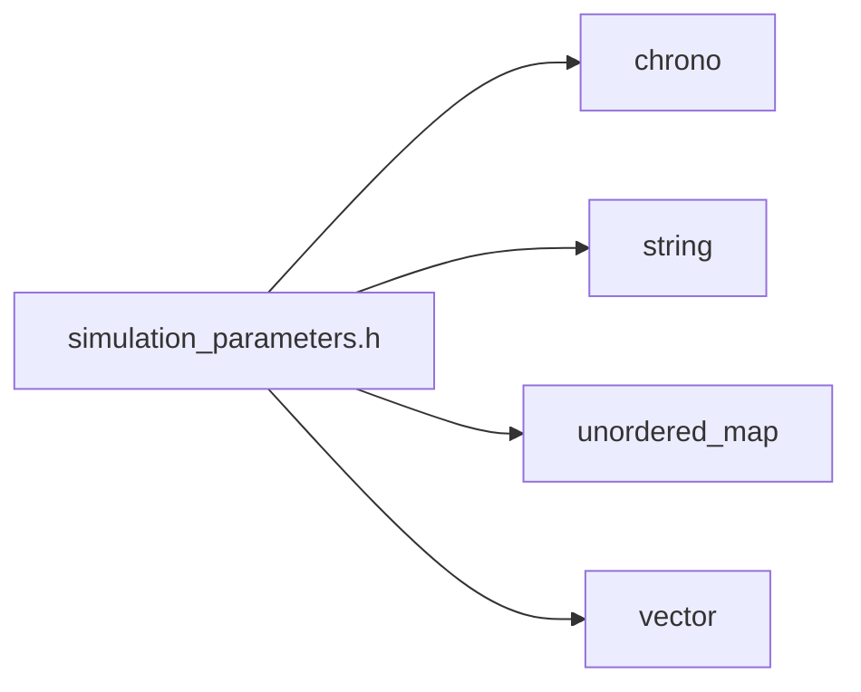
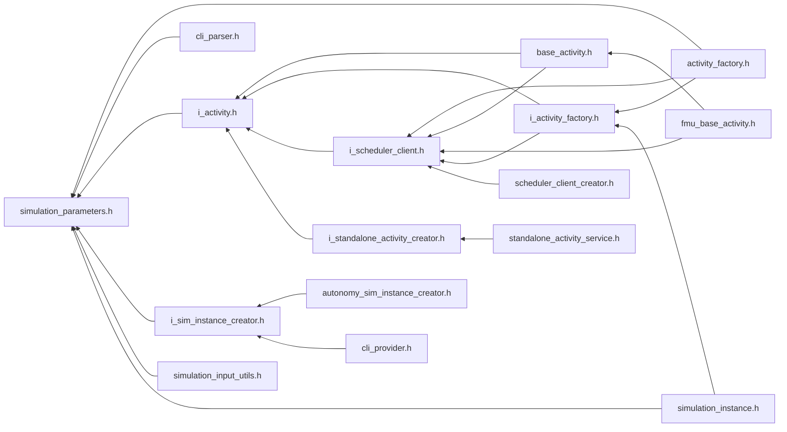

<a id="simulation__parameters_8h"></a>
# File simulation\_parameters.h

![][C++]

**Location**: `core/service/parameter/simulation\_parameters.h`


## Classes

* [simulation\_framework::core::SimulationParameters](structsimulation__framework_1_1core_1_1SimulationParameters.md#structsimulation__framework_1_1core_1_1SimulationParameters)

## Namespaces

* [simulation\_framework](namespacesimulation__framework.md#namespacesimulation__framework)
* [simulation\_framework::core](namespacesimulation__framework_1_1core.md#namespacesimulation__framework_1_1core)

## Includes

* <chrono>
* <string>
* <unordered_map>
* <vector>





## Included by

* [activity_factory.h](activity__factory_8h.md#activity__factory_8h)
* [cli_parser.h](cli__parser_8h.md#cli__parser_8h)
* [i_activity.h](i__activity_8h.md#i__activity_8h)
* [i_sim_instance_creator.h](i__sim__instance__creator_8h.md#i__sim__instance__creator_8h)
* [simulation_input_utils.h](simulation__input__utils_8h.md#simulation__input__utils_8h)
* [simulation_instance.h](simulation__instance_8h.md#simulation__instance_8h)





## Source


```cpp


#pragma once

#include <chrono>
#include <string>
#include <unordered_map>
#include <vector>

namespace simulation_framework
{
namespace core
{

struct SimulationParameters
{
    using CustomizedParameters = std::unordered_map<std::string, std::string>;

    static constexpr size_t kMaxCustomizedParamNameLength = 64;
    static constexpr size_t kMaxCustomizedParamValueLength = 1024;
    std::string version = "";

    std::string log_level = "Debug";

    std::string id = "";

    std::string simulation_config = "";

    std::string scheduling_config = "";

    std::string output_directory = "./";

    CustomizedParameters customized_parameters = {};

    std::string cli_control_grpc_address = "localhost:50051";

    bool cli_control_mode_enabled = false;

    std::chrono::milliseconds scheduler_event_timeout = std::chrono::milliseconds(60000);

    float timescale_factor = -1.0f;

    bool debugger_enabled = false;

    std::string breakpoints_file_path = "";
};

}  // namespace core
}  // namespace simulation_framework
```


[public]: https://img.shields.io/badge/-public-brightgreen (public)
[C++]: https://img.shields.io/badge/language-C%2B%2B-blue (C++)
[private]: https://img.shields.io/badge/-private-red (private)
[const]: https://img.shields.io/badge/-const-lightblue (const)
[static]: https://img.shields.io/badge/-static-lightgrey (static)
[protected]: https://img.shields.io/badge/-protected-yellow (protected)