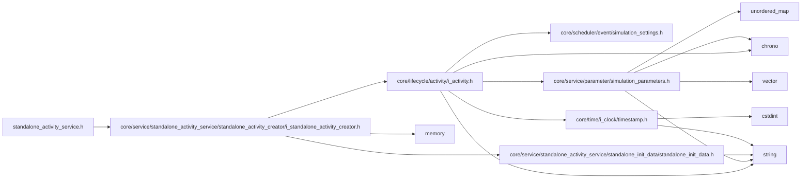

<a id="standalone__activity__service_8h"></a>
# File standalone\_activity\_service.h

![][C++]

**Location**: `core/service/standalone\_activity\_service/standalone\_activity\_service.h`


## Classes

* [simulation\_framework::core::StandaloneActivityService](classsimulation__framework_1_1core_1_1StandaloneActivityService.md#classsimulation__framework_1_1core_1_1StandaloneActivityService)

## Namespaces

* [simulation\_framework](namespacesimulation__framework.md#namespacesimulation__framework)
* [simulation\_framework::core](namespacesimulation__framework_1_1core.md#namespacesimulation__framework_1_1core)

## Includes

* [core/service/standalone_activity_service/standalone_activity_creator/i_standalone_activity_creator.h](i__standalone__activity__creator_8h.md#i__standalone__activity__creator_8h)





## Source


```cpp


#pragma once

#include "core/service/standalone_activity_service/standalone_activity_creator/i_standalone_activity_creator.h"

namespace simulation_framework
{
namespace core
{

class StandaloneActivityService final
{
  public:
    StandaloneActivityService(std::unique_ptr<IStandaloneActivityCreator> standalone_activity_creator);
    ~StandaloneActivityService();

    int Run();
};

}  // namespace core
}  // namespace simulation_framework
```


[public]: https://img.shields.io/badge/-public-brightgreen (public)
[C++]: https://img.shields.io/badge/language-C%2B%2B-blue (C++)
[private]: https://img.shields.io/badge/-private-red (private)
[const]: https://img.shields.io/badge/-const-lightblue (const)
[static]: https://img.shields.io/badge/-static-lightgrey (static)
[protected]: https://img.shields.io/badge/-protected-yellow (protected)