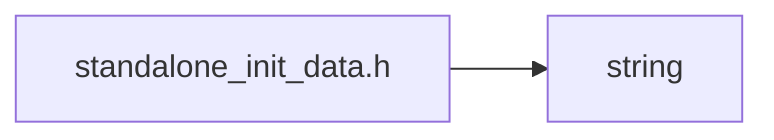
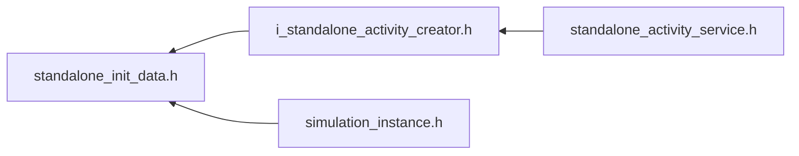

<a id="standalone__init__data_8h"></a>
# File standalone\_init\_data.h

![][C++]

**Location**: `core/service/standalone\_activity\_service/standalone\_init\_data/standalone\_init\_data.h`


## Classes

* [simulation\_framework::core::StandaloneInitData](structsimulation__framework_1_1core_1_1StandaloneInitData.md#structsimulation__framework_1_1core_1_1StandaloneInitData)

## Namespaces

* [simulation\_framework](namespacesimulation__framework.md#namespacesimulation__framework)
* [simulation\_framework::core](namespacesimulation__framework_1_1core.md#namespacesimulation__framework_1_1core)

## Includes

* <string>





## Included by

* [i_standalone_activity_creator.h](i__standalone__activity__creator_8h.md#i__standalone__activity__creator_8h)
* [simulation_instance.h](simulation__instance_8h.md#simulation__instance_8h)





## Source


```cpp


#pragma once

#include <string>

namespace simulation_framework
{
namespace core
{

struct StandaloneInitData
{
    std::string input_file_stream;

    std::uint32_t primary_activity_cycle_time_in_ms;
};

bool operator==(const StandaloneInitData& lhs, const StandaloneInitData& rhs);

}  // namespace core
}  // namespace simulation_framework
```


[public]: https://img.shields.io/badge/-public-brightgreen (public)
[C++]: https://img.shields.io/badge/language-C%2B%2B-blue (C++)
[private]: https://img.shields.io/badge/-private-red (private)
[const]: https://img.shields.io/badge/-const-lightblue (const)
[static]: https://img.shields.io/badge/-static-lightgrey (static)
[protected]: https://img.shields.io/badge/-protected-yellow (protected)