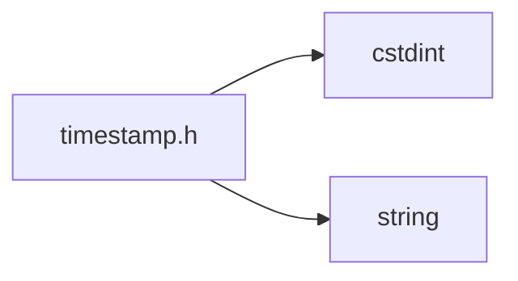
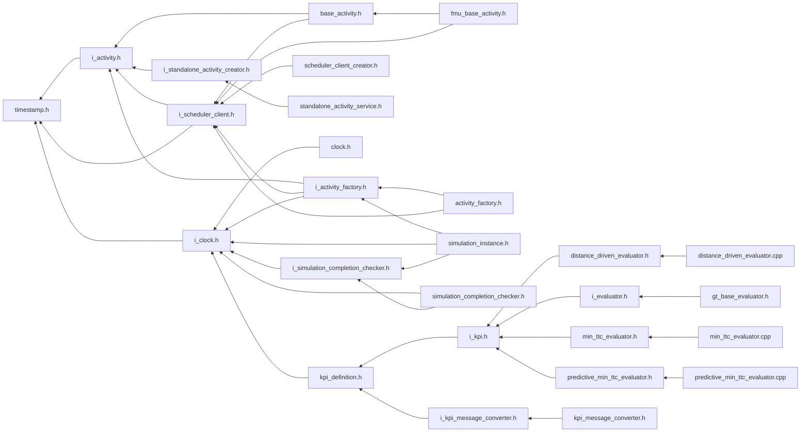

<a id="timestamp_8h"></a>
# File timestamp.h

![][C++]

**Location**: `core/time/i\_clock/timestamp.h`


## Classes

* [simulation\_framework::core::time::Timestamp](structsimulation__framework_1_1core_1_1time_1_1Timestamp.md#structsimulation__framework_1_1core_1_1time_1_1Timestamp)

## Namespaces

* [simulation\_framework](namespacesimulation__framework.md#namespacesimulation__framework)
* [simulation\_framework::core](namespacesimulation__framework_1_1core.md#namespacesimulation__framework_1_1core)
* [simulation\_framework::core::time](namespacesimulation__framework_1_1core_1_1time.md#namespacesimulation__framework_1_1core_1_1time)

## Includes

* <cstdint>
* <string>





## Included by

* [i_activity.h](i__activity_8h.md#i__activity_8h)
* [i_clock.h](i__clock_8h.md#i__clock_8h)
* [i_scheduler_client.h](i__scheduler__client_8h.md#i__scheduler__client_8h)





## Source


```cpp


#pragma once

#include <cstdint>
#include <string>

namespace simulation_framework
{
namespace core
{
namespace time
{

struct Timestamp
{
    uint32_t seconds;
    uint32_t nanoseconds;
    std::string DebugString() const
    {
        return "Simulation timestamp: " + std::to_string(seconds) + " second and " + std::to_string(nanoseconds) +
               " nanos ";
    }
};

inline bool operator==(const Timestamp& lhs, const Timestamp& rhs)
{
    return (lhs.seconds == rhs.seconds) && (lhs.nanoseconds == rhs.nanoseconds);
}

}  // namespace time
}  // namespace core
}  // namespace simulation_framework
```


[public]: https://img.shields.io/badge/-public-brightgreen (public)
[C++]: https://img.shields.io/badge/language-C%2B%2B-blue (C++)
[private]: https://img.shields.io/badge/-private-red (private)
[const]: https://img.shields.io/badge/-const-lightblue (const)
[static]: https://img.shields.io/badge/-static-lightgrey (static)
[protected]: https://img.shields.io/badge/-protected-yellow (protected)