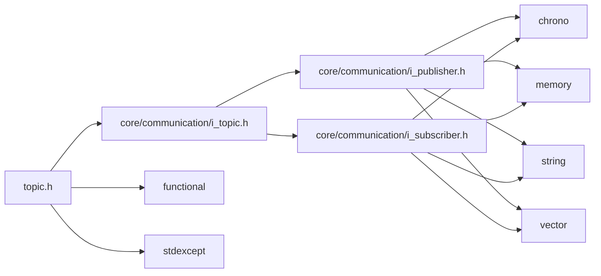
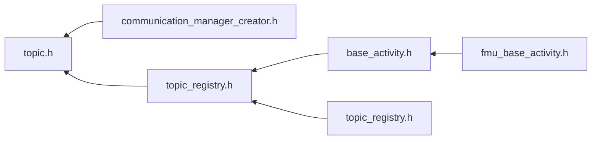

<a id="topic_8h"></a>
# File topic.h

![][C++]

**Location**: `core/communication/topic.h`


## Classes

* [simulation\_framework::core::Topic](classsimulation__framework_1_1core_1_1Topic.md#classsimulation__framework_1_1core_1_1Topic)

## Namespaces

* [simulation\_framework](namespacesimulation__framework.md#namespacesimulation__framework)
* [simulation\_framework::core](namespacesimulation__framework_1_1core.md#namespacesimulation__framework_1_1core)

## Includes

* [core/communication/i_topic.h](i__topic_8h.md#i__topic_8h)
* <functional>
* <stdexcept>





## Included by

* [communication_manager_creator.h](communication__manager__creator_8h.md#communication__manager__creator_8h)
* [topic_registry.h](core_2communication_2topic__registry_8h.md#core_2communication_2topic__registry_8h)





## Source


```cpp


#pragma once

#include "core/communication/i_topic.h"
#include <functional>
#include <stdexcept>

namespace simulation_framework
{
namespace core
{

using TopicId = std::string;

template <typename TopicMsgType>
class Topic : public ITopic
{
  public:
    using PublisherCallback = std::function<TopicMsgType()>;
    using SubscriberMessageCallback = std::function<void(const TopicMsgType&)>;
    using TopicMessageType = TopicMsgType;

    Topic(const TopicId& topic_id, const TopicType topic_type = TopicType::kRTIDDS)
        : ITopic{}, topic_id_(topic_id), topic_type_(topic_type)
    {
    }

    TopicId GetId() const override { return topic_id_; }
    TopicType GetType() const override { return topic_type_; }

    void AddPublisher(std::unique_ptr<IPublisher> pub_ptr) override
    {
        if (publishers_.size() == 1)
        {
            throw std::range_error("Already a Publisher for topic " + topic_id_ +
                                   " has been set. Multiple publishers for same topic is NOT allowed! ");
        }
        publishers_.push_back(std::move(pub_ptr));
    }
    void AddSubscriber(std::unique_ptr<ISubscriber> sub_ptr) override { subscribers_.push_back(std::move(sub_ptr)); }

    std::size_t SubscriberCount() const override { return subscribers_.size(); }
    std::size_t PublisherCount() const override { return publishers_.size(); }

    void ClearPubSub() override
    {
        publishers_.clear();
        subscribers_.clear();
    }

    const Subscribers& GetSubscribers() const override { return subscribers_; }
    const Publishers& GetPublishers() const override { return publishers_; }

  private:
    TopicId topic_id_{};
    Subscribers subscribers_{};
    Publishers publishers_{};

    const core::TopicType topic_type_{core::TopicType::kRTIDDS};
};

}  // namespace core
}  // namespace simulation_framework
```


[public]: https://img.shields.io/badge/-public-brightgreen (public)
[C++]: https://img.shields.io/badge/language-C%2B%2B-blue (C++)
[private]: https://img.shields.io/badge/-private-red (private)
[const]: https://img.shields.io/badge/-const-lightblue (const)
[static]: https://img.shields.io/badge/-static-lightgrey (static)
[protected]: https://img.shields.io/badge/-protected-yellow (protected)