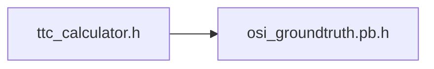
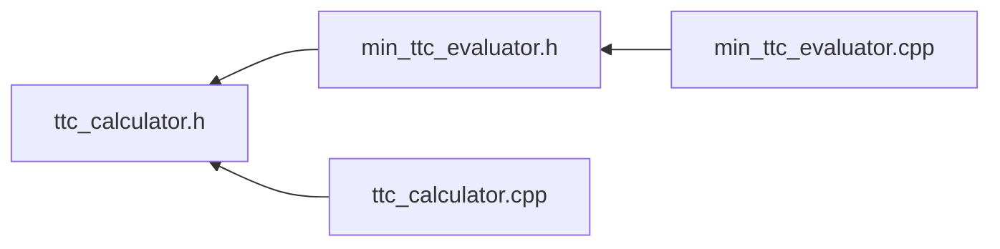

<a id="ttc__calculator_8h"></a>
# File ttc\_calculator.h

![][C++]

**Location**: `autonomy/evaluator/ttc\_calculator/ttc\_calculator.h`


## Classes

* [simulation\_framework::evaluator::TimeToCollisionCalculator](classsimulation__framework_1_1evaluator_1_1TimeToCollisionCalculator.md#classsimulation__framework_1_1evaluator_1_1TimeToCollisionCalculator)

## Namespaces

* [simulation\_framework](namespacesimulation__framework.md#namespacesimulation__framework)
* [evaluator](namespaceevaluator.md#namespaceevaluator)
* [simulation\_framework::evaluator](namespacesimulation__framework_1_1evaluator.md#namespacesimulation__framework_1_1evaluator)

## Includes

* <osi_groundtruth.pb.h>





## Included by

* [min_ttc_evaluator.h](min__ttc__evaluator_8h.md#min__ttc__evaluator_8h)
* [ttc_calculator.cpp](ttc__calculator_8cpp.md#ttc__calculator_8cpp)





## Source


```cpp


#pragma once

#include <osi_groundtruth.pb.h>

namespace simulation_framework
{

namespace evaluator
{


class TimeToCollisionCalculator
{
  public:
    std::chrono::milliseconds Calculate(const osi3::GroundTruth& ground_truth) const;
};

}  // namespace evaluator
}  // namespace simulation_framework
```


[public]: https://img.shields.io/badge/-public-brightgreen (public)
[C++]: https://img.shields.io/badge/language-C%2B%2B-blue (C++)
[private]: https://img.shields.io/badge/-private-red (private)
[const]: https://img.shields.io/badge/-const-lightblue (const)
[static]: https://img.shields.io/badge/-static-lightgrey (static)
[protected]: https://img.shields.io/badge/-protected-yellow (protected)