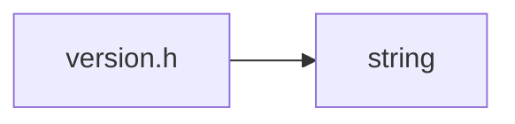

<a id="version_8h"></a>
# File version.h

![][C++]

**Location**: `core/version/version.h`


## Namespaces

* [simulation\_framework](namespacesimulation__framework.md#namespacesimulation__framework)
* [simulation\_framework::core](namespacesimulation__framework_1_1core.md#namespacesimulation__framework_1_1core)

## Includes

* <string>





## Source


```cpp


#ifndef EXPORT_VERSION_VERSION_H_
#define EXPORT_VERSION_VERSION_H_

#include <string>

namespace simulation_framework
{
namespace core
{

std::string GetCoreVersion();
std::string GetCorePublicVersion();
std::string GetCoreInternalVersion();

}  // namespace core
}  // namespace simulation_framework

#endif  // EXPORT_VERSION_VERSION_H_
```


[public]: https://img.shields.io/badge/-public-brightgreen (public)
[C++]: https://img.shields.io/badge/language-C%2B%2B-blue (C++)
[private]: https://img.shields.io/badge/-private-red (private)
[const]: https://img.shields.io/badge/-const-lightblue (const)
[static]: https://img.shields.io/badge/-static-lightgrey (static)
[protected]: https://img.shields.io/badge/-protected-yellow (protected)