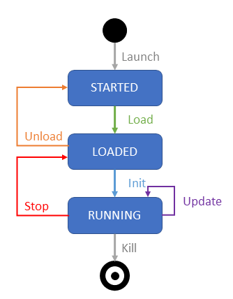

# API description

> **Important Note:** You are reading the documentation for AVxcelerate Sensors Simulator API v1 delivered in 2026 R1.
>
> To consult the documentation of the API delivered in a previous release, go to the [Ansys Developer Portal](https://developer.ansys.com/).
>
> Please refer to the [Changelog](../changelog/changelog.md) to get the complete list of changes introduced in this version.
>

This document is intended for developers who need to develop client applications communicating with AVxcelerate Sensors Simulator internal services in order to:

- integrate AVxcelerate Sensors Simulator (AVX) in their driving simulation application,
- integrate the System Under Test (SUT) into the simulation loop.

This document describes how AVxcelerate Sensors Simulator works and how to use it. The API is composed of different protocol buffer contracts and gRPC services. In this document, the usage of the API is demonstrated in some code snippets written in C# programming language. Samples written in C++ and Python programming languages are provided in the *VSS API* folder.

## Overview

AVxcelerate Sensors Simulator embeds physics-based sensor models for camera, lidar and radar. It computes the sensor outputs from a virtual world model. The step-by-step execution of AVxcelerate Sensors Simulator is driven by an external software (referred below as "Simulation System"). External components, for example perception algorithms, can interact with AVxcelerate Sensors Simulator through the data acquisition or sensor feedback control interfaces. In summary, the API contains different services which allow to:

- drive the sensors' simulation using the *[Simulation](#simulation)* service,
- adjust the sensors' parameters during the simulation using the *[Feedback Control](#sensors-feedback-control)* service,
- adjust parameters of the lighting system during the simulation using the *[Lighting System Control](#lighting-system-control)* service,
- being notified about new sensor data using the *Sensor Data Notifier* service, refer to [Notifications](#notifications),
- request or read sensor data using the *Data Access* service, refer to [Sensor data acquisition](#sensor-data-acquisition).


The API is designed to contain a minimum of simulation logic. This means that the responsibility for executing a blocking or a non-blocking loop is on the Simulation System side. AVX always waits until completion of each simulation command and sends back an acknowledgment when all components have been fully executed. It is the responsibility of the Simulation System to sequence the execution of all the software involved in the simulation (including AVX). In short terms AVxcelerate Sensors Simulator is totally passive in terms of simulation scheduling.

The AVxcelerate Sensors Simulator API is composed of different [protocol buffer](https://developers.google.com/protocol-buffers) contracts and [gRPC](https://grpc.io/) services defining the interface of AVxcelerate Sensors Simulator. In gRPC, a client application can directly call a method on a server application on a different machine as if it were a local object. Another benefit of using gRPC with protocol buffers is that the contract files (.proto) can be compiled into [different programming languages](https://grpc.io/docs/#official-support).

The usage of the API is demonstrated in some [Examples](#examples) provided in this documentation, with code snippets written in C# programming language.

## Services

This section presents the main services of the AVxcelerate Sensors Simulator API.

### Simulation

The *Simulation* service (exposed in the *simulation.proto* file) provides you with control procedures to monitor your simulation by requesting state transitions. The *ResourceUploader* service (exposed in the *upload.proto* file) allows you to upload resources as byte stream before loading them.

All possible states (started, loaded, running) and transitions (load/unload, initialize, update, stop and kill) of AVX during a simulation sequence are depicted in the following illustration.



Six control procedures (corresponding to the six possible state transitions) are provided in the *Simulation* service.

> **Note:** AVX simulation sequence/logic always must be considered when using simulation control procedures to trigger state transitions. Procedures that are not consistent with the  simulation transitions will end in error.
> Examples of a valid simulation sequence include:
>
>- **LOAD** > **INIT** > n **UPDATE** > **STOP** > **UNLOAD** > **KILL**
>
>- **LOAD** > **INIT** > n **UPDATE** > **STOP** > **INIT** > n **UPDATE** > **STOP** > **UNLOAD** > **KILL**
>
>   In this sequence, the simulation reset feature is used. It consists in sending an **INIT** command after a **STOP** command, which allows you to perform consecutive simulations without having to reload all the resources.
>   In the current release, when a simulation is reset:
>   - only sensors and advanced lighting systems are automatically reset to their initial loaded state at each **INIT** command,
>   - the last updates on an asset or track, for example asset positions, orientations, date and time, etc., are kept unless you redefine them in the WorldUpdate sent in the **INIT** command,
>   - the simulation noise is not reset, therefore consecutive simulations with a simulation reset are not deterministic.

> **Prerequisite:** When the track and/or assets are not files but byte streams, you must use the  *[Resource Uploader](#resource-uploader)* service to upload resources before being able to load them.

- **LOAD**: loads a new scene and configures simulation, sensors, and lighting systems.
    Always the **first** command.
  
    -> AVX switches to **LOADED** state.

- **INIT**: sets the scenario to the desired initial state (asset positions, date and time, etc.). If called after a **STOP** command, only the sensors and advanced lighting systems are automatically reset.
  
    -> AVX switches to **RUNNING** state and is ready to receive updates.

- **UPDATE**: applies a world update for a given simulation step and triggers the generation of sensor data.
  
    -> AVX remains in **RUNNING** state.

- **STOP**: stops the simulation.
  
    -> AVX switches to **LOADED** state.

- **UNLOAD**: allows to have a clear environment for a new simulation.
  
    -> AVX switches to **STARTED** state.

- **KILL**:  stops all AVX processes.
    The **KILL** command can be applied from any state. It can be used for example to end the simulation if there is a blocking problem.
    For a new simulation, AVX must be launched again after a **KILL** command.

For more information on the state transition commands, please refer to the [Simulation service](../ref/reference-documentation.md#simulation). For an implementation example, refer to [Simulation control example](#simulation-control-example).

### Resource Uploader

The *Resource Uploader* service (exposed in the *upload.proto* file) is an alternative way to provide resources such as tracks, assets, sensor configurations, or lighting systems to AVxcelerate Sensors Simulator without referencing paths or sending binary data directly through the **Configuration** message of the **LOAD** command.

With the *ResourceUploader* service, using the **UPLOAD** command before executing the **LOAD** command, you upload those files and send their contents as a byte array using gRPC streaming capabilities.
The *ResourceUploader* service allows you to upload simultaneously multiple sensor configurations, lighting systems, and assets.

For more information, please refer to the [ResourceUploader service](../ref/reference-documentation.md#resourceuploader). For an implementation example, refer to [Resource Uploader example](#resource-uploader-example).

### Sensors Feedback Control

The *Feedback Control* service (exposed in the *feedback_control.proto* file) allows you to update sensor parameters during the simulation. It can only be used when AVX is in **RUNNING** state and has been started with the `-fbc` [process argument](https://ansyshelp.ansys.com/account/secured?returnurl=/Views/Secured/corp/v261/en/Optis_UG_VSS/Optis/UG_VSS/R_UG_VSS_simulation_arguments.html).

The process (external software) you will develop will be running as a closed-loop simulation to update sensor parameters.
It will retrieve sensor outputs, analyze them and if needed adjust them for the next output produced. The update of parameters sent to AVX will depend on your algorithms and defined thresholds.

> **Note:** A certain latency can be observed between the update request (using the `Send` method of the Feedback Control service) and the generation of the sensor data with the updated parameters.
> The update is first sent to the sensor at the next world update (requested using the `Update` method of the Simulation service). Then, the sensor must be reloaded so that the updated parameter(s) are used for the next output calculation. However, a sensor cannot be reloaded during an ongoing output calculation, it can be reloaded only after the computation is completed.
> Only three parameters can be updated without requiring a sensor reload: the camera gain, exposure and time encoding.

The Feedback Control is available for the following sensor parameters:
  
- Camera Sensor
  
  Focal length | Wavelength of Focal length | Chromatic Dispersion presets | Focal Shift | Aperture values | Distortion values | Imager resolution | Exposure time | Readout noise values | Thermal noise values | Native bit depth | Gain | Bit Depth Reduction (for demosaicing output) or Time encoding (for injection Output)
  
- Lidar Sensor
  
  All lidar parameters.
  
  For certain lidar parameters (rotating or flashing), the feedback control is only applied at the end of the lidar frame: Rotation speed | Firing sequence | Firing frequency | Power | Responsivity | Aperture area | Pulse shape and duration | Max current | Max number of returns

- Radar Sensor
  
  All radar parameters **except** for:
  
  - Antenna Tx/Rx: Ids | Polarization | Horizontal and Vertical power beam width | Pattern identity (File) | Peak gain
  - Mode: Id | Multiplexing Type | Waveform | Center frequency | Transmission power | Type | Preset | Filter Type | Roll-off type

    > **Note:** You can only apply feedback control to values that have been previously set in the sensor configuration. For example, you cannot add a Range filter during the simulation, nor can you set a Roll-off parameter if it does not correspond to the Roll-off type.
  
For radar sensors, the Feedback Control also allows you to:

- activate or deactivate a radar mode during the simulation
- enable IP protection on the radar so that all of its parameters are protected (no longer readable, nor editable from the Feedback Control service)
  > **Note:** Enabling the protection using the feedback control service is irreversible.

The complete list of available feedback control parameters can also directly be found in [FeedbackControl service](../ref/reference-documentation.md#feedbackcontrol). For an implementation example, refer to [Sensor Feedback Control example](#sensor-feedback-control-example).

### Lighting System Control

The *Lighting System Control* service allows you to retrieve and update lighting system parameters during the simulation. This service can only be accessed when AVX is in **RUNNING** state, has been started with the `-lsc` [process argument](https://ansyshelp.ansys.com/account/secured?returnurl=/Views/Secured/corp/v261/en/Optis_UG_VSS/Optis/UG_VSS/R_UG_VSS_simulation_arguments.html), and when a lighting system has been loaded during the simulation configuration.

For more information and a complete list of available lighting system control parameters, please refer to the [Lighting System Control service](../ref/reference-documentation.md#lightingsystemcontrol). For an implementation example, refer to [Lighting System Control Example](#lighting-system-control-example).

### Sensor data access

The *Sensor Data Notifier* service (exposed in the *sensor_data_output_notification.proto* file) allows an external software to be notified anytime sensor data is produced.
The *Data Access* service allows to retrieve the data. The requested sensor response can then be parsed to be processed with your own algorithm.

#### Notifications

During the simulation, sensors produce data according to their assigned frequency. An external software can subscribe to the sensor data notifications stream using the *SensorDataNotifier* service. AVX then streams notifications to the subscriber when new sensor data is produced.

Notifications are sent in a **SensorDataDescription** message which contains all the needed information to identify and acquire the data produced by a sensor during a simulation step.

Depending on the `output_splitting` value in the [simulation parameters message](../ref/reference-documentation.md#simulationparameters), a sensor can produce multiple data during one single simulation step. All unique data identifiers along with some metadata are stored in the repeated `data_by_identifiers` field. The metadata contains information about the publisher's host address, the data access server port if available, and the characteristics of the data. The metadata also allows identification and filtering to access only data of interest.

> **Notes:**
>
> The fields `data_id` and `metadata` in the **SensorDataDescription** message contain values only if the data is not split. They are deprecated and kept only to ensure backward compatibility. Please prefer using the field `data_by_identifiers` to access data identifiers and metadata.
>
> If `data_by_identifiers` does not provide the data access server port, this means that the data is only available via shared memory.

For a complete description of this service, please refer to the [SensorDataNotifier service](../ref/reference-documentation.md#sensordatanotifier). For an implementation example, refer to [Subscription to sensor data notifications example](#subscription-to-sensor-data-notifications-example).

#### Sensor data acquisition

During a simulation, the data produced by the sensors are added to a data store which holds the data in the shared memory, except if storage to shared memory is disabled in the simulation parameters. Once a notification about a new sensor output is received, the data can be requested using the unique data identifiers that are specified in the notifications.

Three different methods can be used to acquire the sensor data produced in a simulation:

- requesting it by calling the `RequestData` method of the [DataAccess Service](../ref/reference-documentation.md#dataaccess),
- requesting it through stream by calling the `RequestDataStream` method of the [DataAccess Service](../ref/reference-documentation.md#dataaccess),
- accessing it directly from the shared memory.

Accessing the sensor data directly from the shared memory is more performant than accessing it from the RPC. However, to access the data directly from the shared memory, the external software and AVX must be executed on the same machine. Accessing the data from the RPC through stream allows the user to bypass the 2 gigabytes limit from proto.

The AVxcelerate Sensors Simulator API contains some classes that implement the data access from the shared memory for Windows and Unix-based systems and for different programming languages (C#, C++, Python). This plugin allows you to use the same service definition for access from shared memory and access via RPC. For more details refer to [DataAccess Service](../ref/reference-documentation.md#dataaccess). For an implementation example, refer to [Sensor data acquisition example](#sensor-data-acquisition-example).

#### Data retention

The data produced by the sensors are held in the data store until it is released. Not all the data generated by the sensors for all the simulation steps are held in the shared memory for the whole duration of the simulation in order to avoid overloading the memory. For more information, refer to [Output Data in Shared Memory](https://ansyshelp.ansys.com/account/secured?returnurl=/Views/Secured/corp/v261/en/Optis_UG_VSS/Optis/UG_VSS/C_UG_VSS_results_shared_memory.html).

By default, the data produced in shared memory is erased and rewritten at each **INIT** command. In addition, only the two last data blocks generated by each sensor are retained in the shared memory and accessible to the data consumer application. With this default behavior, when the data for the simulation step n is created, the data for the simulation step n-2 is erased. This behavior is equivalent to setting `maxStoredData` to `2`.

You can opt for one of the following two strategies for data retention:

- defining the **amount of data blocks** that are stored in parallel for each sensor (by setting the `maxStoredData` parameter),
- defining the lifetime for the data stored in the shared memory (by setting the `retentionTimeFrame` parameter).

For more details, refer to [Data Retention Strategy](https://ansyshelp.ansys.com/account/secured?returnurl=/Views/Secured/corp/v261/en/Optis_UG_VSS/Optis/UG_VSS/C_UG_VSS_data_retention_strategy.html) in AVxcelerate Sensors User's Guide.

The data retention strategy can be modified in the *avxcelerate.sensorprocess.dll.config* configuration file located in the AVX installation directory in *VSS/VssSpawner*. Refer to [Configuring the Data Retention Strategy](https://ansyshelp.ansys.com/account/secured?returnurl=/Views/Secured/corp/v261/en/Optis_UG_VSS/Optis/UG_VSS/T_UG_VSS_configuring_retention_strategy.html) in AVxcelerate Sensors User's Guide.

#### Data format

The sensor data stored in the shared memory is serialized using the [SensorData message](../ref/reference-documentation.md#sensordata). Therefore, the data buffer, received from the data request, must be parsed using this proto contract.

The Camera Output (Image) and Imager Output (Injection) of physics-based camera sensors can be stored unserialized by setting the sensor parameter `serialize_data` in the [simulation parameters](../ref/reference-documentation.md#simulationparameters) to `false`.

By default, the sensor data contains all data produced by one single sensor during one simulation step. For example, the sensor data of a lidar sensor can contain point-cloud, waveform and contribution map data, depending on the simulation parameters provided during the loading phase. However, the data produced by a radar sensor can be split per mode or per transmitter, using the `output_splitting` field in the simulation parameters. In this case, the radar data are stored in shared memory as follows:

- **MODE**: for each mode one **SensorData** message is created containing the data of this single mode.
  
  > **Note:** When the Tx waveform report is activated and the data split per mode, one Tx waveform report will be contained in the data of each mode.

- **TRANSMITTER**: for each Tx antenna one **SensorData** message is created containing the data of this single Tx antenna
  
  > **Note:** When the Tx waveform report is activated and the data split per Tx, the same Tx waveform report will be contained in the data of each Tx antenna of one mode.

In the data notification, the field `data_by_identifiers` contains all data identifiers together with their metadata produced by one single sensor in one single simulation step.

### Ground Truth Data Helper

The *Ground Truth Data Helper* service (exposed in the *ground_truth_data_helper.proto* file) allows you to retrieve ground truth data from a sensor during a simulation. This service can only be accessed when AVX is in the **LOADED** or **RUNNING** state.

#### Contribution dictionary

 If a lidar sensor is loaded in the simulation, with the *contribution* simulation parameter set to *true*, a contribution dictionary can be requested using the *GetContributionDictionary* rpc method, with a sensor identifier as parameter. The returned data is a *ContributionDictionary*, see the [ContributionDictionary message](../ref/reference-documentation.md#contributiondictionary).

#### Pixel segmentation tag color map

 If a camera sensor is loaded in the simulation, with the `generatePixelSegmentation` parameter set to true, the tag/color map used by pixel segmentation algorithm can be requested by calling the `GetPixelSegmentationTagColorMap` method. The returned message is a PixelSegmentationTagColorMap containing TagColorMap data.

> **Notes:**
>
> Same TagColorMap data can be used in SimulationParameters. PixelSegmentationMapping to freely assign tag/color associations. All tags that are not associated with a color by the user are automatically assigned with a unique color by AVxcelerate Sensors Simulator.
>
> The tag/color map is common to all camera sensors.

For an implementation example, refer to [Ground Truth Data Helper example](#ground-truth-data-helper-example).

## Examples

This section provides examples showing how to prepare your own component for interacting with the different AVX interfaces.

Before continuing reading, if you are not familiar with the basic principles of Protocol Buffers and gRPC, please read the getting started guides on:

- [Protocol Buffers](https://developers.google.com/protocol-buffers)
- [gRPC](https://www.grpc.io/)

The following sections will give you guidance on how to use the different interfaces of AVX. The sample code is given in C# programming language. If you're programming in another programming language you can adapt the code snippets with the help of the gRPC documentation which includes examples for different programming languages.

### Preliminary steps

1. Compile all the needed protobuf contracts. Please follow the instructions on the Protocol Buffers and gRPC websites. There are several tutorials and documentation available.
1. Include the generated code into your project.
1. Launch AVxcelerate Sensors Simulator with the [simulation process arguments](https://ansyshelp.ansys.com/account/secured?returnurl=/Views/Secured/corp/v261/en/Optis_UG_VSS/Optis/UG_VSS/R_UG_VSS_simulation_arguments.html) required for the [transport mode](#transport-modes) you want to use. Refer to:
    - [Launching AVxcelerate Sensors Simulator with the UDS transport mode](#launching-avxcelerate-sensors-simulator-with-the-uds-transport-mode)
    - [Launching AVxcelerate Sensors Simulator with the mTLS transport mode](#launching-avxcelerate-sensors-simulator-with-the-mtls-transport-mode)
    - [Launching AVxcelerate Sensors Simulator with the insecure transport mode](#launching-avxcelerate-sensors-simulator-with-the-insecure-transport-mode)
    > **Note**: Additional simulation process arguments are required for the Sensor Feedback Control service (`-fbc`), the Lighting System Control service (`-lsc`) and to start the Sensor Data Access server (`-d <PORT>`).
1. Create a gRPC channel, see:
    - [Creating a gRPC channel to communicate over UDS](#creating-a-grpc-channel-to-communicate-over-uds)
    - [Creating a gRPC channel to communicate over mTLS](#creating-a-grpc-channel-to-communicate-over-mtls)
    - [Creating a gRPC channel to communicate over gRPC/HTTP2](#creating-a-grpc-channel-to-communicate-over-grpchttp2)
 
    > **Note:** A gRPC channel should be reused for multiple calls to the server to optimize performance and resource usage. For more details on best practices and additional configuration options, refer to the [gRPC for .NET documentation](https://docs.microsoft.com/en-us/aspnet/core/grpc/?view=aspnetcore-5.0).

Then, you can start implementing your own logic.

### AVX internal gRPC server

#### Transport modes

Any client application that will communicate with the AVxcelerate Sensor Simulator internal gRPC server over a gRPC channel must be configured with the same transport mode that the one set when launching AVxcelerate Sensors Simulator.

By default, the transport mode set for the AVX internal server is [Unix Domain System (UDS)](#uds-transport-mode). With this transport mode, the AVX internal gRPC server and the client applications must run on the same workstation.

Alternatively, you could either use [mutual Transport Layer security (mTLS)](#mtls-transport-mode) or the [insecure](#insecure-transport-mode) transport mode.

#### UDS transport mode

The Unix Domain Socket (UDS) transport mode is usable only when the client applications and AVxcelerate Sensors Simulator run on the same workstation. The UDS transport mode is therefore not suitable for co-simulation between AVxcelerate Sensors Simulator and CarMaker HiL.

When the transport mode is set to UDS, a UDS socket file is automatically created when the AVX gRPC internal server is started. The default name of the socket file is vss.sock and its default location is *[USER_HOME_DIRECTORY]/.conn*.

Optionally, you can define a custom location and/or an identifier for the socket file using the dedicated arguments `--uds-dir`and `--uds-id`. When an identifier is defined, the socket file is named *vss-<uds-id>.sock*.

> **Note**: The maximum length of the full path to the socket file (file name included) is 107 characters on Linux and Windows. Space and special characters are not allowed in the directory path, nor in the identifier.

The AVX internal server cannot start if the socket file is already in use by another application.

#### Launching AVxcelerate Sensors Simulator with the UDS transport mode

To use the UDS transport mode, you can launch AVxcelerate Sensors Simulator with no argument, since it is the default transport mode that is used when the `-t` | `--transport-mode` argument is not specified.

You can specify the following optional arguments:

- `--uds-dir` followed by the directory path in which the socket file will be created. This argument is optional, when not set, the socket file is created in *[USER_HOME_DIRECTORY]/.conn*.
- `--uds-id` followed by the identifier for the socket file. This argument is optional, when not set, the name of the socket file is _vss.sock_.

Example to start the server with the UDS transport mode and its default settings using PowerShell on Windows:

```ps
PS C:\Program Files\ANSYS Inc\v261\Autonomy\AVxcelerateSensors\VSS>.\avxcelerate.sensorssimulator.exe 
```

Example to start the server with the UDS transport mode and specific UDS settings using PowerShell on Windows:

```ps
PS C:\Program Files\ANSYS Inc\v261\Autonomy\AVxcelerateSensors\VSS>.\avxcelerate.sensorssimulator.exe --uds-dir "C:\ProgramData\uds_socket_files" --uds-id myUdsSocket
```

##### Creating a gRPC channel to communicate over UDS

To be able to communicate with the AVX internal server, your custom client applications must use a gRPC channel configured for the UDS transport mode.

The following example demonstrates how to create a gRPC channel in C# using Grpc.Net version 2.65.0 to communicate with the AVX internal server over UDS transport mode.

```cs
using System.Net.Http;
using System.Net.Sockets;
using Grpc.Net.Client;
// Socket path created by the server:
// - default (no flags): ~/.conn/vss.sock
// - with --udsId=ID: ~/.conn/vss-<ID>.sock
// - with --udsDir=/path: /path/vss.sock
// - with both --udsDir and --udsId: /path/vss-<ID>.sock
string socketPath = @"<absolute-path-to-socket>";
// Create an HTTP handler that dials the Unix Domain Socket
var httpHandler = new SocketsHttpHandler
{
ConnectCallback = async (_, cancellationToken) =>
{
var socket = new Socket(AddressFamily.Unix, SocketType.Stream,
ProtocolType.Unspecified);
await socket.ConnectAsync(new UnixDomainSocketEndPoint(socketPath),
cancellationToken);
return new NetworkStream(socket, ownsSocket: true);
}
};
// Use a placeholder base address; transport is UDS via ConnectCallback
var channel = GrpcChannel.ForAddress("http://localhost", new GrpcChannelOptions
{
HttpHandler = httpHandler,
MaxReceiveMessageSize = null //No gRPC limit on the size of response messages
(default is 4 MB)
});
await channel.ConnectAsync(TimeSpan.FromSeconds(5));
```

The gRPC channel you created can now be used to communicate with the AVX internal server.

> **Tips**: After stopping the AVX internal gRPC server, make sure that socket files previously created
have been properly deleted. If not, delete the file(s) manually to prevent issues.

#### mTLS transport mode

With the mTLS transport mode, you need TLS certificates on both the client side and the server side to secure the connection.

##### Generating mTLS certificates

The following certificate and key files are required:

- *server.crt*: the server certificate file
- *server.key*: the server key file
- *client.crt*: the client certificate file
- *client.key*: the client key file
- *ca.crt*: the Certification Authority certificate file

All the above-listed files must be saved on the workstation running AVxcelerate Sensors Simulator either:

- In any folder, then you must define the path to the folder in which you saved the certificate and key files, using one of the two below-listed methods:
    - Using the `-c` | `--certs-folder` argument when launching AVxcelerate Sensors Simulator followed by the path (for more details see below),
    - In an environment variable named ANSYS_GRPC_CERTIFICATES,
- In a sub-folder named certs located in the same repository as the AVxcelerate Sensors Simulator executable.

Additionally, when the client application and AVxcelerate Sensors Simulator run on different workstations, the *client.crt*, *client.key* and *ca.crt* files must also be saved on the workstation on which the client application runs.

> **Note**: Make sure that the certificates folder path does not include space characters, as such characters are not properly supported for co-simulation with CarMaker, nor for using the Track Exporter feature.

##### Launching AVxcelerate Sensors Simulator with the mTLS transport mode

To use the mTLS transport mode, launch AVxcelerate Sensors Simulator with the following arguments:

- `-p` | `--port` followed by the TCP port on which the AVX internal server will listen for client requests
    > **Note**: The value must be an integer in the range 1024 to 65535, the port must not be currently in use and not blocked by any firewall.
- `-h` | `--host` followed by the host name – or IP address (IPv4) – of the workstation on which AVxcelerate Sensors Simulator will run. The default value for this argument is *localhost*.
- `-t` | `--transport-mode` followed by `mtls`.
- `-c` | `--certs-folder` followed by the path to the folder where the certificate files are saved. This argument is optional, when not set the path to the certificate files must be defined in the ANSYS_GRPC_CERTIFICATES environment variable, or the files must be saved in a certs sub-folder inside the software’s repository.

Example to start the server with the mTLS transport mode and a custom location for the certificate and key files using PowerShell on Windows:

```ps
PS C:\Program Files\ANSYS Inc\v261\Autonomy\AVxcelerateSensors\VSS>.\avxcelerate.sensorssimulator.exe -p 5050 -h 192.168.120.006 -t mtls -c "C:\certs"
```

##### Loading the certificates

If you use custom client applications to communicate with the AVX internal gRPC server, such as custom connectors for your driving simulator or feedback control applications, you must modify them so that they load the certificate and key files.

The following example demonstrates how to load certificate and key files on the client’s side in C# using using Grpc.Net version 2.65.0.

```cs
using System.Security.Cryptography.X509Certificates;
// Load client certificate (PEM cert + PEM key) cross-platform
static X509Certificate2 LoadClientCertificateFromPem(string clientCrtPath, string
clientKeyPath)
{
string certPem = File.ReadAllText(clientCrtPath);
string keyPem = File.ReadAllText(clientKeyPath);
// Combine cert + key from PEM
var certWithKey = X509Certificate2.CreateFromPem(certPem, keyPem);
// On Windows, export to PFX to avoid ephemeral key issues
if (RuntimeInformation.IsOSPlatform(OSPlatform.Windows))
{
using (certWithKey)
{
return new X509Certificate2(certWithKey.Export(X509ContentType.Pfx));
}
}
return certWithKey;
}
// Paths to your existing certificate files
string clientCrtPath = @"<path>/client.crt";
string clientKeyPath = @"<path>/client.key";
string caCrtPath = @"<path>/ca.crt";
// Load client cert (with private key) and the CA cert
X509Certificate2 clientCertificate = LoadClientCertificateFromPem(clientCrtPath,
clientKeyPath);
X509Certificate2 caCertificate = new X509Certificate2(caCrtPath);
```

##### Creating a gRPC channel to communicate over mTLS

To be able to communicate with the AVX internal server, your custom client applications must use a gRPC channel configured for the mTLS transport mode.

The following example demonstrates how to create a gRPC channel in C# using Grpc.Net version 2.65.0 to communicate with the AVX internal server over mTLS transport mode.

```cs
// Target AVX internal server (same host/port you used to launch it)
string hostname = "<server-ip-or-hostname>";
int port = 5050;
var handler = new SocketsHttpHandler
{
SslOptions = new SslClientAuthenticationOptions
{
ClientCertificates = new X509CertificateCollection { clientCertificate },
// Validate server cert against our CA
RemoteCertificateValidationCallback = (_, serverCert, _, sslErrors) =>
{
if (serverCert is null)
{
return false;
}
var chain = new X509Chain
{
ChainPolicy =
{
RevocationMode = X509RevocationMode.NoCheck,
VerificationFlags =
X509VerificationFlags.AllowUnknownCertificateAuthority
}
};
chain.ChainPolicy.ExtraStore.Add(caCertificate);
bool isValid = chain.Build(new X509Certificate2(serverCert));
bool trusted = chain.ChainElements.Any(e => e.Certificate.Thumbprint ==
caCertificate.Thumbprint);
return isValid && trusted;
}
}
};
var channel = GrpcChannel.ForAddress($"https://{hostname}:{port}", new
GrpcChannelOptions
{
HttpHandler = handler,
MaxReceiveMessageSize = null //No gRPC limit on the size of response messages
(default is 4 MB)
});
await channel.ConnectAsync(TimeSpan.FromSeconds(5));
```

> **Note**: This example does not check every SSL error. If you want to add further checks, please refer to the Microsoft documentation [SslPolicyErrors Enum](https://learn.microsoft.com/en-us/dotnet/api/system.net.security.sslpolicyerrors?view=net-9.0).

The gRPC channel you created can now be used to communicate with the AVX internal server.

#### Insecure transport mode

Alternatively to the mTLS or UDS transport mode, you may use the insecure transport mode to communicate with the AVX internal server.

> **Important note**: Using the insecure transport mode is not recommended.

##### Launching AVxcelerate Sensors Simulator with the insecure transport mode

To use the insecure transport mode, you must launch AVxcelerate Sensors Simulator with the following arguments:

- `-t` | `--transport-mode` `insecure`
- `-p` | `--port` followed by the TCP port on which the AVX internal server will listen for client requests
    > **Note**: The value must be an integer in the range 1024 to 65535, the port must not be currently in use and not blocked by any firewall.
- `-h` | `--host` followed by the host name – or IP address (IPv4) – of the workstation on which AVxcelerate Sensors Simulator will run. This argument is optional; its default value is *localhost*.

Example to start the server with the insecure transport mode using PowerShell on Windows:

```ps
PS C:\Program Files\ANSYS Inc\v261\Autonomy\AVxcelerateSensors\VSS>.\avxcelerate.sensorssimulator.exe -p 5050 -h 192.168.120.006 -t insecure
```

##### Creating a gRPC channel to communicate over gRPC/HTTP2

With the insecure transport mode, the client application connects to the AVX internal server through a gRPC .NET channel.

The following example demonstrates how to create a gRPC channel in C#:

```cs
using Grpc.Net.Client;

// Configuration for the gRPC channel
GrpcChannel channel = GrpcChannel.ForAddress($"http://{hostname}:{port}", new GrpcChannelOptions
{
    MaxReceiveMessageSize = null,  //No gRPC limit on the size of response messages (default is 4 MB)
});

try
{
    channel.ConnectAsync().Wait(TimeSpan.FromSeconds(5));
}
catch (AggregateException e)
{
    Log.Error($"Failed to connect to the gRPC server at {hostname}:{port}. Check the server status and network settings.");
    throw new InvalidOperationException("Failed to establish a gRPC connection.", e);
}
```

- **GrpcChannel.ForAddress**: This method creates a channel that targets a specific server address. The connection uses HTTP/2 as per gRPC specifications.
    > **Warning**: Specifying a hostname other than `localhost` or an IP address other than `127.0.0.1` enables remote access to this machine, which may expose it to unauthorized control and compromise sensitive data. To mitigate security risks, it is strongly advised to use these settings only within a trusted and secure network environment.
- **GrpcChannelOptions**: This object allows you to configure various settings of the channel. Here, `MaxReceiveMessageSize` is set to `null` to remove any limit on the size of the messages that the client can receive. This setting is beneficial in scenarios where you expect to receive large data payloads that exceed the default size limits.
  > **Note:** By default, the maximum message size limit in gRPC is 4 MB. For more details, refer to the [Message size limits in gRPC](https://learn.microsoft.com/en-us/aspnet/core/grpc/security?view=aspnetcore-8.0#message-size-limits).
- **ConnectAsync**: This method asynchronously starts the HTTP/2 connection to the server. It's recommended to handle potential timeouts or exceptions to ensure robust client behavior.

The gRPC channel you created can now be used to communicate with the AVX internal server.

### Simulation control example

**Prerequisites**: The [preliminary steps](#preliminary-steps) are done. *simulation.proto* is compiled and included in your project.

1. Instantiate the `Simulation.SimulationClient` class from the gRPC channel. The class `SimulationClient` is generated from the protobuf contract which defines the *Simulation* service.

    ```cs
    _client = new Simulation.SimulationClient(_channel);
    ```

1. Use the client to send the different commands to AVX and receive back the command status. Make sure your command order is compliant with AVX State Machine.

    ```cs
    // Example of usage of the STOP command

    Status status = _client.Stop(new Empty());

    if (status.Code == StatusCode.UnknownFailure)
    {
        // Handle error case
        throw new Exception($"Stop command failed to execute properly. Message: {status.Message}");
    }

    // status.Code == StatusCode.Success -> Simulation is stopped
    // ...
    ```

1. Implement your logic according to your needs. Refer to the [Simulation service](../ref/reference-documentation.md#simulation).
1. At the end of the simulation close the channel and dispose of all objects.
1. Implement an error processing that sends a **KILL** command to stop AVX properly if something goes wrong in your code, otherwise AVX processes will not be closed properly, thus preventing the application from restarting.

> **Note:** **LOAD** must always be the first command sent to AVX, except if you use the **UPLOAD** command of the *ResourceUploader Service* prior to the **LOAD** command. For more information about using the *ResourceUploader Service*, refer to [Resource Uploader example](#resource-uploader-example).
> **KILL** must be the last command sent to AVX.

### Resource Uploader example

**Prerequisites**: The [preliminary steps](#preliminary-steps) are done. *upload.proto* is compiled and included in your project.

1. Instantiate the `ResourceUploader.ResourceUploaderClient` class from the gRPC channel. The class `ResourceUploaderClient` is generated from the protobuf contract defining the *ResourceUploader* service.

    ```cs
    _client = new ResourceUploader.ResourceUploaderClient(rpcChannel as RpcChannel);
    ```

1. Make sure AVX is in the **STARTED** state.
1. Request the upload of the desired resource(s) using a unique identifier for each resource and define the correct metadata according to the type of the resource.

    - For Tracks, Assets, or Lighting Systems the metadata consists in the resource identifier (`ResourceIdentifier`) and is mandatory, for example:

    ```cs
            UploadMetadata = new UploadMetaData
            {
                Values =
                {
                    {
                        "ResourceIdentifier", resourceIdentifierValue
                    }
                }
            }        
    ```

    - For Sensor Configurations, the resource type (`ResourceType`) must be specified as a sensor configuration (`SensorConfiguration`), for example:

    ```cs
            UploadMetadata = new UploadMetaData
            {
                Values =
                {
                    {
                        "ResourceType", "SensorConfiguration"
                    }
                }
            }
    ```

    The following example demonstrates the process of uploading one resource file using gRPC streaming. First, the resource file is opened as a stream. Then, byte arrays are extracted from the stream for transmission via gRPC streaming. This approach applies to various resource types.

    ```cs

            public async Task<Status> UploadResource(FilePath resourcePath, string resourceIdentifier)
            {
                var uploadResourceCall = _client.UploadResource();
                    
                // the first RequestStream should contain the metadata.
                await uploadResourceCall.RequestStream.WriteAsync(new UploadRequest
                {
                    UploadMetadata = new UploadMetaData
                    {
                        Values =
                        {
                            {
                                "ResourceIdentifier", resourceIdentifier
                            }
                        }
                    }
                });
            
                // send the resource byte content (here we read the bytes from a file stream)
                await using var readStream = File.OpenRead(resourcePath);
            
                var buffer = new byte[1024 * 1024];
                int count;
                while ((count = await readStream.ReadAsync(buffer)) != 0)
                {
                    await uploadResourceCall.RequestStream.WriteAsync(new UploadRequest
                    {
                        Data = UnsafeByteOperations.UnsafeWrap(buffer.AsMemory(0, count))
                    });
                }
            
                await uploadResourceCall.RequestStream.CompleteAsync();
            
                return await uploadResourceCall;
            }
    ```

1. You can now load the uploaded resources using the **LOAD** command of the *Simulation* service. Ensure that in the **Configuration** message of the **LOAD** command, the `vss.ResourceIdentifier` field aligns with the identifier assigned in the `UploadMetadata` of the uploaded resource:

- for Tracks, Assets, or Lighting Systems: the `vss.ResourceIdentifier` must match the identifier set in the `UploadMetadata` to correctly reference the track, asset, or lighting system,
- for Sensor Configurations: the `vss.ResourceIdentifier` is optional, you do not have to assign an identifier to load a sensor configuration.

### Sensor Feedback Control example

**Prerequisites**: The [preliminary steps](#preliminary-steps) are done. *feedback_control.proto* is compiled and included in your project. AVxcelerate Sensors Simulator has been launched with the `-fbc` simulation process argument.

1. Instantiate the `FeedbackControl.FeedbackControlClient` class from the gRPC channel. The class `FeedbackControlClient` is generated from the protobuf contract which defines the *FeedbackControl* service.

    ```cs
    _client = new FeedbackControl.FeedbackControlClient(_channel);
    ```

1. Wait for the simulation to be in **Running** state.

1. At any time in **Running** state, you can send a request to adjust sensor parameters by calling the `FeedbackControl.FeedbackControlClient.Send()` method with the appropriate parameters in each request:

    - the *sensor_id* as it is defined in the sensor configuration given to AVX,
    - at least one of the sensor parameters (but you can also provide multiple parameters for one sensor in a single request).

    ```cs
    // Example for camera

    FeedbackControl feedback = new FeedbackControl
    {
        sensorId = "vehicle_front_camera",
        feedbackControlCameraParameters = new FeedbackControlCameraParameters
        {
            gain = 1.3,
            injectionTime = 100
        }
    };

    Status status = _client.Send(feedback);

    if (status.Code == StatusCode.UnknownFailure)
    {
        // Handle error case
        throw new Exception($"Send feed back command failed. Message: {status.Message}");
    }

    // status.Code == StatusCode.Success -> go on with your logic
    ```

1. Implement your logic according to your needs. Refer to the [FeedbackControl service](../ref/reference-documentation.md#feedbackcontrol).

### Lighting System Control example

**Prerequisites**: The [preliminary steps](#preliminary-steps) are done. *lighting_system_control.proto* is compiled and included in your project. AVxcelerate Sensors Simulator has been launched with the `-lsc` simulation process argument.

1. Instantiate the `LightingSystemControl.LightingSystemControlClient` class from the gRPC channel. The class `LightingSystemControlClient` is generated from the protobuf contract which defines the *LightingSystemControl* service.

    ```cs
    _client = new LightingSystemControl.LightingSystemControlClient(_channel);
    ```

1. Wait for the simulation to be in **Running** state.
1. At any time in *Running* state you can send a:

    - Set request to update lighting system parameters by calling the `LightingSystemControl.LightingSystemControlClient.Set()` method with appropriate parameters and get the feedback status.
    - Get request to retrieve the current lighting system state by calling the `LightingSystemControl.LightingSystemControlClient.Set()` method with appropriate parameters.

1. Implement your logic according to your needs. Refer to the [Lighting System Control service](../ref/reference-documentation.md#LightingSystemControl).

### Subscription to sensor data notifications example

**Prerequisites**: The [preliminary steps](#preliminary-steps) are done. *sensor_data_output_notification.proto* is compiled and included in your project.

1. Instantiate the `SensorDataNotifier.SensorDataNotifierClient` class from the gRPC channel. The class `SensorDataNotifierClient` is generated from the protobuf contract which defines the *SensorDataNotifier* service.

    ```cs
    var client = new SensorDataNotifier.SensorDataNotifierClient(_channel);
    ```

1. Start AVX and subscribe to notifications. You can subscribe to notifications as soon as AVX is ready to receive RPC requests.

    ```cs
    using (var call = client.Subscribe(new Empty()))
    {
        while (await call.ResponseStream.MoveNext(CancellationToken.None))
        {
            SensorDataDescription notification = call.ResponseStream.Current;
            // Go on with your business logic e.g. filter notifications, request data, ...
        }
    }
    ```

> **Note:** As notifications might come in fast, you should consider treating them as fast as possible. For example analyzing notifications and requesting data outside of the *while* loop, inside another thread might be a good idea.

### Sensor data acquisition example

You can access the sensor data in two different ways depending on your use case.

#### Accessing the sensor data directly from the shared memory

> **Note:** To access the sensor data directly from the shared memory, the sensor and the component requesting the data must be located on the same machine.

##### Prerequisites

1. Compile all the needed protobuf contracts. Please follow the instructions on the Protocol Buffers and gRPC websites. There are several tutorials and documentation available.
1. Generate the plugin. To do so, three executables are provided in the *VSS_API > bin* folder.

    Assuming you start from a given protobuf contract, you can generate extra tooling leveraging built-in `protoc` plugin mechanism.

    ```shell
    > protoc.exe --shm_out=<shmOutputFolder> \
                --plugin=protoc-gen-shm=<shm_xx_plugin.exe> \
                --proto_path=<myProtoFolder> <MyProtoFile>
    ```

    Where <shm_xx_plugin.exe> is the path to *shm_cpp_plugin.exe*, *shm_csharp_plugin.exe* or *shm_python_plugin.exe*.

    You end up with an *xxx.shm.h*| *xxx.shm.cs* | *xxx.shm.py* file.

    You can of course enrich an existing `protoc` command line (generating gRPC files) with `--shm_out` and `-plugin=protoc-gen-shm` options. Then you will end up with an extra xxx.shm.h|cs|py file, along with well-known generated ones i.e. *xxx.pb*, *xxx.grpc.pb* & *xxx.grpc.pb*.

    > **Note:** The function signature in generated `.shm` files shall be compatible with gRPC function signature.
    > Thus, when you generate both `.shm` and gRPC files, it is recommended to use the same gRPC version that the Shm plugin version.
    > You can find this version in the header of the generated `.shm` files.

1. Include the generated code into your project.

##### Steps

1. Start AVX and subscribe to notifications.
1. Once a notification about new sensor data is received, the data can be acquired in one of two ways:
    - doing a call with a client instance that has the same signature as the call from data access server.
    - doing a static call with the sensor data identifier you want to request from the shared memory.

    Both methods use the same underlying code and are differentiated only in their function signature.

    - Instance call:

    ```cs
    // Create client
    GrpcChannel channel = GrpcChannel.ForAddress($"http://{hostname}:{port}", new GrpcChannelOptions
    {
        MaxReceiveMessageSize = null,  //No gRPC limit on the size of response messages (default is 4 MB)
    });
    var client  = new DataAccess.DataAccessClient(channel);

    // Request Data
    Task<SensorDataBuffer> res = await client.RequestDataOptimized(sensorDataIdentifier);
    SensorDataBuffer sensorDataBuffer = res.Result;
    ```

    - Static call:

    ```cs
    // Request Data
    SensorDataBuffer sensorDataBuffer = DataAccess.DataAccessClient.RequestDataQuery(sensorDataIdentifier);
    ```

1. You can parse the received data buffer using the class `SensorData` generated from the *sensor_data.proto* file:

    ```cs
    if (sensorDataBuffer.Data.IsEmpty)
    {
        // An empty buffer is returned if data couldn't be retrieved (e.g. when data is already released)
    }
    else
    {
        // Deserialize data buffer
        SensorData data = SensorData.Parser.ParseFrom(sensorDataBuffer.Data);
    }
    ```

#### Accessing the sensor data using the RPC

**Prerequisites**: The [preliminary steps](#preliminary-steps) are done. *sensor_data_access.proto*, *sensor_data_buffer.proto* and *sensor_data.proto* are compiled and included in your project. AVxcelerate Sensors Simulator has been launched with the `-d <PORT>` simulation process argument.

1. Create a gRPC channel to communicate with the **Data access server**.

    ```cs
    // Specifying the host address and port number of the data access server
    var endpoint = "localhost:50508"

    // Instanciating the gRPC channel
    GrpcChannel channel = GrpcChannel.ForAddress($"http://{endpoint}", new GrpcChannelOptions
    {
        MaxReceiveMessageSize = null,  //No gRPC limit on the size of response messages (default is 4 MB)
    });
    ```

    > **Warning**: Specifying a hostname other than `localhost` or an IP address other than `127.0.0.1` enables remote access to this machine, which may expose it to unauthorized control and compromise sensitive data. To mitigate security risks, it is strongly advised to use these settings only within a trusted and secure network environment.

1. Instantiate the `DataAccessClient` class from the gRPC channel. The class `DataAccessClient` is generated from the Protobuf contract which defines the *DataAccess* service.

    ```cs
    // Create client
    var client = new DataAccess.DataAccessClient(channel);
    ```

1. Start AVX with the sensor data access server (argument `-d <PORT>`) and subscribe to notifications as described in **Subscription to Sensor Data Notifications Example**.

1. Once a notification about new sensor data is received, you have two choices:

    - [Request Data through a single proto message](#request-data-through-a-single-proto-message)
    - [Request Data through a stream](#request-data-through-a-stream)

###### Request data through a single proto message

1. The data can be acquired through a single message by calling the **DataAccessClient.RequestData** method and using the unique data identifier acquired from the notification.

    ```cs
    // Request Data
    Task<SensorDataBuffer> sensorDataTask = client.RequestDataAsync(sensorDataIdentifier).ResponseAsync;
    SensorDataBuffer sensorDataBuffer = sensorDataTask.Result;
    ```

1. You can parse the received data buffer using the class `SensorData` generated from the *sensor_data.proto* file:

    ```cs
    if (sensorDataBuffer.Data.IsEmpty)
    {
        // An empty buffer is returned if data couldn't be retrieved (e.g. when data is already released)
    }
    else
    {
        // Deserialize data buffer
        SensorData data = SensorData.Parser.ParseFrom(sensorDataBuffer.Data);
    }
    ```

###### Request Data through a stream

1. In stream mode, data is split and sent to clients in chunks. These data chunks can be acquired through a stream by calling the **DataAccessClient.RequestDataStream** method and using the unique data identifier obtained from the notification.

    ```cs
    // Request Data
    using var streamingCall = _client.RequestDataStream(sensorDataIdentifier);

    ```

1. You can concatenate the data chunks received through the stream into a byte array:

    ```cs
    using var memoryStream  = new MemoryStream();
    while (await streamingCall.ResponseStream.MoveNext(CancellationToken.None))
    {
        memoryStream.Write(streamingCall.ResponseStream.Current.Data.ToByteArray());
    }
    return memoryStream.ToArray();
    ```

1. By default, the size of a stream data chunk is **256 kB**. You can modify the size of data chunk by editing the *avxcelerate.sensorsdataaccessserver.dll.config* file (delivered with AVX installation, located in the executable folder). To do so, change the value for the **sensorDataChunkSize** key (must be a positive integer).

    ````cs
        <appSettings>
            <add key="isDiagnosticOn"
                value="false"/>
            <add key="sensorDataChunkSize"
                value="262144"/>
        </appSettings>
    ````

### Ground Truth Data Helper example

**Prerequisites**: The [preliminary steps](#preliminary-steps) are done.  *ground_truth_data_helper.proto* is compiled and included in your project.

1. Instantiate the `GroundTruthDataHelper.GroundTruthDataHelperClient` class from the gRPC channel. The class `GroundTruthDataHelperClient` is generated from the protobuf contract which defines the *GroundTruthDataHelper* service.

    ```cs
    _client = new GroundTruthDataHelper.GroundTruthDataHelperClient(_channel);
    ```

1. Wait for the simulation to be in **Loaded** or **Running** state.
At any time in **Loaded** or **Running** state you can send a:

    - `GetContributionDictionary` request to retrieve the current contribution dictionary of a lidar by calling the `GroundTruthDataHelper.GroundTruthDataHelperClient.GetContributionDictionary(SensorIdentifier)` method with the wanted sensor identifier.
    - `GetPixelSegmentationTagColorMap` request to retrieve the tag/color map used in the camera pixel segmentation algorithm by calling the `GroundTruthDataHelper.GroundTruthDataHelperClient.GetPixelSegmentationTagColorMap (new Empty())`.

1. Implement your logic according to your needs. Refer to the [GroundTruthDataHelper service](../ref/reference-documentation.md#groundtruthdatahelper).
