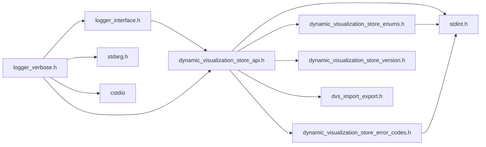
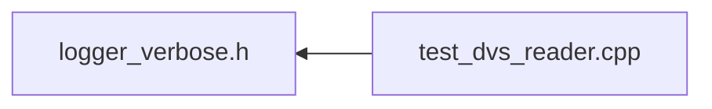

# File logger_verbose.h

<a id="logger__verbose_8h"></a>

![][C++]

Verbosity based logger for DVS.

## Classes

* [DVS::LoggerVerbose](../classes/class_d_v_s_1_1_logger_verbose.md)

## Namespaces

* [DVS](../namespaces/namespace_d_v_s.md)

## Includes

* [logger_interface.h](logger__interface_8h.md)
* [dynamic_visualization_store_api.h](dynamic__visualization__store__api_8h.md)
* <stdarg.h>
* <cstdio>



## Included by

* [test_dvs_reader.cpp](test__dvs__reader_8cpp.md)



## Source

```cpp
/**************************************************************
*
*   (C) 2022-2025 ANSYS, Inc. Unauthorized use, distribution, or duplication is prohibited.
*
*   Restricted Rights Legend
*
*   Use, duplication, or disclosure of this
*   software and its documentation by the
*   Government is subject to restrictions as
*   set forth in subdivision [(b)(3)(ii)] of
*   the Rights in Technical Data and Computer
*   Software clause at 52.227-7013.
*
**************************************************************
*/


#ifndef ___DVS_LOGGER_VERBOSE_CONCRETE_H___
#define ___DVS_LOGGER_VERBOSE_CONCRETE_H___

#include "logger_interface.h"
#include "dynamic_visualization_store_api.h"
#include <stdarg.h>
#include <cstdio>

namespace DVS
{

class LoggerVerbose : public ILogger
{
public:

    LoggerVerbose(void* user_data, dvs_verbosity level, dvs_log_func func)
    : _user_data(user_data), _level(level), _func(func)
    {}

    virtual ~LoggerVerbose() = default; // make dtor virtual

    LoggerVerbose(LoggerVerbose&&) = default; 
    LoggerVerbose& operator=(LoggerVerbose&&) = default;
    LoggerVerbose(const LoggerVerbose&) = default;
    LoggerVerbose& operator=(const LoggerVerbose&) = default;

    void log(int level, const char* msg, ...) override
    {
        if (_func && (level <= _level))
        {
            char buffer[1024];
            va_list args;
            va_start (args, msg);
            vsnprintf(buffer, 1024, msg, args);
            va_end (args);
            _func(_user_data, buffer);
        }
    }

    void release() override
    {
        delete this;
    }

private:

    void* _user_data;
    dvs_verbosity _level;
    dvs_log_func _func;
};
}

#endif //___DVS_LOGGER_VERBOSE_CONCRETE_H___
```

[C++]: https://img.shields.io/badge/language-C%2B%2B-blue (C++)