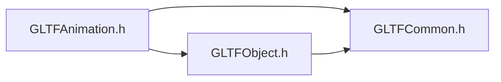
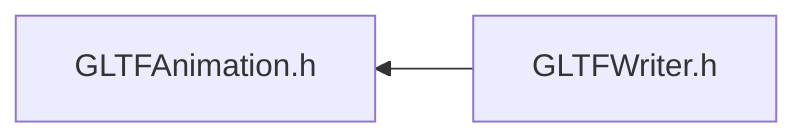

# File GLTFAnimation.h

<a id="_g_l_t_f_animation_8h"></a>

![][C++]

## Classes

* [ANSYS::AVZ::GLTFWriter::AnimationSampler](class_a_n_s_y_s_1_1_a_v_z_1_1_g_l_t_f_writer_1_1_animation_sampler.md#class_a_n_s_y_s_1_1_a_v_z_1_1_g_l_t_f_writer_1_1_animation_sampler)
* [ANSYS::AVZ::GLTFWriter::Animation](class_a_n_s_y_s_1_1_a_v_z_1_1_g_l_t_f_writer_1_1_animation.md#class_a_n_s_y_s_1_1_a_v_z_1_1_g_l_t_f_writer_1_1_animation)

## Namespaces

* [ANSYS](namespace_a_n_s_y_s.md#namespace_a_n_s_y_s)
* [ANSYS::AVZ](namespace_a_n_s_y_s_1_1_a_v_z.md#namespace_a_n_s_y_s_1_1_a_v_z)
* [ANSYS::AVZ::GLTFWriter](namespace_a_n_s_y_s_1_1_a_v_z_1_1_g_l_t_f_writer.md#namespace_a_n_s_y_s_1_1_a_v_z_1_1_g_l_t_f_writer)

## Includes

* [GLTFCommon.h](_g_l_t_f_common_8h.md#_g_l_t_f_common_8h)
* [GLTFObject.h](_g_l_t_f_object_8h.md#_g_l_t_f_object_8h)





## Included by

* [GLTFWriter.h](_g_l_t_f_writer_8h.md#_g_l_t_f_writer_8h)





## Source


```cpp
/*
 * Copyright 2018-2021 ANSYS, Inc. Unauthorized use, distribution, or duplication is prohibited.
 * 
 * Restricted Rights Legend
 *
 * Use, duplication, or disclosure of this
 * software and its documentation by the
 * Government is subject to restrictions as
 * set forth in subdivision [(b)(3)(ii)] of
 * the Rights in Technical Data and Computer
 * Software clause at 52.227-7013.
 */
#ifndef __INCLUDED_GLTF_GLTFANIMATION__
#define __INCLUDED_GLTF_GLTFANIMATION__

#include "GLTFCommon.h"
#include "GLTFObject.h"

namespace ANSYS { namespace AVZ { namespace GLTFWriter {
    class GLTF;
    class Attribute;
    class Material;
    class Node;

    class AnimationSampler : public Object
    {
    public:
        enum AnimationSamplerType
        {
            AST_LINEAR 
        };

    protected:
        virtual ~AnimationSampler() {}

    public:
        static GLTFWRITERSPEC AnimationSampler *Create(GLTF *gltf, 
            Attribute *input, 
            Attribute *output, 
            AnimationSamplerType type = AST_LINEAR 
        );
    };

    class Animation
    {
    protected:
        virtual ~Animation() {}

    public:
        static GLTFWRITERSPEC Animation *Create(GLTF *gltf, 
            const char *name = 0 
        );

        GLTFWRITERSPEC virtual bool AppendChannel(AnimationSampler *sampler, 
            Node *target, 
            const char *path 
        ) = 0;
        GLTFWRITERSPEC virtual bool AppendChannel(AnimationSampler *sampler, 
            Material *target, 
            const char *path 
        ) = 0;
    };

} } }

#endif

```


[public]: https://img.shields.io/badge/-public-brightgreen (public)
[protected]: https://img.shields.io/badge/-protected-yellow (protected)
[static]: https://img.shields.io/badge/-static-lightgrey (static)
[C++]: https://img.shields.io/badge/language-C%2B%2B-blue (C++)
[Python]: https://img.shields.io/badge/language-Python-blue (Python)
[private]: https://img.shields.io/badge/-private-red (private)
[const]: https://img.shields.io/badge/-const-lightblue (const)
[Markdown]: https://img.shields.io/badge/language-Markdown-blue (Markdown)