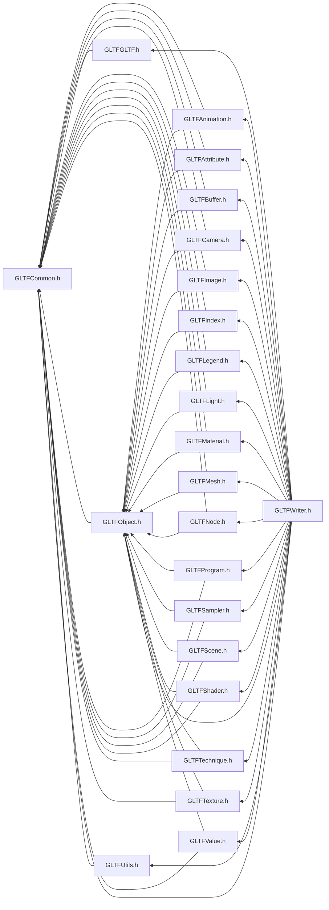

# File GLTFCommon.h

<a id="_g_l_t_f_common_8h"></a>

![][C++]

## Included by

* [GLTFAnimation.h](_g_l_t_f_animation_8h.md#_g_l_t_f_animation_8h)
* [GLTFAttribute.h](_g_l_t_f_attribute_8h.md#_g_l_t_f_attribute_8h)
* [GLTFBuffer.h](_g_l_t_f_buffer_8h.md#_g_l_t_f_buffer_8h)
* [GLTFCamera.h](_g_l_t_f_camera_8h.md#_g_l_t_f_camera_8h)
* [GLTFGLTF.h](_g_l_t_f_g_l_t_f_8h.md#_g_l_t_f_g_l_t_f_8h)
* [GLTFImage.h](_g_l_t_f_image_8h.md#_g_l_t_f_image_8h)
* [GLTFIndex.h](_g_l_t_f_index_8h.md#_g_l_t_f_index_8h)
* [GLTFLegend.h](_g_l_t_f_legend_8h.md#_g_l_t_f_legend_8h)
* [GLTFLight.h](_g_l_t_f_light_8h.md#_g_l_t_f_light_8h)
* [GLTFMaterial.h](_g_l_t_f_material_8h.md#_g_l_t_f_material_8h)
* [GLTFMesh.h](_g_l_t_f_mesh_8h.md#_g_l_t_f_mesh_8h)
* [GLTFNode.h](_g_l_t_f_node_8h.md#_g_l_t_f_node_8h)
* [GLTFObject.h](_g_l_t_f_object_8h.md#_g_l_t_f_object_8h)
* [GLTFProgram.h](_g_l_t_f_program_8h.md#_g_l_t_f_program_8h)
* [GLTFSampler.h](_g_l_t_f_sampler_8h.md#_g_l_t_f_sampler_8h)
* [GLTFScene.h](_g_l_t_f_scene_8h.md#_g_l_t_f_scene_8h)
* [GLTFShader.h](_g_l_t_f_shader_8h.md#_g_l_t_f_shader_8h)
* [GLTFTechnique.h](_g_l_t_f_technique_8h.md#_g_l_t_f_technique_8h)
* [GLTFTexture.h](_g_l_t_f_texture_8h.md#_g_l_t_f_texture_8h)
* [GLTFUtils.h](_g_l_t_f_utils_8h.md#_g_l_t_f_utils_8h)
* [GLTFValue.h](_g_l_t_f_value_8h.md#_g_l_t_f_value_8h)
* [GLTFWriter.h](_g_l_t_f_writer_8h.md#_g_l_t_f_writer_8h)





## Macros

<a id="_g_l_t_f_common_8h_1a2dcb114d3a4cd1870f2a6570876d5c2e"></a>
### Macro GLTFWRITERSPEC

![][public]


```cpp
#define GLTFWRITERSPEC __declspec(dllimport)
```


## Source


```cpp
/*
 * Copyright 2018-2021 ANSYS, Inc. Unauthorized use, distribution, or duplication is prohibited.
 * 
 * Restricted Rights Legend
 *
 * Use, duplication, or disclosure of this
 * software and its documentation by the
 * Government is subject to restrictions as
 * set forth in subdivision [(b)(3)(ii)] of
 * the Rights in Technical Data and Computer
 * Software clause at 52.227-7013.
 */
#ifndef __INCLUDED_GLTF_COMMON__
#define __INCLUDED_GLTF_COMMON__

#ifdef __unix__
#define GLTFWRITERSPEC
#else
#ifdef GLTFWRITER_WANTLIB
#define GLTFWRITERSPEC
#else 
#ifdef GLTFWRITER_BUILDDLL
#define GLTFWRITERSPEC __declspec(dllexport)
#else
#define GLTFWRITERSPEC __declspec(dllimport)
#endif
#endif
#endif

#endif
```


[public]: https://img.shields.io/badge/-public-brightgreen (public)
[protected]: https://img.shields.io/badge/-protected-yellow (protected)
[static]: https://img.shields.io/badge/-static-lightgrey (static)
[C++]: https://img.shields.io/badge/language-C%2B%2B-blue (C++)
[Python]: https://img.shields.io/badge/language-Python-blue (Python)
[private]: https://img.shields.io/badge/-private-red (private)
[const]: https://img.shields.io/badge/-const-lightblue (const)
[Markdown]: https://img.shields.io/badge/language-Markdown-blue (Markdown)