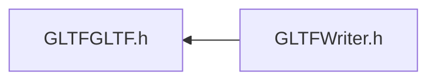

# File GLTFGLTF.h

<a id="_g_l_t_f_g_l_t_f_8h"></a>

![][C++]

## Classes

* [ANSYS::AVZ::GLTFWriter::GLTF](class_a_n_s_y_s_1_1_a_v_z_1_1_g_l_t_f_writer_1_1_g_l_t_f.md#class_a_n_s_y_s_1_1_a_v_z_1_1_g_l_t_f_writer_1_1_g_l_t_f)

## Namespaces

* [ANSYS](namespace_a_n_s_y_s.md#namespace_a_n_s_y_s)
* [ANSYS::AVZ](namespace_a_n_s_y_s_1_1_a_v_z.md#namespace_a_n_s_y_s_1_1_a_v_z)
* [ANSYS::AVZ::GLTFWriter](namespace_a_n_s_y_s_1_1_a_v_z_1_1_g_l_t_f_writer.md#namespace_a_n_s_y_s_1_1_a_v_z_1_1_g_l_t_f_writer)

## Includes

* [GLTFCommon.h](_g_l_t_f_common_8h.md#_g_l_t_f_common_8h)


## Included by

* [GLTFWriter.h](_g_l_t_f_writer_8h.md#_g_l_t_f_writer_8h)





## Source


```cpp
/*
 * Copyright 2018-2021 ANSYS, Inc. Unauthorized use, distribution, or duplication is prohibited.
 * 
 * Restricted Rights Legend
 *
 * Use, duplication, or disclosure of this
 * software and its documentation by the
 * Government is subject to restrictions as
 * set forth in subdivision [(b)(3)(ii)] of
 * the Rights in Technical Data and Computer
 * Software clause at 52.227-7013.
 */

#ifndef __INCLUDED_GLTF_GLTF__
#define __INCLUDED_GLTF_GLTF__

#include "GLTFCommon.h"

namespace ANSYS { namespace AVZ { namespace GLTFWriter {
    class Scene;

    class GLTF
    {
    public:
        enum GLTFError {
            GLTF_ERROR_NONE = 0, 
            GLTF_ERROR_DUPLICATE_VALUE, 
            GLTF_ERROR_INCOMPATIBLE_VALUE, 
            GLTF_ERROR_INVALID_PATH, 
            GLTF_ERROR_INVALID_TARGET, 
            GLTF_ERROR_INVALID_TYPE, 
            GLTF_ERROR_INVALID_VALUE, 
            GLTF_ERROR_MEMORY, 
            GLTF_ERROR_RANGE, 
            GLTF_ERROR_READ, 
            GLTF_ERROR_SIZE_MISMATCH, 
            GLTF_ERROR_VALUE_NOT_INITIALIZED, 
            GLTF_ERROR_WRITE, 

            GLT_ERROR_MAX
        };

        enum OutputType
        {
            OT_AVZ, 
            OT_GLTF, 
            OT_GLB1, 
            OT_GLTF1, 
            OT_GLB2 
        };

    protected:
        virtual ~GLTF() {};

    public:
        static GLTFWRITERSPEC GLTF *Create(const char *application, 
            const char *applicationVersion, 
            const char *filePath, 
            OutputType fileType = OT_AVZ 
        );
        static GLTFWRITERSPEC void Destroy(GLTF *gltf 
        );

        GLTFWRITERSPEC virtual bool Write(bool formatJSON = false 
        ) = 0;
        GLTFWRITERSPEC virtual void SetDefaultScene(const Scene *scene 
        ) = 0;
        GLTFWRITERSPEC virtual GLTFError GetError() = 0;
    };

} } }

#endif

```


[public]: https://img.shields.io/badge/-public-brightgreen (public)
[protected]: https://img.shields.io/badge/-protected-yellow (protected)
[static]: https://img.shields.io/badge/-static-lightgrey (static)
[C++]: https://img.shields.io/badge/language-C%2B%2B-blue (C++)
[Python]: https://img.shields.io/badge/language-Python-blue (Python)
[private]: https://img.shields.io/badge/-private-red (private)
[const]: https://img.shields.io/badge/-const-lightblue (const)
[Markdown]: https://img.shields.io/badge/language-Markdown-blue (Markdown)