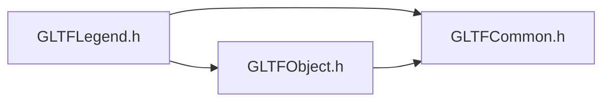
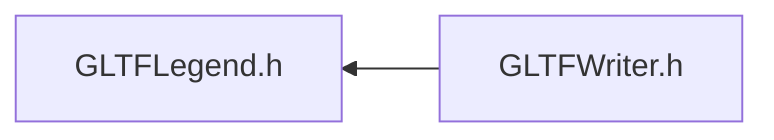

# File GLTFLegend.h

<a id="_g_l_t_f_legend_8h"></a>

![][C++]

## Classes

* [ANSYS::AVZ::GLTFWriter::Legend](class_a_n_s_y_s_1_1_a_v_z_1_1_g_l_t_f_writer_1_1_legend.md#class_a_n_s_y_s_1_1_a_v_z_1_1_g_l_t_f_writer_1_1_legend)

## Namespaces

* [ANSYS](namespace_a_n_s_y_s.md#namespace_a_n_s_y_s)
* [ANSYS::AVZ](namespace_a_n_s_y_s_1_1_a_v_z.md#namespace_a_n_s_y_s_1_1_a_v_z)
* [ANSYS::AVZ::GLTFWriter](namespace_a_n_s_y_s_1_1_a_v_z_1_1_g_l_t_f_writer.md#namespace_a_n_s_y_s_1_1_a_v_z_1_1_g_l_t_f_writer)

## Includes

* [GLTFCommon.h](_g_l_t_f_common_8h.md#_g_l_t_f_common_8h)
* [GLTFObject.h](_g_l_t_f_object_8h.md#_g_l_t_f_object_8h)





## Included by

* [GLTFWriter.h](_g_l_t_f_writer_8h.md#_g_l_t_f_writer_8h)





## Source


```cpp
/*
 * Copyright 2018-2021 ANSYS, Inc. Unauthorized use, distribution, or duplication is prohibited.
 * 
 * Restricted Rights Legend
 *
 * Use, duplication, or disclosure of this
 * software and its documentation by the
 * Government is subject to restrictions as
 * set forth in subdivision [(b)(3)(ii)] of
 * the Rights in Technical Data and Computer
 * Software clause at 52.227-7013.
 */
#ifndef __INCLUDED_GLTF_GLTFLEGEND__
#define __INCLUDED_GLTF_GLTFLEGEND__

#include "GLTFCommon.h"
#include "GLTFObject.h"

namespace ANSYS { namespace AVZ { namespace GLTFWriter {
    class GLTF;
    class Texture;

    class Legend : public Object
    {
    public:
        enum LegendOrientation
        {
            LO_VERTICAL, 
            LO_HORIZONTAL 
        };
        enum LegendAttachment
        {
            LA_X_Y = 0, 
            LA_X_YBOTTOM = 1, 
            LA_X_YTOP = 2, 
            LA_X_YCENTER = 3, 
            LA_XLEFT_Y = 4, 
            LA_XLEFT_YBOTTOM = 5, 
            LA_XLEFT_YTOP = 6, 
            LA_XLEFT_YCENTER = 7, 
            LA_XRIGHT_Y = 8, 
            LA_XRIGHT_YBOTTOM = 9, 
            LA_XRIGHT_YTOP = 10, 
            LA_XRIGHT_YCENTER = 11, 
            LA_XCENTER_Y = 12, 
            LA_XCENTER_YBOTTOM = 13, 
            LA_XCENTER_YTOP = 14, 
            LA_XCENTER_YCENTER = 15 
        };

    protected:
        virtual ~Legend() {}

    public:
        static GLTFWRITERSPEC Legend *Create(GLTF *gltf, 
            LegendOrientation orientation, 
            float size, 
            Texture *texture, 
            float mn, 
            float mx, 
            LegendAttachment attachment = LA_XLEFT_YCENTER, 
            const char *title = 0, 
            const char *units = 0, 
            const char *other = 0, 
            unsigned int numTicks = 0, 
            const float *valueLocations = 0, 
            bool border = false, 
            bool logarithmic = false, 
            float x = 0, 
            float y = 0, 
            float foregroundR = 0, 
            float foregroundG = 0, 
            float foregroundB = 0, 
            float backgroundR = 1, 
            float backgroundG = 1, 
            float backgroundB = 1, 
            float backgroundA = 0 
        );
    };

} } } 

#endif
```


[public]: https://img.shields.io/badge/-public-brightgreen (public)
[protected]: https://img.shields.io/badge/-protected-yellow (protected)
[static]: https://img.shields.io/badge/-static-lightgrey (static)
[C++]: https://img.shields.io/badge/language-C%2B%2B-blue (C++)
[Python]: https://img.shields.io/badge/language-Python-blue (Python)
[private]: https://img.shields.io/badge/-private-red (private)
[const]: https://img.shields.io/badge/-const-lightblue (const)
[Markdown]: https://img.shields.io/badge/language-Markdown-blue (Markdown)