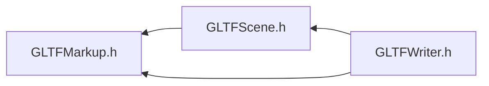

# File GLTFMarkup.h

<a id="_g_l_t_f_markup_8h"></a>

![][C++]

## Namespaces

* [ANSYS](namespace_a_n_s_y_s.md#namespace_a_n_s_y_s)
* [ANSYS::AVZ](namespace_a_n_s_y_s_1_1_a_v_z.md#namespace_a_n_s_y_s_1_1_a_v_z)
* [ANSYS::AVZ::GLTFWriter](namespace_a_n_s_y_s_1_1_a_v_z_1_1_g_l_t_f_writer.md#namespace_a_n_s_y_s_1_1_a_v_z_1_1_g_l_t_f_writer)
* [ANSYS::AVZ::GLTFWriter::Markup](namespace_a_n_s_y_s_1_1_a_v_z_1_1_g_l_t_f_writer_1_1_markup.md#namespace_a_n_s_y_s_1_1_a_v_z_1_1_g_l_t_f_writer_1_1_markup)

## Included by

* [GLTFScene.h](_g_l_t_f_scene_8h.md#_g_l_t_f_scene_8h)
* [GLTFWriter.h](_g_l_t_f_writer_8h.md#_g_l_t_f_writer_8h)





## Source


```cpp
/*
 * Copyright 2018-2021 ANSYS, Inc. Unauthorized use, distribution, or duplication is prohibited.
 * 
 * Restricted Rights Legend
 *
 * Use, duplication, or disclosure of this
 * software and its documentation by the
 * Government is subject to restrictions as
 * set forth in subdivision [(b)(3)(ii)] of
 * the Rights in Technical Data and Computer
 * Software clause at 52.227-7013.
 */
#ifndef __INCLUDED_GLTF_GLTFMARKUP__
#define __INCLUDED_GLTF_GLTFMARKUP__

namespace ANSYS { namespace AVZ { namespace GLTFWriter {
    namespace Markup
    {
        enum MarkupLineType
        {
            MLT_LINE, 
            MLT_ARROW, 
            MLT_BALL 
        };
        enum MarkupTextAttachmentType
        {
            MTAT_AUTO, 
            MTAT_NW, 
            MTAT_N, 
            MTAT_NE, 
            MTAT_W, 
            MTAT_CENTER, 
            MTAT_E, 
            MTAT_SW, 
            MTAT_S, 
            MTAT_SE 
        };
    };

} } } 

#endif
```


[public]: https://img.shields.io/badge/-public-brightgreen (public)
[protected]: https://img.shields.io/badge/-protected-yellow (protected)
[static]: https://img.shields.io/badge/-static-lightgrey (static)
[C++]: https://img.shields.io/badge/language-C%2B%2B-blue (C++)
[Python]: https://img.shields.io/badge/language-Python-blue (Python)
[private]: https://img.shields.io/badge/-private-red (private)
[const]: https://img.shields.io/badge/-const-lightblue (const)
[Markdown]: https://img.shields.io/badge/language-Markdown-blue (Markdown)