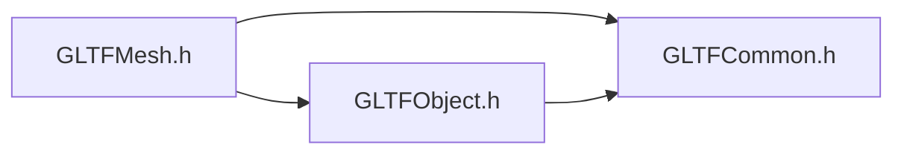
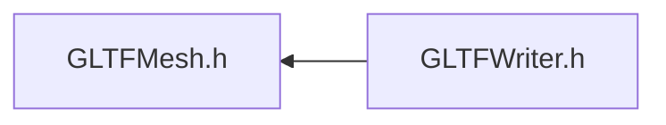

# File GLTFMesh.h

<a id="_g_l_t_f_mesh_8h"></a>

![][C++]

## Classes

* [ANSYS::AVZ::GLTFWriter::Primitive](class_a_n_s_y_s_1_1_a_v_z_1_1_g_l_t_f_writer_1_1_primitive.md#class_a_n_s_y_s_1_1_a_v_z_1_1_g_l_t_f_writer_1_1_primitive)
* [ANSYS::AVZ::GLTFWriter::Mesh](class_a_n_s_y_s_1_1_a_v_z_1_1_g_l_t_f_writer_1_1_mesh.md#class_a_n_s_y_s_1_1_a_v_z_1_1_g_l_t_f_writer_1_1_mesh)

## Namespaces

* [ANSYS](namespace_a_n_s_y_s.md#namespace_a_n_s_y_s)
* [ANSYS::AVZ](namespace_a_n_s_y_s_1_1_a_v_z.md#namespace_a_n_s_y_s_1_1_a_v_z)
* [ANSYS::AVZ::GLTFWriter](namespace_a_n_s_y_s_1_1_a_v_z_1_1_g_l_t_f_writer.md#namespace_a_n_s_y_s_1_1_a_v_z_1_1_g_l_t_f_writer)

## Includes

* [GLTFCommon.h](_g_l_t_f_common_8h.md#_g_l_t_f_common_8h)
* [GLTFObject.h](_g_l_t_f_object_8h.md#_g_l_t_f_object_8h)





## Included by

* [GLTFWriter.h](_g_l_t_f_writer_8h.md#_g_l_t_f_writer_8h)





## Source


```cpp
/*
 * Copyright 2018-2021 ANSYS, Inc. Unauthorized use, distribution, or duplication is prohibited.
 * 
 * Restricted Rights Legend
 *
 * Use, duplication, or disclosure of this
 * software and its documentation by the
 * Government is subject to restrictions as
 * set forth in subdivision [(b)(3)(ii)] of
 * the Rights in Technical Data and Computer
 * Software clause at 52.227-7013.
 */
#ifndef __INCLUDED_GLTF_GLTFMESH__
#define __INCLUDED_GLTF_GLTFMESH__

#include "GLTFCommon.h"
#include "GLTFObject.h"

namespace ANSYS { namespace AVZ { namespace GLTFWriter {
    class GLTF;
    class Attribute;
    class Index;
    class Material;
    class Texture;
    class Value;

    class Primitive : public Object
    {
    public:
        enum PrimitiveType
        {
            PT_POINTS = 0, 
            PT_LINES = 1, 
            PT_LINE_LOOP = 2, 
            PT_LINE_STRIP = 3, 
            PT_TRIANGLES = 4, 
            PT_TRIANGLE_STRIP = 5, 
            PT_TRIANGLE_FAN = 6 
        };
        enum PrimitiveXAttachment
        {
            PXA_NONE, 
            PXA_LEFT, 
            PXA_CENTER, 
            PXA_RIGHT 
        };
        enum PrimitiveYAttachment
        {
            PYA_NONE, 
            PYA_BOTTOM, 
            PYA_CENTER, 
            PYA_TOP 
        };

    protected:
        virtual ~Primitive() {}

    public:
        static GLTFWRITERSPEC Primitive *Create(GLTF *gltf, 
            PrimitiveType type, 
            Material *material, 
            Index *indices = 0, 
            bool isPickable = true 
        );

        GLTFWRITERSPEC virtual Primitive *Mirror() = 0;
        GLTFWRITERSPEC virtual bool AppendAttribute(Attribute *attribute 
        ) = 0;
        static GLTFWRITERSPEC Primitive *Create2DTexture(GLTF *gltf, 
            Texture *texture, 
            float width, 
            float height, 
            PrimitiveXAttachment xAttach = PXA_LEFT, 
            PrimitiveYAttachment yAttach = PYA_CENTER 
        );
        static GLTFWRITERSPEC Primitive *Create2DTexture(GLTF *gltf, 
            Texture *texture, 
            float width, 
            float height, 
            float x = 0, 
            float y = 0 
        );
    };

    class Mesh : public Object
    {
    protected:
        virtual ~Mesh() {}

    public:
        static GLTFWRITERSPEC Mesh *Create(GLTF *gltf 
        );

        GLTFWRITERSPEC virtual Mesh *Mirror() = 0;
        GLTFWRITERSPEC virtual bool AppendPrimitive(Primitive *primitive 
        ) = 0;
        GLTFWRITERSPEC virtual unsigned int NumPrimitives() const = 0;
        GLTFWRITERSPEC virtual bool AppendValue(Value* value 
        ) = 0;
    };

} } }

#endif
```


[public]: https://img.shields.io/badge/-public-brightgreen (public)
[protected]: https://img.shields.io/badge/-protected-yellow (protected)
[static]: https://img.shields.io/badge/-static-lightgrey (static)
[C++]: https://img.shields.io/badge/language-C%2B%2B-blue (C++)
[Python]: https://img.shields.io/badge/language-Python-blue (Python)
[private]: https://img.shields.io/badge/-private-red (private)
[const]: https://img.shields.io/badge/-const-lightblue (const)
[Markdown]: https://img.shields.io/badge/language-Markdown-blue (Markdown)