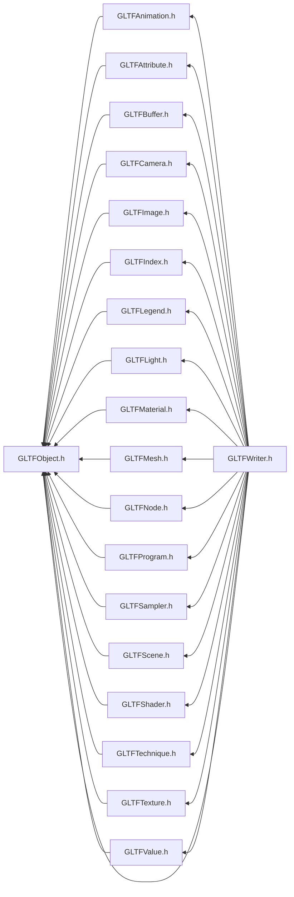

# File GLTFObject.h

<a id="_g_l_t_f_object_8h"></a>

![][C++]

## Classes

* [ANSYS::AVZ::GLTFWriter::Object](class_a_n_s_y_s_1_1_a_v_z_1_1_g_l_t_f_writer_1_1_object.md#class_a_n_s_y_s_1_1_a_v_z_1_1_g_l_t_f_writer_1_1_object)

## Namespaces

* [ANSYS](namespace_a_n_s_y_s.md#namespace_a_n_s_y_s)
* [ANSYS::AVZ](namespace_a_n_s_y_s_1_1_a_v_z.md#namespace_a_n_s_y_s_1_1_a_v_z)
* [ANSYS::AVZ::GLTFWriter](namespace_a_n_s_y_s_1_1_a_v_z_1_1_g_l_t_f_writer.md#namespace_a_n_s_y_s_1_1_a_v_z_1_1_g_l_t_f_writer)

## Includes

* [GLTFCommon.h](_g_l_t_f_common_8h.md#_g_l_t_f_common_8h)


## Included by

* [GLTFAnimation.h](_g_l_t_f_animation_8h.md#_g_l_t_f_animation_8h)
* [GLTFAttribute.h](_g_l_t_f_attribute_8h.md#_g_l_t_f_attribute_8h)
* [GLTFBuffer.h](_g_l_t_f_buffer_8h.md#_g_l_t_f_buffer_8h)
* [GLTFCamera.h](_g_l_t_f_camera_8h.md#_g_l_t_f_camera_8h)
* [GLTFImage.h](_g_l_t_f_image_8h.md#_g_l_t_f_image_8h)
* [GLTFIndex.h](_g_l_t_f_index_8h.md#_g_l_t_f_index_8h)
* [GLTFLegend.h](_g_l_t_f_legend_8h.md#_g_l_t_f_legend_8h)
* [GLTFLight.h](_g_l_t_f_light_8h.md#_g_l_t_f_light_8h)
* [GLTFMaterial.h](_g_l_t_f_material_8h.md#_g_l_t_f_material_8h)
* [GLTFMesh.h](_g_l_t_f_mesh_8h.md#_g_l_t_f_mesh_8h)
* [GLTFNode.h](_g_l_t_f_node_8h.md#_g_l_t_f_node_8h)
* [GLTFProgram.h](_g_l_t_f_program_8h.md#_g_l_t_f_program_8h)
* [GLTFSampler.h](_g_l_t_f_sampler_8h.md#_g_l_t_f_sampler_8h)
* [GLTFScene.h](_g_l_t_f_scene_8h.md#_g_l_t_f_scene_8h)
* [GLTFShader.h](_g_l_t_f_shader_8h.md#_g_l_t_f_shader_8h)
* [GLTFTechnique.h](_g_l_t_f_technique_8h.md#_g_l_t_f_technique_8h)
* [GLTFTexture.h](_g_l_t_f_texture_8h.md#_g_l_t_f_texture_8h)
* [GLTFValue.h](_g_l_t_f_value_8h.md#_g_l_t_f_value_8h)
* [GLTFWriter.h](_g_l_t_f_writer_8h.md#_g_l_t_f_writer_8h)





## Source


```cpp
/*
 * Copyright 2018-2021 ANSYS, Inc. Unauthorized use, distribution, or duplication is prohibited.
 * 
 * Restricted Rights Legend
 *
 * Use, duplication, or disclosure of this
 * software and its documentation by the
 * Government is subject to restrictions as
 * set forth in subdivision [(b)(3)(ii)] of
 * the Rights in Technical Data and Computer
 * Software clause at 52.227-7013.
 */
#ifndef __INCLUDED_GLTF_GLTFOBJECT__
#define __INCLUDED_GLTF_GLTFOBJECT__

#include "GLTFCommon.h"

namespace ANSYS { namespace AVZ { namespace GLTFWriter {
    class Object
    {
    protected:
        virtual ~Object() {}

    public:
        GLTFWRITERSPEC virtual void SetName(const char *name 
        ) = 0;
        GLTFWRITERSPEC virtual const char *GetName() const = 0;
        GLTFWRITERSPEC virtual const char *GetID() const = 0;
    };

} } }

#endif
```


[public]: https://img.shields.io/badge/-public-brightgreen (public)
[protected]: https://img.shields.io/badge/-protected-yellow (protected)
[static]: https://img.shields.io/badge/-static-lightgrey (static)
[C++]: https://img.shields.io/badge/language-C%2B%2B-blue (C++)
[Python]: https://img.shields.io/badge/language-Python-blue (Python)
[private]: https://img.shields.io/badge/-private-red (private)
[const]: https://img.shields.io/badge/-const-lightblue (const)
[Markdown]: https://img.shields.io/badge/language-Markdown-blue (Markdown)