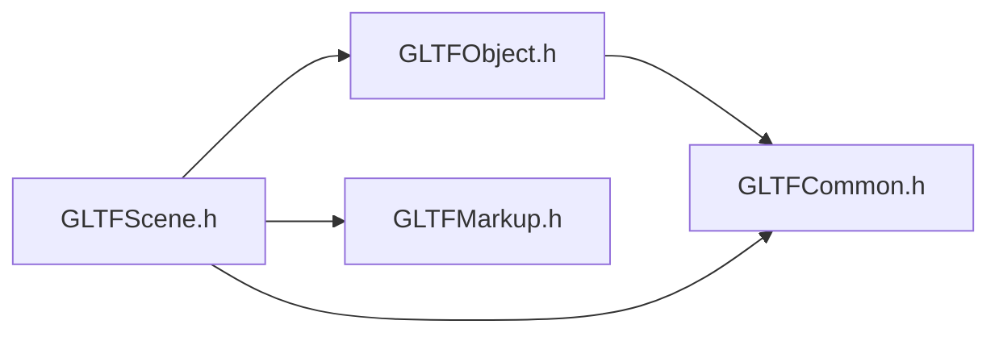

# File GLTFScene.h

<a id="_g_l_t_f_scene_8h"></a>

![][C++]

## Classes

* [ANSYS::AVZ::GLTFWriter::Scene](class_a_n_s_y_s_1_1_a_v_z_1_1_g_l_t_f_writer_1_1_scene.md#class_a_n_s_y_s_1_1_a_v_z_1_1_g_l_t_f_writer_1_1_scene)

## Namespaces

* [ANSYS](namespace_a_n_s_y_s.md#namespace_a_n_s_y_s)
* [ANSYS::AVZ](namespace_a_n_s_y_s_1_1_a_v_z.md#namespace_a_n_s_y_s_1_1_a_v_z)
* [ANSYS::AVZ::GLTFWriter](namespace_a_n_s_y_s_1_1_a_v_z_1_1_g_l_t_f_writer.md#namespace_a_n_s_y_s_1_1_a_v_z_1_1_g_l_t_f_writer)

## Includes

* [GLTFCommon.h](_g_l_t_f_common_8h.md#_g_l_t_f_common_8h)
* [GLTFObject.h](_g_l_t_f_object_8h.md#_g_l_t_f_object_8h)
* [GLTFMarkup.h](_g_l_t_f_markup_8h.md#_g_l_t_f_markup_8h)





## Included by

* [GLTFWriter.h](_g_l_t_f_writer_8h.md#_g_l_t_f_writer_8h)


## Source


```cpp
/*
 * Copyright 2018-2021 ANSYS, Inc. Unauthorized use, distribution, or duplication is prohibited.
 * 
 * Restricted Rights Legend
 *
 * Use, duplication, or disclosure of this
 * software and its documentation by the
 * Government is subject to restrictions as
 * set forth in subdivision [(b)(3)(ii)] of
 * the Rights in Technical Data and Computer
 * Software clause at 52.227-7013.
 */
#ifndef __INCLUDED_GLTF_GLTFSCENE__
#define __INCLUDED_GLTF_GLTFSCENE__

#include "GLTFCommon.h"
#include "GLTFObject.h"
#include "GLTFMarkup.h"

namespace ANSYS { namespace AVZ { namespace GLTFWriter {
    class GLTF;
    class Node;
    class Value;

    class Scene : public Object
    {
    public:
        enum BackgroundType
        {
            BT_NONE = -1, 
            BT_SOLID = 0, 
            BT_TB, 
            BT_LR, 
            BT_TLBR 
        };

    protected:
        virtual ~Scene() {}

    public:
        static GLTFWRITERSPEC Scene *Create(GLTF *gltf, 
            const char *name = 0, 
            const char *units = 0, 
            float scale = 1, 
            Scene::BackgroundType backgroundType = Scene::BT_NONE, 
            float r1 = 0, 
            float g1 = 0, 
            float b1 = 0, 
            float r2 = 0, 
            float g2 = 0, 
            float b2 = 0 
        );

        GLTFWRITERSPEC virtual bool SetCamera(Node *camera 
        ) = 0;
        GLTFWRITERSPEC virtual bool SetLight(Node *light 
        ) = 0;
        GLTFWRITERSPEC virtual bool SetProxyImage(Node* image 
        ) = 0;
        GLTFWRITERSPEC virtual void SetClipPlane(float p0x, 
            float p0y, 
            float p0z, 
            float p1x, 
            float p1y, 
            float p1z, 
            float p2x, 
            float p2y, 
            float p2z 
        ) = 0;
        GLTFWRITERSPEC virtual bool AppendMesh(Node *mesh 
        ) = 0;
        GLTFWRITERSPEC virtual bool Add2DText(GLTF *gltf, 
            const char *text, 
            float x, 
            float y, 
            Markup::MarkupTextAttachmentType textAttach = Markup::MTAT_CENTER, 
            float textSize = 20, 
            const char *textFont = 0, 
            float textR = 0, 
            float textG = 0, 
            float textB = 0, 
            float bgR = 1, 
            float bgG = 1, 
            float bgB = 1, 
            float bgA = 0, 
            const char *path = 0 
        ) = 0;
        GLTFWRITERSPEC virtual bool Add3DText(GLTF *gltf, 
            const char *text, 
            float x, 
            float y, 
            float z, 
            Markup::MarkupTextAttachmentType textAttach = Markup::MTAT_AUTO, 
            float textSize = 12, 
            const char *textFont = 0, 
            float textOffX = 0, 
            float textOffY = 0, 
            Markup::MarkupLineType lineShape = Markup::MLT_LINE, 
            float lineR = 0, 
            float lineG = 0, 
            float lineB = 0, 
            float textR = 0, 
            float textG = 0, 
            float textB = 0, 
            float bgR = 1, 
            float bgG = 1, 
            float bgB = 1, 
            float bgA = 0.5, 
            const char *path = 0 
        ) = 0;
        GLTFWRITERSPEC virtual bool AppendValue(Value* value 
        ) = 0;
    };

} } }

#endif
```


[public]: https://img.shields.io/badge/-public-brightgreen (public)
[protected]: https://img.shields.io/badge/-protected-yellow (protected)
[static]: https://img.shields.io/badge/-static-lightgrey (static)
[C++]: https://img.shields.io/badge/language-C%2B%2B-blue (C++)
[Python]: https://img.shields.io/badge/language-Python-blue (Python)
[private]: https://img.shields.io/badge/-private-red (private)
[const]: https://img.shields.io/badge/-const-lightblue (const)
[Markdown]: https://img.shields.io/badge/language-Markdown-blue (Markdown)